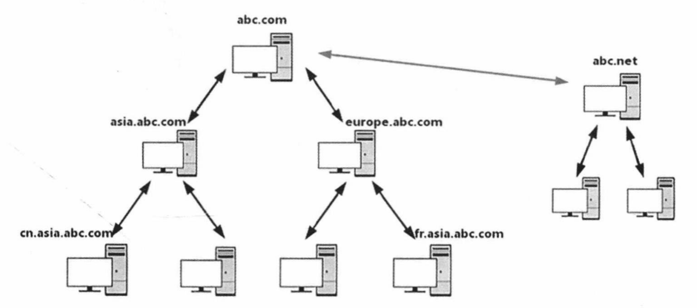
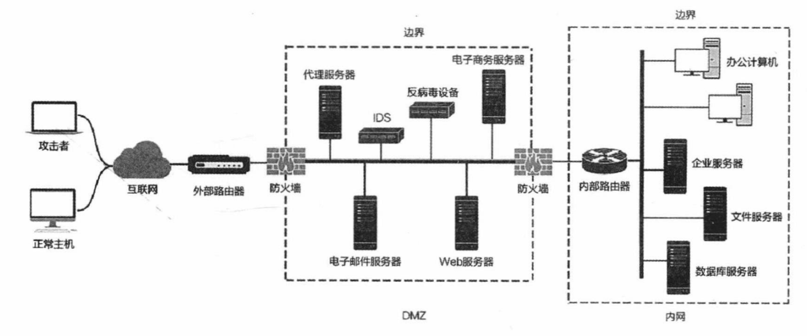
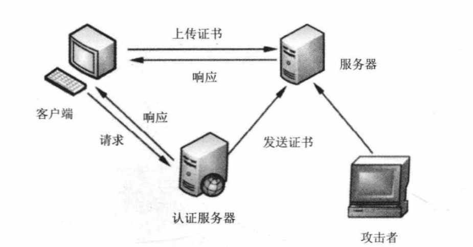

# 内网渗透

## 知识储备

### 域

**域**（Domain）是一个有安全边界的计算机集合（安全边界的意思是，在两个域中，一个域中的用户无法访问另一个域中的资源）。可以简单地把域理解成升级版的工作组。与工作组相比，域的安全管理控制机制更加严格。用户要想访问域内的资源，必须以合法的身份登录域，而用户对域内的资源拥有什么样的权限，还取决于用户在域内的身份

### 域控制器

**域控制器**（Domain Controller，DC）是域中的一台类似管理服务器的计算机，我们可以形象地将它理解为一个单位的门禁系统。域控制器负责所有连入的计算机和用户的验证工作。域内的计算机如果想互相访问，都要经过域控制器的审核。



### 活动目录

**活动目录**（Active Directory，AD）是指域环境中提供目录服务的组件。

目录用于存储有关网络对象（例如用户、组、计算机、共享资源、打印机和联系人等）的信息。目录服务是指帮助用户快速、准确地从目录中找到其所需要的信息的服务。活动目录实现了目录服务，为企业提供了网络环境的集中式管理机制。

如果将企业的内网看成一本字典，那么内网里的资源就是字典的内容，活动目录就相当于字典的索引。也就是说，活动目录存储的是网络中所有资源的快捷方式，用户可以通过寻找快捷方式来定位资源。

在活动目录中，管理员不需要考虑被管理对象的地理位置，只需要按照一定的方式将这些对象放置在不同的容器中。这种不考虑被管理对象的具体地理位置的组织框架称为逻辑结构。

### 内网结构




## 信息收集

> 在内网中如何获得信息

### 主动信息收集

本机信息包括操作系统、权限、内网IP地址段、杀毒软件、端口、服务、补丁更新频率、网络连接、共享、会话等。如果是域内主机，操作系统、应用软件、补丁、服务、杀毒软件一般都是批量安装的。

#### 查询用户列表

```
net user
```

#### 获取本地管理员

```
net localgroup administrators
```

#### 查看在线用户

```
query user || qwinsta
```

#### 查看session

```
net session
```

#### 查询端口列表

```
netstat -ano
```

#### 查看补丁列表

```
systeminfo

wmic qfe get Caption，Description，HotFixID，InstalledOn
```

#### 查询本机共享列表

```
net share

wmic share get name，path，status
```

#### 查看路由表

```
route print

arp -a
```

#### 获取域ID

```
whoami /all
```

#### 查询指定用户的详细信息

```
net user *** /domain
```

#### 反向解析查询

```
nslookup *domain*
```

### 自动信息收集

#### WMIC脚本

WMIC （ Windows Management Instrumentation Command-Line，Windows管理工具命令行）是最有用的 Windows命令行工具。在默认情况下，任何版本的Windows XP的低权限用户不能访问WMIC，Windows 7以上版本的低权限用户允许访问WMIC 并执行相关查询操作。

#### Empire工具

#### 内网探测

- ICMP
- ARP
- NetBIOS
- msf

## 隐藏通信隧道

> 在内网中如何传递信息，保证连通性

### 判断内网连通性

- ICMP `ping`
- TCP `nc`
- HTTP `curl`
- DNS `nslookup`

### 网络层隧道

#### IPV6隧道

- **socat**
- 6tunnel
- nt6tunnel

#### ICMP隧道

- icmpsh
- PingTunnel

### 传输层隧道

#### lcx端口转发

- 内网端口转发
- 本地端口映射

#### netcat

#### PowerCat

### 应用层隧道

#### ssh

- 远程转发
- 本地转发
- 动态转发（socks 4/5 代理通道）

#### HTTP/HTTPS

- **reGeorg**
- **meterpreter**

#### DNS

- dnscat
- **iodine**

### SOCKS 代理

- **EarthWorm（EW）**
- sSocks
- SocksCap64
- ProxyChains

## 权限提升

### 系统内核

- 补丁

### Windows错误配置

#### 系统服务权限配置错误

#### 注册表键 AlwaysInstallElevated

注册表键 AlwaysInstallElevated是一个策略设置项。Windows允许低权限用户以System权限运行安装文件。如果启用此策略设置项，那么任何权限的用户都能以NT AUTHORITY\SYSTEM权限来安装恶意的MSI （ Microsoft Windows Installer ）文件

#### 可信任服务路径

> 因为Windows服务通常都是以System权限运行的，所以系统在解析服务所对应的文件路径中的空格时，也会以系统权限进行
>
> 例如，有一个文件路径“C:\Program FileslSome FolderlService.exe”。对于该路径中的每一个空格，Windows都会尝试寻找并执行与空格前面的名字相匹配的程序。操作系统会对文件路径中空格的所有可能情况进行尝试，直至找到一个能够匹配的程序。在本例中，Windows 会依次尝试确定和执行下列程序。
>
> - C:\Program.exe
> - C:\Program Files\Some.exe
> - C:\Program Files\Some Folder\Service.exe
>
> 因此，如果一个被“适当”命名的可执行程序被上传到受影响的目录中，服务一旦重启，该程序就会以System权限运行（在大多数情况下）

可信任服务路径（包含空格且没有引号的路径）漏洞利用了 Windows文件路径解析的特性，并涉及服务路径的文件/文件夹权限（存在缺陷的服务程序利用了属于可执行文件的文件/文件夹的权限）。如果一个服务调用的可执行文件没有正确地处理所引用的元整路径名，这个雨间肌云饭攻击者用来上传任意可执行文件。也就是说，如果一个服务的可执行文件的路径没有被双引号引起来且包含空格，那么这个服务就是有漏洞的。

该漏洞存在如下两种可能性。

- 如果路径与服务有关，就任意创建一个服务或者编译Service模板
- 如果路径与可执行文件有关，就任意创建一个可执行文件。

#### 自动安装配置文件

#### 计划任务

#### 组策略首选项提权

#### MOF

MOF是Windows系统的一个文件（ `c:/windows/system32/wbem/mof/nullevt.mof` ）叫做"托管对象格式"，其作用是每隔五秒就会去监控进程创建和死亡。

当拥有文件上传的权限但是没有Shell时，可以上传定制的mof文件至相应的位置，一定时间后这个mof就会被执行。

一般会采用在mof中加入一段添加管理员用户的命令的vbs脚本，当执行后就拥有了新的管理员账户。

### **UAC绕过**

> UAC是微软为提高系统安全性在 Windows Vista中引入的技术。UAC要求用户在执行可能影响计算机运行的操作或者在进行可能影响其他用户的设置之前，拥有相应的权限或者管理员密码。UAC在操作启动前对用户身份进行验证，以避免恶意软件和间谍软件在未经许可的情况下在计算机上进行安装操作或者对计算机设置进行更改

- Nishang
- Empire

### **令牌窃取**

#### Kerberos协议



## 横向移动

> 横向移动通常是为了扩大战果而进行的信息收集

### IPC（139 445）

IPC （ Internet Process Connection）共享“命名管道”的资源，是为了实现进程间通信而开放的命名管道。IPC可以通过验证用户名和密码获得相应的权限，通常在远程管理计算机和查看计算机的共享资源时使用。

通过ipc$，可以与目标机器建立连接。利用这个连接，不仅可以访问目标机器中的文件，进行上传、下载等操作，还可以在目标机器上运行其他命令，以获取目标机器的目录结构、用户列表等信息。

### **LM HASH & NTLM HASH**

- GetPass
- PwDump

#### **mimikatz**

> 内网扒密码必备

#### Hashcat

### **Pass The Hash**

> 在域环境中，用户登录计算机时使用的大都是域账号，大量计算机在安装时会使用相同的本地管理员账号和密码，因此，如果计算机的本地管理员账号和密码也是相同的，攻击者就能使用哈希传递攻击的方法登录内网中的其他计算机。同时，通过哈希传递攻击，攻击者不需要花时间破解密码散列值（进而获得密码明文）。

在 Windows网络中，散列值就是用来证明身份的（有正确的用户名和密码散列值，就能通过验证），而微软自己的产品和工具显然不会支持这种攻击，于是，攻击者往往会使用第三方工具来完成任务。在 Windows Server 2012 R2及之后版本的操作系统中默认在内存中不会记录明文密码，因此，攻击者往往会使用工具将散列值传递到其他计算机中，进行权限验证，实现对远程计算机的控制。

### 票据传递

mimikatz可以提供票据传递，而不需要本地管理员权限

### **WMI**

> WMI的全名为“Windows Management Instrumentation”。从Windows 98开始，Windows操作系统都支持 WMI。WMI是由一系列工具集组成的，可以在本地或者远程管理计算机系统。

### SPN

### Exchange邮件服务器

### DCSync 攻击

DCSync是域渗透中经常会用到的技术。DCSync是mimikatz在2015年添加的一个功能，由Benjamin DELPY gentilkiwi和Vincent LE TOUX共同编写，基于 [DRS](https://docs.microsoft.com/en-us/openspecs/windows_protocols/ms-drsr/f977faaa-673e-4f66-b9bf-48c640241d47) 来导出域内所有用户的hash。

这种方式需要满足以下任一一种权限：

- Administrators组内的用户
- Domain Admins组内的用户
- Enterprise Admins组内的用户
- 域控制器的计算机帐户

### DCShadow 攻击

DCShadow是由来自法国的安全研究人员Benjamin Delpy和Vincent Le Toux在2018年的微软蓝帽（Blue Hat）大会上提出

## 域控安全

### 卷影拷贝提取ntds.dit

> 在活动目录中，所有的数据都保存在 ntds.dit文件中。ntds.dit是一个二进制文件，存储位置为域控制器的 %SystemRoot%IntdsIntds.dit。ntds.dit中包含（但不限于）用户名、散列值、组、GPP、OU等与活动目录相关的信息。它和SAM文件一样，是被Windows操作系统锁定的。

- ntdsutil.exe
- vssadmin
- vssown.vbs
- diskshadow

### 提取域散列值

- mimikatz

- metasploit

- QuarksPwDump.exe

## 跨域攻击

### 信任域关系

### 域信任密钥

## 权限维持

### 粘滞键后门

### 注册表后门

### 计划任务后门

### **WMI后门**

> 管理员，但是无文件，无进程

### Webshell

### DSRM域后门

> DSRM ( Directory Services Restore Mode，目录服务恢复模式)是 Windows域环境中域控制器的安全模式启动选项。每个域控制器都有一个本地管理员账户（也就是 DSRM账户)。DSRM的用途是:允许管理员在域环境中出现故障或崩溃时还原、修复、重建活动目录数据库，使域环境的运行恢复正常。在域环境创建初期，DSRM的密码需要在安装DC时设置，且很少会被重置。修改DSRM密码最基本的方法是在 DC上运行ntdsutil命令行工具。

mimikatz

### SID History域后门

### 黄金票据 & 白银票据

### 免杀

### 自启动

#### 基于注册表的自启动

通过在注册表中写入相应的键值可以实现程序的开机自启动，主要是 `Run` 和 `RunOnce` ，其中RunOnce和Run区别在于RunOnce的键值只作用一次，执行完毕后会自动删除。

注册表如下：

- `HKEY_CURRENT_USER\Software\Microsoft\Windows\CurrentVersion\Run`
- `HKEY_CURRENT_USER\Software\Microsoft\Windows\CurrentVersion\RunOnce`
- `HKEY_LOCAL_MACHINE\Software\Microsoft\Windows\CurrentVersion\Run`
- `HKEY_LOCAL_MACHINE\Software\Microsoft\Windows\CurrentVersion\RunOnce`
- `HKEY_LOCAL_MACHINE\Software\Microsoft\Windows\CurrentVersion\RunOnceEx`

基于策略的自启动注册表设置如下：

- `HKEY_LOCAL_MACHINE\Software\Microsoft\Windows\CurrentVersion\Policies\Explorer\Run`
- `HKEY_CURRENT_USER\Software\Microsoft\Windows\CurrentVersion\Policies\Explorer\Run`

设置启动文件夹注册表位置如下：

- `HKEY_CURRENT_USER\Software\Microsoft\Windows\CurrentVersion\Explorer\User Shell Folders`
- `HKEY_CURRENT_USER\Software\Microsoft\Windows\CurrentVersion\Explorer\Shell Folders`
- `HKEY_LOCAL_MACHINE\SOFTWARE\Microsoft\Windows\CurrentVersion\Explorer\Shell Folders`
- `HKEY_LOCAL_MACHINE\SOFTWARE\Microsoft\Windows\CurrentVersion\Explorer\User Shell Folders`


## 实战

### 外部渗透

> 一般来说外部渗透抵达的都是DMZ区域

外部渗透一般是找到外网服务器进行攻击，常见的难点如

- CDN绕过
- waf绕过
- 物理防火墙
- 权限维持

### DMZ突破

- VPN
- 防火墙

### 到达内网

- 蜜罐
- 流量检测

### 其他

#### 幽灵登录

#### 隧道隐藏

#### 反弹shell隐匿

#### 代理链

## 案例

### 攻击域控服务器

Tomcat —— 员工主机 ——域控服务器 rmi

### 批量获取主机&数据库

### 某公司VPN 

ezconnect